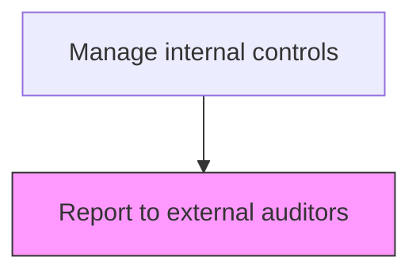
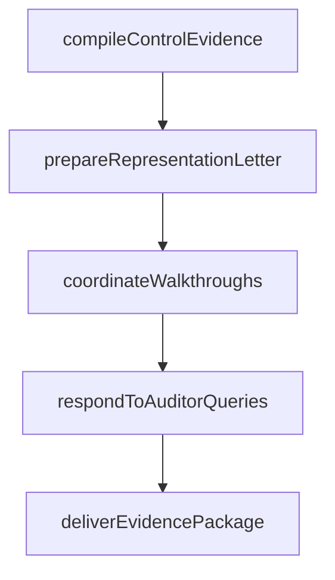

# Report to external auditors

> Business-as-Code definition for external auditor reporting. Models the preparation and delivery of control testing results, management representations, and compliance documentation to external audit firms.

## Overview

Preparing and delivering internal control testing results, management representations, and supporting documentation to external audit firms to facilitate their assessment of financial reporting controls. This process includes compiling control evidence packages, coordinating walkthroughs, providing management representation letters, and responding to auditor inquiries about control design and operating effectiveness. Timely and complete reporting to external auditors supports efficient audit execution and demonstrates management's commitment to strong internal controls.

## Process Hierarchy



## GraphDL

```yaml
report:
  object: To External Auditors
  actor: ComplianceReportingManager
  result: ExternalAuditReport
```

## Actions

| Action | Description |
|--------|-------------|
| compileControlEvidence | Gather control testing results, workpapers, and supporting documentation |
| prepareRepresentationLetter | Draft the management representation letter attesting to control effectiveness |
| coordinateWalkthroughs | Schedule and facilitate control walkthroughs with external audit teams |
| respondToAuditorQueries | Address external auditor questions about control design and operating effectiveness |
| deliverEvidencePackage | Transmit the finalized evidence package and representations to the external audit firm |

## Events

| Event | Description |
|-------|-------------|
| controlEvidenceCompiled | Testing results and supporting documentation gathered for external audit |
| representationLetterPrepared | Management representation letter drafted and ready for sign-off |
| walkthroughsCoordinated | Control walkthroughs scheduled and completed with external auditors |
| auditorQueriesResolved | External auditor inquiries addressed with documented responses |
| evidencePackageDelivered | Finalized evidence package transmitted to external audit firm |

## Searches

| Search | Description |
|--------|-------------|
| getReportStatus | Retrieve report preparation status |
| getReportArchive | Query historical reports by period and audience |

## Process Flow



## RACI Matrix

| Activity | Responsible | Accountable | Consulted | Informed |
|----------|-------------|-------------|-----------|----------|
| compileControlEvidence | InternalAuditManager | ChiefAuditExecutive | ControlOwners | CFO |
| prepareRepresentationLetter | ComplianceReportingManager | CFO | GeneralCounsel | AuditCommittee |
| coordinateWalkthroughs | InternalAuditManager | ChiefAuditExecutive | ProcessOwners | ExternalAuditor |
| deliverEvidencePackage | ComplianceReportingManager | ChiefAuditExecutive | Controller | CFO |

## Related Processes

| Process | Relationship |
|---------|-------------|
| 9.8.2.2 Monitor control effectiveness | Upstream - control testing results feed auditor reporting |
| 9.8.4.2 Report to regulators, share-/debt-holders, securities exchanges | Parallel - regulatory filings leverage same evidence base |
| 9.8.4.4 Report to internal management | Sibling - internal and external reporting use common data |
| 9.8.4 | Parent - governing process group |

## Related Departments

| Department | Role |
|-----------|------|
| Internal Audit | Provides control testing workpapers and findings |
| Compliance | Prepares evidence packages and representation letters |
| Legal | Reviews management representations for legal accuracy |
| Finance | Supplies financial data supporting control assertions |

## Related Occupations

| Occupation | Involvement |
|-----------|-------------|
| Compliance Reporting Manager | Prepares and coordinates evidence delivery |
| Internal Audit Manager | Compiles testing results and coordinates walkthroughs |
| Chief Audit Executive | Owns the relationship and reporting process with external auditors |

## KPIs

| KPI | Description | Unit |
|-----|-------------|------|
| Evidence Delivery Timeliness | Percentage of evidence packages delivered by audit deadline | % |
| Query Response Time | Average days to respond to external auditor information requests | Days |
| Walkthrough Completion Rate | Percentage of scheduled walkthroughs completed on time | % |
| Representation Letter Accuracy | Number of representation letters requiring revision after initial submission | Count |

## Usage

```typescript
import { reportToExternalAuditors } from '@headlessly/report-to-external-auditors'

const client = reportToExternalAuditors()

// Compile control evidence for the external audit
const evidence = await client.compileControlEvidence({
  period: '2025-FY',
  scope: 'SOX-key-controls',
  includeTestResults: true
})

// Track status of auditor queries
const queries = await client.respondToAuditorQueries({
  auditFirm: 'external-auditor',
  status: 'open',
  dueDateBefore: '2025-03-31'
})
```
