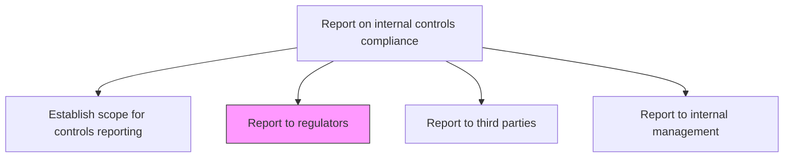
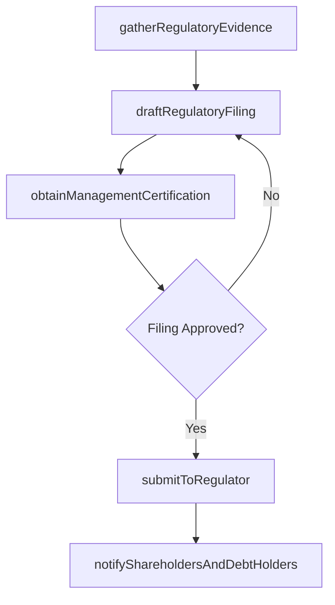

# Report to regulators, share-/debt-holders, securities exchanges, etc.

> Business-as-Code definition for regulatory compliance reporting. Models the preparation and submission of internal controls compliance reports to regulators, securities exchanges, shareholders, and debt holders.

## Overview

Preparing and submitting internal controls compliance reports to regulators, securities exchanges, shareholders, and debt holders as required by applicable laws and listing requirements. This process gathers control testing evidence and management assertions, drafts formal regulatory filings such as SOX Section 302 and 404 certifications, and secures CEO and CFO sign-off on internal controls effectiveness attestations. Filed documents are submitted through regulatory portals such as EDGAR, and relevant disclosures are distributed to investors and debt covenant holders to satisfy transparency requirements.

## Process Hierarchy



## GraphDL

```yaml
report:
  object: To Regulators, Share-/debt-holders, Securities Exchanges, Etc.
  actor: RegulatoryReportingManager
  result: RegulatoryFiling
```

## Actions

| Action | Description |
|--------|-------------|
| gatherRegulatoryEvidence | Collect control testing evidence and management assertions for regulatory filings |
| draftRegulatoryFiling | Prepare the formal filing document (e.g., SOX 302/404 certification, SEC disclosures) |
| obtainManagementCertification | Secure CEO/CFO sign-off on internal controls effectiveness assertions |
| submitToRegulator | File the completed report with the SEC, stock exchange, or other regulatory body |
| notifyShareholdersAndDebtHolders | Distribute relevant controls disclosures to investors and debt covenant holders |

## Events

| Event | Description |
|-------|-------------|
| regulatoryEvidenceGathered | All supporting evidence compiled for the filing period |
| regulatoryFilingDrafted | Formal regulatory filing document prepared |
| managementCertificationObtained | CEO/CFO certifications signed and documented |
| filingSubmittedToRegulator | Filing submitted to the regulatory authority |
| stakeholdersNotified | Shareholders and debt holders received required disclosures |

## Searches

| Search | Description |
|--------|-------------|
| findFilingDeadlines | List upcoming regulatory filing deadlines by jurisdiction and type |
| getFilingStatus | Retrieve preparation status for a specific regulatory filing |
| getFilingHistory | Query historical filings by regulator, period, or filing type |
| getCertificationLog | Retrieve management certification records and sign-off dates |

## Process Flow



## RACI Matrix

| Activity | Responsible | Accountable | Consulted | Informed |
|----------|-------------|-------------|-----------|----------|
| gatherRegulatoryEvidence | RegulatoryReportingManager | ChiefAuditExecutive | ControlOwners | ExternalAuditor |
| draftRegulatoryFiling | RegulatoryReportingManager | CFO | GeneralCounsel | BoardAuditCommittee |
| obtainManagementCertification | CFO | CEO | GeneralCounsel | BoardAuditCommittee |
| submitToRegulator | RegulatoryReportingManager | CFO | ExternalAuditor | InvestorRelations |
| notifyShareholdersAndDebtHolders | InvestorRelationsManager | CFO | GeneralCounsel | CEO |

## Related Processes

| Process | Relationship |
|---------|-------------|
| 9.8.4 Report on internal controls compliance | Parent - component of compliance reporting |
| 9.8.4.3 Report to third parties | Sibling - third-party attestation reporting |
| 9.8.4.4 Report to internal management | Sibling - internal management reporting |
| 9.8.2 Operate controls and monitor compliance | Upstream - provides control testing evidence |

## Related Departments

| Department | Role |
|-----------|------|
| Compliance | Prepares and manages regulatory filings |
| Legal | Reviews filings for legal accuracy and regulatory alignment |
| Internal Audit | Provides control testing evidence and management assertions |
| Investor Relations | Coordinates disclosures to shareholders and debt holders |

## Related Occupations

| Occupation | Involvement |
|-----------|-------------|
| Regulatory Reporting Manager | Prepares and submits regulatory filings |
| Chief Audit Executive | Oversees controls evidence gathering |
| General Counsel | Reviews filings for legal compliance |

## KPIs

| KPI | Description | Unit |
|-----|-------------|------|
| Filing Timeliness | Percentage of regulatory filings submitted before deadline | % |
| Filing Accuracy | Number of regulator-requested amendments or restatements | Count |
| Certification Turnaround | Average days from draft completion to management certification | Days |
| Disclosure Completeness | Percentage of required disclosures included in filings | % |
| Regulator Comment Rate | Number of comment letters received per filing cycle | Count |

## Usage

```typescript
import { reportToRegulators } from '@headlessly/report-to-regulators-share-debt-holders-securities-exchanges-etc'

const regulatory = reportToRegulators()

// Gather evidence for SOX 404 filing
const evidence = await regulatory.gatherRegulatoryEvidence({
  filingType: 'SOX-404',
  period: '2024-FY',
  regulator: 'SEC'
})

// Draft the regulatory filing
const filing = await regulatory.draftRegulatoryFiling({
  evidenceId: evidence.id,
  template: 'annual-10K-controls-disclosure',
  assertionType: 'management-assessment'
})

// Submit to the regulator after certification
await regulatory.submitToRegulator({
  filingId: filing.id,
  regulator: 'SEC',
  submissionMethod: 'EDGAR'
})
```
