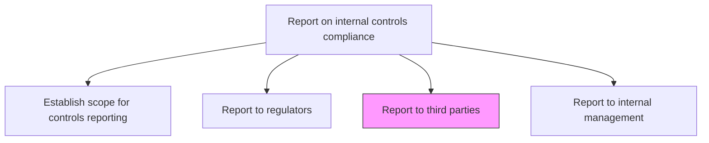
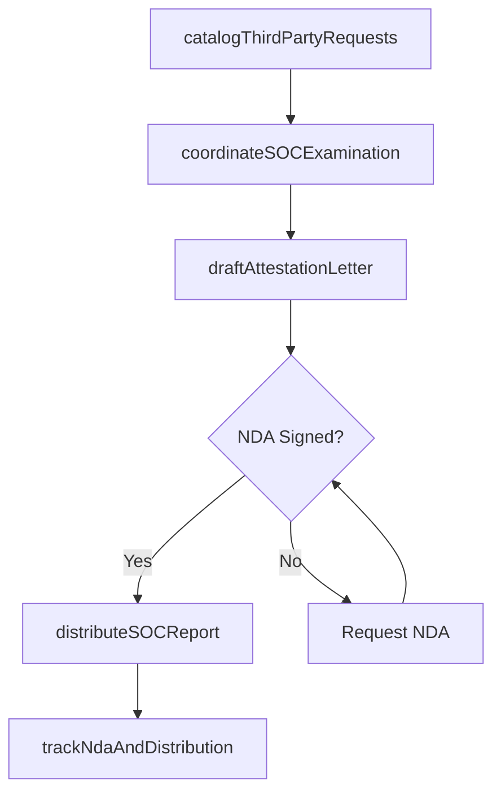

# Report to third parties

> Business-as-Code definition for third-party compliance reporting. Models the generation and delivery of controls compliance attestations to customers, suppliers, and business partners.

## Overview

Generating and delivering controls compliance attestations, SOC reports, and bridge letters to customers, suppliers, and business partners who require assurance about the organization's internal control environment. This process catalogs inbound attestation requests, coordinates SOC 2 Type II examinations with external auditors, prepares formal attestation letters, and distributes completed reports under NDA to requesting third parties. Timely fulfillment of these requests supports customer trust, enables contract compliance, and facilitates business partner due diligence processes.

## Process Hierarchy



## GraphDL

```yaml
report:
  object: To Third Parties
  actor: ComplianceAnalyst
  result: ThirdPartyAttestation
```

## Actions

| Action | Description |
|--------|-------------|
| catalogThirdPartyRequests | Inventory all customer, supplier, and partner compliance questionnaire and attestation requests |
| coordinateSOCExamination | Manage the SOC 2 Type II or similar third-party audit engagement with external auditors |
| draftAttestationLetter | Prepare formal controls attestation letters or bridge letters for business partners |
| distributeSOCReport | Send completed SOC reports and attestation documents to requesting third parties |
| trackNdaAndDistribution | Maintain NDA records and distribution logs for shared compliance documentation |

## Events

| Event | Description |
|-------|-------------|
| thirdPartyRequestsCataloged | All inbound attestation requests inventoried and prioritized |
| socExaminationCoordinated | External audit engagement scheduled and evidence gathering complete |
| attestationLetterDrafted | Formal attestation letter prepared and reviewed |
| socReportDistributed | SOC report or attestation delivered to requesting third party |
| distributionLogUpdated | NDA and distribution tracking records updated |

## Searches

| Search | Description |
|--------|-------------|
| findAttestationRequests | List pending third-party attestation requests by requester, type, or deadline |
| getSOCReportStatus | Retrieve the current status of SOC report preparation and audit engagement |
| getDistributionLog | Query attestation distribution history by third party or report type |
| getAttestationArchive | Retrieve historical attestation letters and bridge letters |

## Process Flow



## RACI Matrix

| Activity | Responsible | Accountable | Consulted | Informed |
|----------|-------------|-------------|-----------|----------|
| catalogThirdPartyRequests | ComplianceAnalyst | ComplianceDirector | SalesOperations | AccountManagement |
| coordinateSOCExamination | ComplianceDirector | ChiefAuditExecutive | ExternalAuditor | CFO |
| draftAttestationLetter | ComplianceAnalyst | ComplianceDirector | GeneralCounsel | InternalAuditManager |
| distributeSOCReport | ComplianceAnalyst | ComplianceDirector | LegalCounsel | AccountManagement |

## Related Processes

| Process | Relationship |
|---------|-------------|
| 9.8.4 Report on internal controls compliance | Parent - component of compliance reporting |
| 9.8.4.2 Report to regulators, share-/debt-holders, securities exchanges, etc. | Sibling - regulatory reporting using similar evidence |
| 9.8.4.4 Report to internal management | Sibling - internal management reporting |
| 9.8.2 Operate controls and monitor compliance | Upstream - provides control testing evidence for attestation |

## Related Departments

| Department | Role |
|-----------|------|
| Compliance | Prepares and distributes attestation documentation |
| Legal | Reviews NDAs and attestation letters for contractual accuracy |
| Internal Audit | Provides control testing evidence for SOC examinations |
| Sales Operations | Routes inbound customer compliance requests |

## Related Occupations

| Occupation | Involvement |
|-----------|-------------|
| Compliance Analyst | Prepares attestation documents and manages distribution |
| External Auditor | Conducts SOC examinations and issues reports |
| Account Manager | Relays third-party requests and delivers final reports |

## KPIs

| KPI | Description | Unit |
|-----|-------------|------|
| Attestation Response Time | Average days from third-party request to report delivery | Days |
| Request Fulfillment Rate | Percentage of third-party requests completed on time | % |
| SOC Report Currency | Age of the most recent SOC report | Months |
| NDA Compliance Rate | Percentage of distributions covered by valid NDAs | % |
| Third-Party Satisfaction | Survey score from attestation recipients | Score (1-5) |

## Usage

```typescript
import { reportToThirdParties } from '@headlessly/report-to-third-parties'

const thirdParty = reportToThirdParties()

// Catalog incoming attestation requests
const requests = await thirdParty.catalogThirdPartyRequests({
  period: '2024-Q4',
  status: 'pending'
})

// Draft an attestation letter for a customer
const attestation = await thirdParty.draftAttestationLetter({
  requestId: requests[0].id,
  type: 'SOC2-bridge-letter',
  recipient: 'Acme Corp'
})

// Distribute the SOC report after NDA verification
await thirdParty.distributeSOCReport({
  reportId: 'SOC2-2024',
  recipientId: requests[0].requesterId,
  deliveryMethod: 'secure-portal'
})
```
