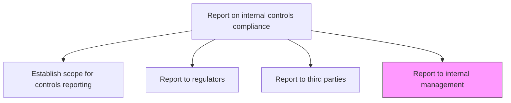
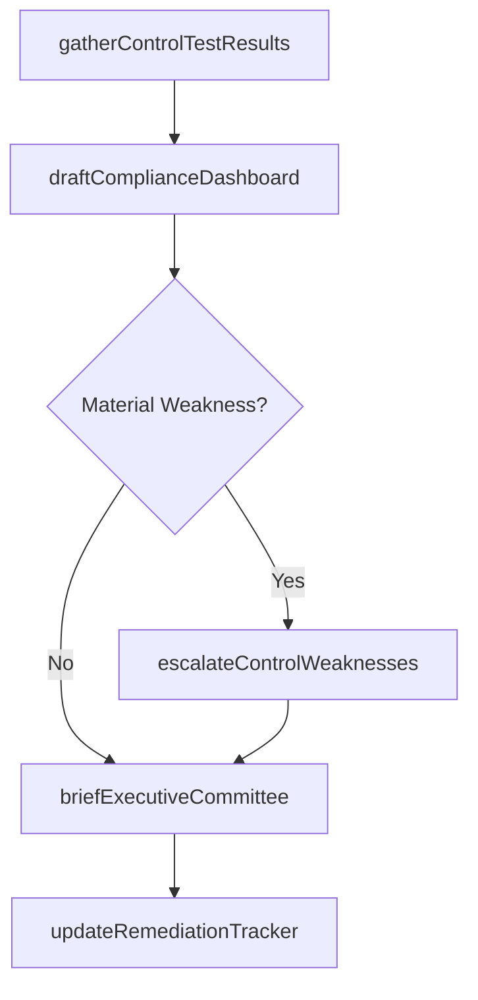

# Report to internal management

> Business-as-Code definition for internal management compliance reporting. Models the creation and distribution of controls status dashboards, finding summaries, and remediation updates to executive management.

## Overview

Creating and distributing internal controls status dashboards, control testing finding summaries, and remediation progress updates to executive management, the audit committee, and business unit leaders. This process compiles control testing outcomes and exception data, drafts executive-level compliance dashboards highlighting risk exposures and trending issues, and facilitates management briefings with documented decisions and action items. Material weaknesses and significant deficiencies are escalated immediately to senior management for urgent attention and remediation prioritization.

## Process Hierarchy



## GraphDL

```yaml
report:
  object: To Internal Management
  actor: InternalReportingAnalyst
  result: ManagementDashboard
```

## Actions

| Action | Description |
|--------|-------------|
| gatherControlTestResults | Collect testing outcomes, exceptions, and remediation status from internal audit |
| draftComplianceDashboard | Prepare an executive-level summary of control effectiveness and risk exposure |
| briefExecutiveCommittee | Present findings and remediation timelines to the executive management team |
| escalateControlWeaknesses | Flag material weaknesses or significant deficiencies for immediate management attention |
| updateRemediationTracker | Record management decisions and track remediation action items to closure |

## Events

| Event | Description |
|-------|-------------|
| controlTestResultsGathered | All control testing data compiled for the reporting period |
| complianceDashboardDrafted | Executive dashboard prepared and ready for review |
| executiveCommitteeBriefed | Management briefing completed with documented decisions |
| controlWeaknessEscalated | Material weakness or significant deficiency flagged to management |
| remediationTrackerUpdated | Action items and remediation status recorded |

## Searches

| Search | Description |
|--------|-------------|
| findControlFindings | List control findings filtered by severity, owner, or status |
| getComplianceDashboard | Retrieve the latest executive compliance dashboard |
| getRemediationStatus | Query remediation progress by finding or control area |
| getReportArchive | Query historical internal reports by period and audience |

## Process Flow



## RACI Matrix

| Activity | Responsible | Accountable | Consulted | Informed |
|----------|-------------|-------------|-----------|----------|
| gatherControlTestResults | InternalAuditManager | ChiefAuditExecutive | ControlOwners | ComplianceOfficer |
| draftComplianceDashboard | InternalReportingAnalyst | ChiefAuditExecutive | RiskManagement | CFO |
| briefExecutiveCommittee | ChiefAuditExecutive | CFO | GeneralCounsel | BoardAuditCommittee |
| escalateControlWeaknesses | ChiefAuditExecutive | CFO | GeneralCounsel | CEO |
| updateRemediationTracker | InternalReportingAnalyst | InternalAuditManager | ControlOwners | ComplianceOfficer |

## Related Processes

| Process | Relationship |
|---------|-------------|
| 9.8.4 Report on internal controls compliance | Parent - component of compliance reporting |
| 9.8.4.2 Report to regulators, share-/debt-holders, securities exchanges, etc. | Sibling - external regulatory reporting |
| 9.8.4.3 Report to third parties | Sibling - third-party attestation reporting |
| 9.8.2 Operate controls and monitor compliance | Upstream - provides control testing data |

## Related Departments

| Department | Role |
|-----------|------|
| Internal Audit | Conducts control testing and gathers findings |
| Compliance | Maintains regulatory mapping and reporting templates |
| Risk Management | Provides enterprise risk context for findings |
| Finance | Consumes reports for financial reporting decisions |

## Related Occupations

| Occupation | Involvement |
|-----------|-------------|
| Internal Reporting Analyst | Prepares dashboards and tracking reports |
| Chief Audit Executive | Owns the reporting process and presents to management |
| Compliance Officer | Reviews regulatory alignment of findings |

## KPIs

| KPI | Description | Unit |
|-----|-------------|------|
| Report Timeliness | Percentage of internal reports delivered by deadline | % |
| Finding Closure Rate | Percentage of findings remediated within target period | % |
| Dashboard Accuracy | Number of post-distribution corrections required | Count |
| Escalation Response Time | Average time from weakness identification to management notification | Days |
| Control Coverage | Percentage of key controls tested and reported on | % |

## Usage

```typescript
import { reportToInternalManagement } from '@headlessly/report-to-internal-management'

const reporting = reportToInternalManagement()

// Gather control test results for Q4
const findings = await reporting.gatherControlTestResults({
  period: '2024-Q4',
  scope: 'SOX-key-controls'
})

// Draft executive compliance dashboard
const dashboard = await reporting.draftComplianceDashboard({
  findings: findings.id,
  format: 'executive-summary',
  includeRemediationStatus: true
})

// Brief the executive committee
await reporting.briefExecutiveCommittee({
  dashboardId: dashboard.id,
  audience: ['CFO', 'CEO', 'GeneralCounsel'],
  scheduledDate: '2025-01-15'
})
```
