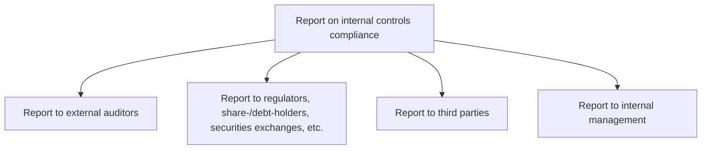
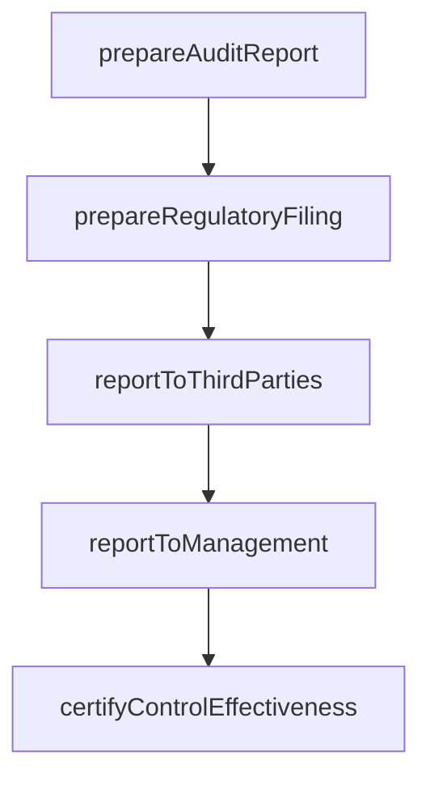

# Report on internal controls compliance

> Business-as-Code definition for internal controls compliance reporting. Models the preparation and delivery of control compliance reports to external auditors, regulators, securities exchanges, third parties, and internal management.

## Overview

Reporting on internal controls compliance to the appropriate authority, including IT regulations and pertinent data.

## Process Hierarchy



## GraphDL

```yaml
report:
  object: On Internal Controls Compliance
  actor: ComplianceReportingManager
  result: ComplianceReport
```

## Actions

| Action | Description |
|--------|-------------|
| prepareAuditReport | Compile control testing results and findings for external auditors |
| prepareRegulatoryFiling | Draft compliance reports for regulators and securities exchanges |
| reportToThirdParties | Generate compliance attestations for business partners and customers |
| reportToManagement | Produce internal management reports on control status and findings |
| certifyControlEffectiveness | Issue formal management certification of internal control adequacy |

## Events

| Event | Description |
|-------|-------------|
| auditReportPrepared | External audit report compiled and reviewed |
| regulatoryFilingPrepared | Regulatory compliance report drafted |
| thirdPartyReportDelivered | Compliance attestation provided to business partner |
| managementReportDelivered | Internal control status report distributed to management |
| controlEffectivenessCertified | Management certification of controls issued |

## Searches

| Search | Description |
|--------|-------------|
| getComplianceReports | Retrieve compliance reports by audience, period, or framework |
| getFilingDeadlines | List upcoming regulatory filing dates and status |
| getCertificationStatus | Query management certification status by entity |

## Process Flow



## RACI Matrix

| Activity | Responsible | Accountable | Consulted | Informed |
|----------|-------------|-------------|-----------|----------|
| prepareAuditReport | ComplianceReportingManager | ChiefAuditExecutive | ExternalAuditor | CFO |
| prepareRegulatoryFiling | ComplianceReportingManager | ComplianceOfficer | LegalCounsel | Board |
| reportToManagement | ComplianceAnalyst | ChiefAuditExecutive | Controller | ExecutiveTeam |
| certifyControlEffectiveness | Controller | CFO | ExternalAuditor | Board |

## Sub-Processes

| ID | Name | Description |
|----|------|-------------|
| 9.8.4.1 | Report to external auditors | Reporting to external auditors. This process requires the organization to report to external auditor |
| 9.8.4.2 | Report to regulators, share-/debt-holders, securities exchanges, etc. | Reporting to regulators, shareholders, debt holders, securities exchanges, etc. about IT regulations |
| 9.8.4.3 | Report to third parties | Reporting to suppliers, customers, and partners that are doing business with the company about IT re |
| 9.8.4.4 | Report to internal management | Reporting to internal management (all employees, directors, and management) about IT regulations and |

## Related Processes

| Process | Relationship |
|---------|-------------|
| 9.8.2 Operate controls and monitor compliance | Upstream - testing results provide content for reports |
| 9.8.3 Manage and monitor compliance function | Upstream - compliance activities generate reportable data |
| 9.3 Perform general accounting and reporting | Parallel - financial reporting relies on controls compliance |

## Related Departments

| Department | Role |
|-----------|------|
| Internal Audit | Provides control testing results for reporting |
| Compliance | Prepares and reviews compliance reports |
| Legal | Validates regulatory filing requirements |
| Finance | Supports management certification process |

## Related Occupations

| Occupation | Involvement |
|-----------|-------------|
| Compliance Reporting Manager | Prepares and coordinates all compliance reports |
| Chief Audit Executive | Reviews and approves audit-related reports |
| Corporate Secretary | Coordinates board reporting and filings |

## KPIs

| KPI | Description | Unit |
|-----|-------------|------|
| Reporting Timeliness | Percentage of reports delivered by deadline | % |
| Report Accuracy | Number of restatements or corrections per period | Count |
| Stakeholder Satisfaction | Satisfaction score from report recipients | Score (1-5) |
| Filing Compliance Rate | Percentage of regulatory filings submitted on time | % |

## Usage

```typescript
import { reportOnInternalControlsCompliance } from '@headlessly/report-on-internal-controls-compliance'

const reporting = reportOnInternalControlsCompliance()

// Prepare audit report for external auditors
const auditReport = await reporting.prepareAuditReport({
  period: 'FY-2024',
  framework: 'SOX-404',
  includeTestResults: true
})

// Report to internal management
const mgmtReport = await reporting.reportToManagement({
  audience: 'executive-committee',
  reportType: 'quarterly-controls-dashboard',
  period: 'Q1-2025'
})
```
