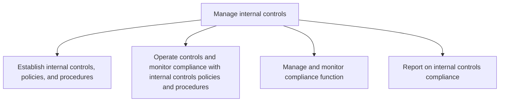
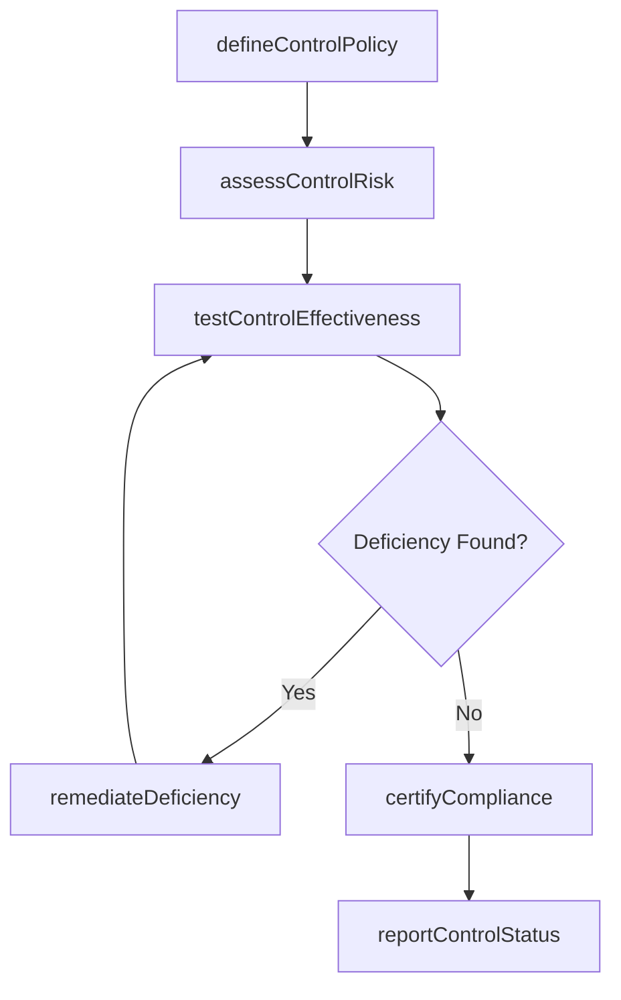

# Manage internal controls

> Business-as-Code definition for internal controls management. Models the establishment, operation, monitoring, and reporting of internal controls to ensure financial reporting reliability, operational effectiveness, and regulatory compliance.

## Overview

Administering internal controls. This process requires the organization to manage entity's board of trustees, management, and other personnel in order to offer judicious assurance about the achievement of effectiveness, proficiency of operations, and reliability of financial reporting.

## Process Hierarchy



## GraphDL

```yaml
manage:
  object: Internal Controls
  actor: InternalAuditor
  result: ControlAssessment
```

## Actions

| Action | Description |
|--------|-------------|
| defineControlPolicy | Establish internal control policies aligned with regulatory requirements |
| assessControlRisk | Evaluate risk levels for each business process and control point |
| testControlEffectiveness | Execute control testing procedures to verify operating effectiveness |
| remediateDeficiency | Address and resolve identified control weaknesses |
| certifyCompliance | Formally attest to the adequacy of internal controls |
| reportControlStatus | Generate compliance and control status reports for stakeholders |

## Events

| Event | Description |
|-------|-------------|
| controlPolicyDefined | Internal control policy documented and approved |
| controlRiskAssessed | Risk assessment completed for control environment |
| controlEffectivenessTested | Control testing cycle completed with findings |
| deficiencyRemediated | Control deficiency resolved and validated |
| complianceCertified | Formal compliance certification issued |
| controlStatusReported | Control status report delivered to stakeholders |

## Searches

| Search | Description |
|--------|-------------|
| getControlInventory | Retrieve all registered controls filtered by process area or risk level |
| getDeficiencies | List open control deficiencies by severity and remediation status |
| getComplianceStatus | Query current compliance posture across entities and frameworks |
| getAuditFindings | Retrieve audit findings by period, auditor, or control area |

## Process Flow



## RACI Matrix

| Activity | Responsible | Accountable | Consulted | Informed |
|----------|-------------|-------------|-----------|----------|
| defineControlPolicy | ComplianceOfficer | CFO | LegalCounsel | AuditCommittee |
| assessControlRisk | InternalAuditor | ChiefAuditExecutive | RiskManager | Controller |
| testControlEffectiveness | InternalAuditor | ChiefAuditExecutive | ProcessOwner | ExternalAuditor |
| remediateDeficiency | ProcessOwner | Controller | InternalAuditor | CFO |
| reportControlStatus | ChiefAuditExecutive | CFO | ExternalAuditor | BoardOfDirectors |

## Sub-Processes

| ID | Name | Description |
|----|------|-------------|
| 9.8.1 | Establish internal controls, policies, and procedures | Forming rules and regulations to ensure the achievement of effectiveness, proficiency of operations, |
| 9.8.2 | Operate controls and monitor compliance with internal controls policies and procedures | Incorporating planning, management, operations, and monitoring of internal control mechanism policie |
| 9.8.3 | Manage and monitor compliance function | Overseeing the compliance function including audit planning, execution, and capability management. |
| 9.8.4 | Report on internal controls compliance | Reporting on internal controls compliance to the appropriate authority, including IT regulations and |

## Related Processes

| Process | Relationship |
|---------|-------------|
| 9.1 Perform planning and management accounting | Upstream - planning data informs control design |
| 9.7 Manage treasury operations | Parallel - treasury controls governed by this process |
| 9.9 Manage taxes | Parallel - tax compliance requires control framework |
| 9.4 Manage fixed-asset project accounting | Downstream - asset controls feed into reporting |

## Related Departments

| Department | Role |
|-----------|------|
| Internal Audit | Primary executor of control testing and assessment |
| Compliance | Establishes policies and monitors regulatory adherence |
| Finance | Process owner for financial controls |
| Legal | Advises on regulatory requirements and governance |
| IT | Manages system access controls and automated monitoring |

## Related Occupations

| Occupation | Involvement |
|-----------|-------------|
| Internal Auditor | Designs and executes control testing procedures |
| Compliance Officer | Oversees regulatory compliance framework |
| Chief Audit Executive | Strategic oversight of audit and control programs |
| External Auditor | Independent validation of control effectiveness |

## KPIs

| KPI | Description | Unit |
|-----|-------------|------|
| Control Deficiency Rate | Percentage of controls with identified deficiencies | % |
| Remediation Timeliness | Average days to remediate identified control gaps | Days |
| Audit Coverage | Percentage of key controls tested within the cycle | % |
| Material Weakness Count | Number of material weaknesses identified in reporting period | Count |
| Compliance Certification Rate | Percentage of entities with current compliance certification | % |

## Usage

```typescript
import { manageInternalControls } from '@headlessly/manage-internal-controls'

const controls = manageInternalControls()

// Assess control risk for revenue cycle processes
const riskAssessment = await controls.assessControlRisk({
  processArea: 'revenue-cycle',
  framework: 'COSO',
  fiscalYear: 2025
})

// Test effectiveness of segregation of duties controls
const testResults = await controls.testControlEffectiveness({
  controlId: 'SOD-AP-001',
  testType: 'walkthrough',
  sampleSize: 25
})
```
