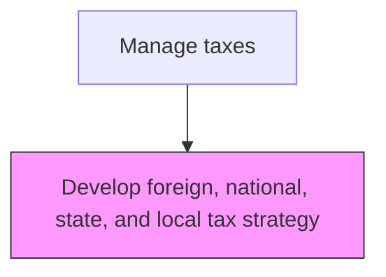
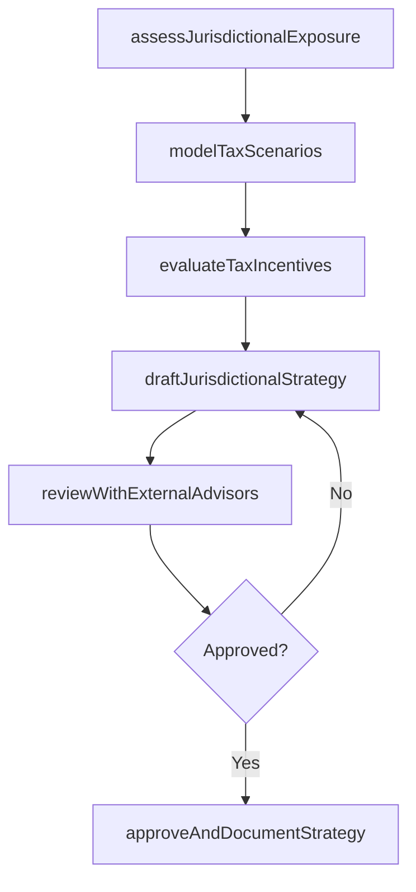

# Develop foreign, national, state, and local tax strategy

> Business-as-Code definition for multi-jurisdictional tax strategy development. Models the analysis and formulation of tax strategies across foreign, federal, state, and local jurisdictions to optimize the overall tax position.

## Overview

Developing a tax strategy for foreign, national, state, and local administration. This process involves analyzing the organization's tax nexus across all applicable jurisdictions, modeling the tax impact of different entity structures and election options, and identifying available credits and incentive programs. The resulting multi-jurisdictional strategy balances tax efficiency with regulatory compliance and supports the organization's overall financial objectives.

## Process Hierarchy



## GraphDL

```yaml
develop:
  object: Foreign, National, State, And Local Tax Strategy
  actor: TaxDirector
  result: JurisdictionalTaxStrategy
```

## Actions

| Action | Description |
|--------|-------------|
| assessJurisdictionalExposure | Analyze the organization's tax nexus and filing obligations across all jurisdictions |
| modelTaxScenarios | Run scenario analyses comparing tax positions under different entity structures and elections |
| evaluateTaxIncentives | Identify available credits, deductions, and incentive programs in each jurisdiction |
| draftJurisdictionalStrategy | Formulate the recommended tax strategy for federal, state, local, and foreign jurisdictions |
| reviewWithExternalAdvisors | Validate the strategy with external tax counsel and advisors |
| approveAndDocumentStrategy | Obtain CFO sign-off and publish the finalized multi-jurisdictional tax strategy |

## Events

| Event | Description |
|-------|-------------|
| jurisdictionalExposureAssessed | Tax nexus and filing obligations have been mapped across jurisdictions |
| taxScenariosModeled | Scenario analyses comparing tax positions have been completed |
| taxIncentivesEvaluated | Available credits and incentive programs have been identified |
| jurisdictionalStrategyDrafted | The recommended tax strategy has been formulated |
| externalReviewCompleted | External tax advisors have validated the strategy |
| strategyApproved | The multi-jurisdictional tax strategy has been formally approved |

## Searches

| Search | Description |
|--------|-------------|
| getJurisdictionalExposure | Retrieve the tax nexus analysis by jurisdiction type and entity |
| getTaxScenarioComparison | Return scenario analysis results comparing different tax structures |
| getAvailableIncentives | List tax credits and incentive programs by jurisdiction |
| getTaxStrategyDocument | Retrieve the current approved tax strategy document |

## Process Flow



## RACI Matrix

| Activity | Responsible | Accountable | Consulted | Informed |
|----------|-------------|-------------|-----------|----------|
| assessJurisdictionalExposure | TaxDirector | CFO | ExternalTaxAdvisor | Controller |
| modelTaxScenarios | SeniorTaxAnalyst | TaxDirector | FPAManager | CFO |
| draftJurisdictionalStrategy | TaxDirector | CFO | GeneralCounsel | AuditCommittee |
| approveAndDocumentStrategy | CFO | CEO | AuditCommittee | Board |

## Related Processes

| Process | Relationship |
|---------|-------------|
| 9.9.1.2 Consolidate and optimize total tax plan | Downstream - jurisdictional strategies feed the consolidated tax plan |
| 9.9.1.3 Maintain tax master data | Related - strategy drives master data requirements |
| 9.9.2.1 Perform tax planning/strategy | Consumer - approved strategy guides ongoing tax planning |

## Related Departments

| Department | Role |
|-----------|------|
| Tax | Primary owner of jurisdictional tax strategy development |
| Legal | Advises on entity structure and regulatory compliance |
| Treasury | Provides data on international cash flows and funding structures |
| Financial Planning and Analysis | Supplies financial projections for scenario modeling |

## Related Occupations

| Occupation | Involvement |
|-----------|-------------|
| Tax Director | Leads strategy formulation across jurisdictions |
| Senior Tax Analyst | Performs scenario modeling and incentive analysis |
| External Tax Advisor | Provides specialized jurisdiction-specific guidance |

## KPIs

| KPI | Description | Unit |
|-----|-------------|------|
| Effective Tax Rate | Consolidated effective tax rate versus statutory rate | % |
| Tax Savings from Incentives | Total value of tax credits and incentives captured | Currency |
| Strategy Review Frequency | Number of times the strategy is reviewed and updated per year | Per Year |
| Jurisdictional Compliance Rate | Percentage of filing obligations met on time across all jurisdictions | % |

## Usage

```typescript
import { developForeignNationalStateAndLocalTaxStrategy } from '@headlessly/develop-foreign-national-state-and-local-tax-strategy'

const client = developForeignNationalStateAndLocalTaxStrategy()

// Assess jurisdictional tax exposure
const exposure = await client.assessJurisdictionalExposure({
  entities: ['US-PARENT', 'UK-SUB', 'DE-SUB'],
  fiscalYear: 2025,
  jurisdictionTypes: ['federal', 'state', 'foreign']
})

// Model tax scenarios for a restructuring
const scenarios = await client.modelTaxScenarios({
  baseCase: 'currentStructure',
  alternatives: ['holdingCompany', 'branchConversion'],
  projectionYears: 5
})
```
