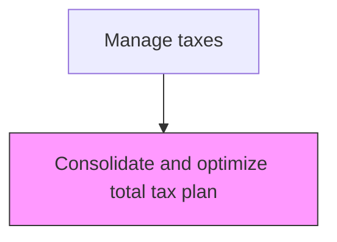
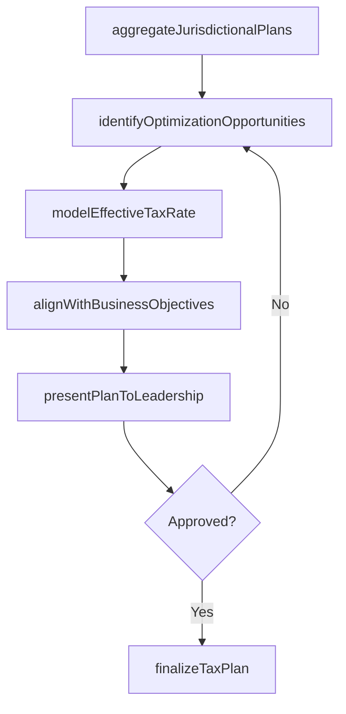

# Consolidate and optimize total tax plan

> Business-as-Code definition for total tax plan optimization. Models the consolidation of jurisdictional tax strategies into a unified plan and the optimization of the effective tax rate through structural and timing strategies.

## Overview

Combining and enhancing individual jurisdictional tax strategies into a unified, enterprise-wide tax plan that optimizes the overall effective tax rate. This process aggregates federal, state, local, and foreign tax positions to identify cross-jurisdictional efficiencies such as credit stacking, timing elections, and entity structure optimization. The consolidated plan aligns tax outcomes with corporate financial goals, cash flow targets, and strategic business objectives.

## Process Hierarchy



## GraphDL

```yaml
consolidate:
  object: And Optimize Total Tax Plan
  actor: TaxDirector
  result: ConsolidatedTaxPlan
```

## Actions

| Action | Description |
|--------|-------------|
| aggregateJurisdictionalPlans | Combine individual jurisdiction tax strategies into a consolidated view |
| identifyOptimizationOpportunities | Analyze the consolidated plan for credits, timing elections, and structural efficiencies |
| modelEffectiveTaxRate | Calculate the projected effective tax rate under the consolidated plan |
| alignWithBusinessObjectives | Ensure the tax plan supports corporate financial goals and cash flow targets |
| presentPlanToLeadership | Brief the CFO and audit committee on the consolidated tax plan and expected outcomes |
| finalizeTaxPlan | Document the approved plan with implementation milestones |

## Events

| Event | Description |
|-------|-------------|
| jurisdictionalPlansAggregated | Individual jurisdiction strategies have been combined |
| optimizationOpportunitiesIdentified | Tax efficiency opportunities have been cataloged |
| effectiveTaxRateModeled | The projected effective tax rate has been calculated |
| businessAlignmentConfirmed | The plan has been validated against corporate objectives |
| planPresentedToLeadership | The consolidated plan has been briefed to executive leadership |
| taxPlanFinalized | The approved plan has been documented with milestones |

## Searches

| Search | Description |
|--------|-------------|
| getConsolidatedTaxPlan | Retrieve the current consolidated tax plan document |
| getEffectiveTaxRateProjection | Return the projected effective tax rate by entity and jurisdiction |
| getOptimizationOpportunities | List identified tax optimization opportunities by category |
| getTaxPlanHistory | Query the revision history of consolidated tax plans |

## Process Flow



## RACI Matrix

| Activity | Responsible | Accountable | Consulted | Informed |
|----------|-------------|-------------|-----------|----------|
| aggregateJurisdictionalPlans | SeniorTaxAnalyst | TaxDirector | RegionalTaxManagers | Controller |
| modelEffectiveTaxRate | TaxDirector | CFO | ExternalTaxAdvisor | FPAManager |
| presentPlanToLeadership | TaxDirector | CFO | GeneralCounsel | AuditCommittee |
| finalizeTaxPlan | TaxDirector | CFO | Controller | Board |

## Related Processes

| Process | Relationship |
|---------|-------------|
| 9.9.1.1 Develop foreign, national, state, and local tax strategy | Upstream - jurisdictional strategies feed consolidation |
| 9.9.1.3 Maintain tax master data | Related - master data supports plan modeling |
| 9.9.2.1 Perform tax planning/strategy | Downstream - the consolidated plan guides ongoing tax execution |

## Related Departments

| Department | Role |
|-----------|------|
| Tax | Primary owner of total tax plan consolidation and optimization |
| Financial Planning and Analysis | Provides financial projections for effective rate modeling |
| Legal | Advises on entity structure implications |
| Treasury | Provides cash flow data for timing optimization |

## Related Occupations

| Occupation | Involvement |
|-----------|-------------|
| Tax Director | Leads consolidation and presents to leadership |
| Senior Tax Analyst | Performs modeling and identifies optimization opportunities |
| External Tax Advisor | Provides specialized guidance on complex structures |

## KPIs

| KPI | Description | Unit |
|-----|-------------|------|
| Effective Tax Rate | Actual vs. planned effective tax rate | % |
| Tax Savings Realized | Total value of optimization benefits captured | Currency |
| Plan Accuracy | Variance between projected and actual tax liability | % |
| Plan Completion Timeliness | Percentage of plan milestones met on schedule | % |

## Usage

```typescript
import { consolidateAndOptimizeTotalTaxPlan } from '@headlessly/consolidate-and-optimize-total-tax-plan'

const client = consolidateAndOptimizeTotalTaxPlan()

// Model the effective tax rate for the consolidated plan
const etrModel = await client.modelEffectiveTaxRate({
  fiscalYear: 2025,
  entities: ['US-PARENT', 'UK-SUB', 'DE-SUB', 'SG-SUB'],
  includeCredits: true,
  includeTimingElections: true
})

// Get optimization opportunities
const opportunities = await client.getOptimizationOpportunities({
  fiscalYear: 2025,
  minimumBenefit: 100000,
  category: 'all'
})
```
