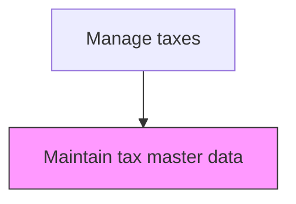
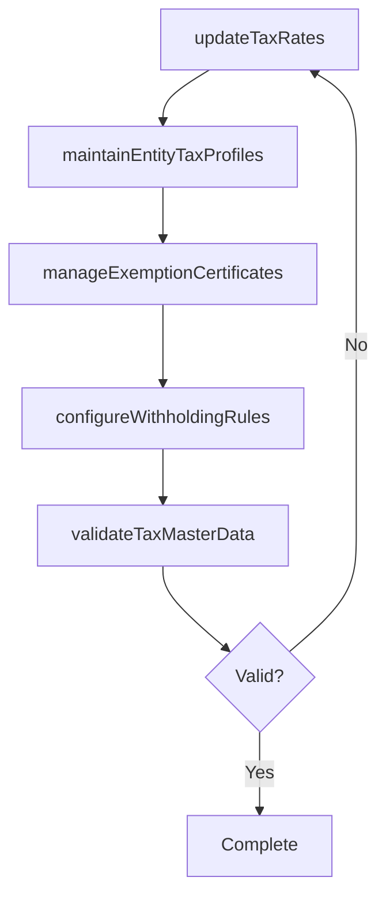

# Maintain tax master data

> Business-as-Code definition for tax master data maintenance. Models the ongoing update of tax rates, entity structures, exemption certificates, and jurisdictional tax rules in the organization's systems.

## Overview

Maintaining the authoritative repository of tax rates, entity registration profiles, exemption certificates, and withholding rules used across the organization's financial systems. This process ensures that the tax engine applies current jurisdictional rates, that entity nexus and filing statuses remain accurate, and that sales tax exemption certificates are renewed before expiration. Reliable tax master data is the foundation for accurate tax calculations, return preparation, and compliance monitoring.

## Process Hierarchy



## GraphDL

```yaml
maintain:
  object: Tax Master Data
  actor: TaxDataAdministrator
  result: TaxMasterDataset
```

## Actions

| Action | Description |
|--------|-------------|
| updateTaxRates | Apply current tax rates for all applicable jurisdictions in the tax engine |
| maintainEntityTaxProfiles | Update entity registration details, filing statuses, and jurisdictional nexus |
| manageExemptionCertificates | Track and renew sales tax exemption and resale certificates |
| configureWithholdingRules | Set up withholding tax rates and thresholds for payments to vendors and employees |
| validateTaxMasterData | Run data quality checks to ensure accuracy of rates, codes, and entity profiles |

## Events

| Event | Description |
|-------|-------------|
| taxRatesUpdated | Jurisdictional tax rates have been refreshed in the system |
| entityTaxProfileMaintained | An entity's tax registration or filing status has been updated |
| exemptionCertificateManaged | An exemption certificate has been added, renewed, or expired |
| withholdingRulesConfigured | Withholding tax rules have been updated in the system |
| taxMasterDataValidated | Data quality checks on tax master records have been completed |

## Searches

| Search | Description |
|--------|-------------|
| getTaxRatesByJurisdiction | Retrieve current tax rates for a specific jurisdiction and tax type |
| getEntityTaxProfile | Return the tax registration and filing status for a specific entity |
| getExpiringCertificates | List exemption certificates approaching their expiration date |
| getTaxDataAuditLog | Retrieve the change history for tax master data records |

## Process Flow



## RACI Matrix

| Activity | Responsible | Accountable | Consulted | Informed |
|----------|-------------|-------------|-----------|----------|
| updateTaxRates | TaxDataAdministrator | TaxManager | ExternalTaxAdvisor | Controller |
| maintainEntityTaxProfiles | TaxDataAdministrator | TaxManager | Legal | TaxDirector |
| manageExemptionCertificates | TaxDataAdministrator | TaxManager | SalesOperations | InternalAudit |
| validateTaxMasterData | TaxDataAdministrator | TaxManager | FinanceSystemsAdmin | Controller |

## Related Processes

| Process | Relationship |
|---------|-------------|
| 9.9.1.1 Develop foreign, national, state, and local tax strategy | Upstream - strategy drives master data requirements |
| 9.9.2 Process taxes | Consumer - tax processing depends on accurate master data |
| 9.6.1 Process accounts payable (AP) | Related - AP uses withholding tax rules from master data |

## Related Departments

| Department | Role |
|-----------|------|
| Tax | Primary owner of tax master data maintenance |
| Finance Systems | Maintains the tax engine and data integrations |
| Legal | Provides entity registration and nexus information |
| Sales Operations | Supplies exemption certificates from customers |

## Related Occupations

| Occupation | Involvement |
|-----------|-------------|
| Tax Data Administrator | Maintains rates, profiles, and certificates in the system |
| Tax Manager | Oversees data accuracy and compliance |
| ERP Administrator | Supports system configuration for tax data |

## KPIs

| KPI | Description | Unit |
|-----|-------------|------|
| Tax Rate Currency | Percentage of jurisdictional rates updated within 30 days of change | % |
| Certificate Expiration Rate | Percentage of exemption certificates expired without renewal | % |
| Data Quality Score | Percentage of tax master records passing validation checks | % |
| Update Cycle Time | Average days to apply a tax rate change in the system | Days |

## Usage

```typescript
import { maintainTaxMasterData } from '@headlessly/maintain-tax-master-data'

const client = maintainTaxMasterData()

// Update tax rates for a jurisdiction
const update = await client.updateTaxRates({
  jurisdiction: 'US-CA',
  taxType: 'salesTax',
  newRate: 0.0725,
  effectiveDate: '2025-04-01'
})

// Get expiring exemption certificates
const expiring = await client.getExpiringCertificates({
  daysUntilExpiration: 60,
  jurisdiction: 'all'
})
```
