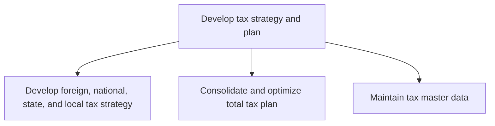
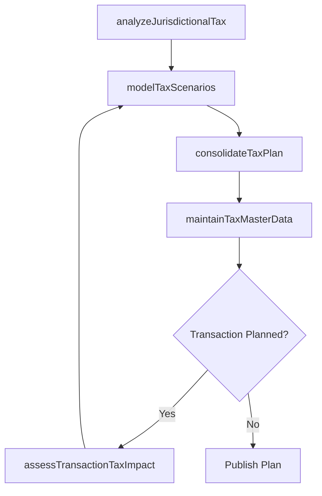

# Develop tax strategy and plan

> Business-as-Code definition for tax strategy and planning. Models the development of multi-jurisdictional tax strategies, consolidation and optimization of the total tax plan, and maintenance of tax master data to minimize effective tax rates while ensuring compliance.

## Overview

Setting targets for periodic tax liabilities. Assess the tax impact of various activities such as the acquisition or disposal of fixed assets or a deliberate change in number of employee.

## Process Hierarchy



## GraphDL

```yaml
develop:
  object: Tax Strategy And Plan
  actor: TaxDirector
  result: TaxStrategyPlan
```

## Actions

| Action | Description |
|--------|-------------|
| analyzeJurisdictionalTax | Evaluate tax implications across foreign, national, state, and local jurisdictions |
| modelTaxScenarios | Create financial models comparing tax outcomes of strategic alternatives |
| consolidateTaxPlan | Combine jurisdictional strategies into an optimized total tax plan |
| maintainTaxMasterData | Update tax rates, entity structures, and exemption records |
| assessTransactionTaxImpact | Evaluate tax consequences of planned acquisitions or dispositions |

## Events

| Event | Description |
|-------|-------------|
| jurisdictionalTaxAnalyzed | Tax analysis completed for a specific jurisdiction |
| taxScenariosModeled | Tax scenario modeling completed with recommendations |
| taxPlanConsolidated | Total tax plan optimized across all jurisdictions |
| taxMasterDataMaintained | Tax reference data updated |
| transactionTaxImpactAssessed | Tax impact of proposed transaction evaluated |

## Searches

| Search | Description |
|--------|-------------|
| getTaxRatesByJurisdiction | Retrieve current tax rates by jurisdiction and tax type |
| getTaxPlanStatus | Query status of the annual tax strategy plan |
| getEntityTaxStructure | List entity legal structures and tax classifications |

## Process Flow



## RACI Matrix

| Activity | Responsible | Accountable | Consulted | Informed |
|----------|-------------|-------------|-----------|----------|
| analyzeJurisdictionalTax | TaxManager | TaxDirector | ExternalTaxAdvisor | CFO |
| consolidateTaxPlan | TaxDirector | CFO | Controller | Board |
| maintainTaxMasterData | TaxAnalyst | TaxManager | ITSystems | TaxTeam |

## Sub-Processes

| ID | Name | Description |
|----|------|-------------|
| 9.9.1.1 | Develop foreign, national, state, and local tax strategy | Developing a tax strategy for foreign, national, state, local administration. Set up tax strategies  |
| 9.9.1.2 | Consolidate and optimize total tax plan | Combining and enhancing a rational analysis of a financial condition or plan from a tax perspective  |
| 9.9.1.3 | Maintain tax master data | Maintaining a master file about the rational analysis of a financial condition or plan from a tax pe |

## Related Processes

| Process | Relationship |
|---------|-------------|
| 9.9.2 Process taxes | Downstream - tax strategy guides return preparation and compliance |
| 9.3 Perform general accounting and reporting | Upstream - financial data informs tax planning |
| 9.10 Manage international funds/consolidation | Parallel - international structure affects tax planning |

## Related Departments

| Department | Role |
|-----------|------|
| Tax | Develops and maintains the tax strategy and plan |
| Finance | Provides financial projections for tax scenario modeling |
| Legal | Advises on entity structuring and regulatory requirements |
| Strategy | Communicates planned transactions requiring tax analysis |

## Related Occupations

| Occupation | Involvement |
|-----------|-------------|
| Tax Director | Leads strategic tax planning across jurisdictions |
| Tax Manager | Manages jurisdictional tax analysis and scenario modeling |
| Transfer Pricing Specialist | Evaluates intercompany pricing impacts on tax plan |

## KPIs

| KPI | Description | Unit |
|-----|-------------|------|
| Effective Tax Rate | Total tax expense as a percentage of pre-tax income | % |
| Tax Planning Savings | Tax reduction achieved through planning initiatives | Currency |
| Master Data Currency | Percentage of tax master data updated within the current period | % |

## Usage

```typescript
import { developTaxStrategyAndPlan } from '@headlessly/develop-tax-strategy-and-plan'

const taxStrategy = developTaxStrategyAndPlan()

// Model tax scenarios for a planned acquisition
const scenarios = await taxStrategy.modelTaxScenarios({
  transactionType: 'acquisition',
  targetEntity: 'Acme Corp',
  structures: ['asset-purchase', 'stock-purchase', 'merger'],
  jurisdictions: ['US-Federal', 'US-DE', 'UK']
})

// Consolidate the annual tax plan
const plan = await taxStrategy.consolidateTaxPlan({
  fiscalYear: 2025,
  targetEffectiveRate: 22.0,
  includeTransferPricing: true
})
```
