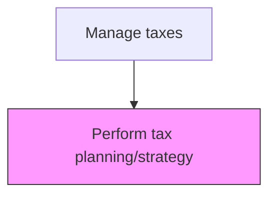
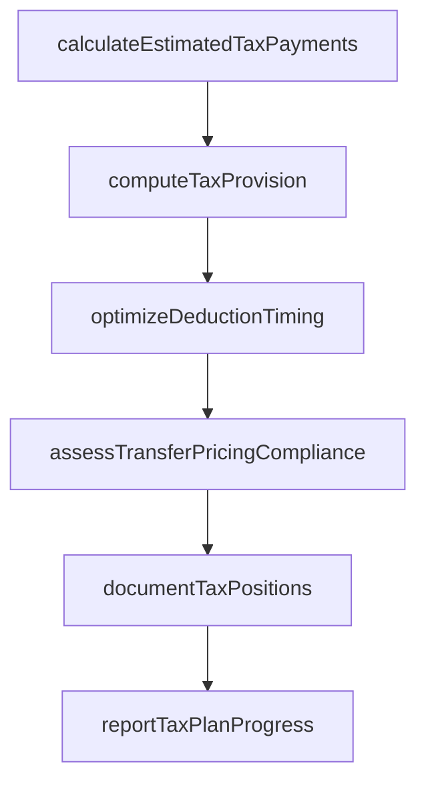

# Perform tax planning/strategy

> Business-as-Code definition for periodic tax planning execution. Models the implementation of tax strategies for the current period including estimated payments, provision calculations, and timing optimization.

## Overview

Creating and implementing strategies for taxes to be paid or collected by the business. This process translates the approved tax plan into periodic execution activities, including the calculation of estimated tax payments, computation of tax provisions for financial reporting, and optimization of deduction timing. It also encompasses transfer pricing compliance reviews and the documentation of uncertain tax positions to manage risk and ensure accurate financial statement disclosures.

## Process Hierarchy



## GraphDL

```yaml
perform:
  object: Tax Planning/strategy
  actor: TaxManager
  result: TaxPlanExecution
```

## Actions

| Action | Description |
|--------|-------------|
| calculateEstimatedTaxPayments | Compute quarterly estimated tax payments based on projected income and credits |
| computeTaxProvision | Calculate the current and deferred tax provision for financial reporting |
| optimizeDeductionTiming | Evaluate opportunities to accelerate or defer deductions for tax efficiency |
| assessTransferPricingCompliance | Review intercompany pricing to ensure arm's length compliance |
| documentTaxPositions | Record uncertain tax positions and their likelihood of sustainability |
| reportTaxPlanProgress | Communicate tax plan execution status and variance to leadership |

## Events

| Event | Description |
|-------|-------------|
| estimatedPaymentsCalculated | Quarterly estimated tax payments have been computed |
| taxProvisionComputed | The current and deferred tax provision has been calculated |
| deductionTimingOptimized | Deduction timing elections have been evaluated and applied |
| transferPricingAssessed | Intercompany pricing has been reviewed for compliance |
| taxPositionsDocumented | Uncertain tax positions have been recorded with risk assessments |
| taxPlanProgressReported | Tax plan execution status has been communicated to leadership |

## Searches

| Search | Description |
|--------|-------------|
| getEstimatedPaymentSchedule | Retrieve the estimated tax payment schedule by entity and jurisdiction |
| getTaxProvisionDetails | Return the current and deferred tax provision breakdown |
| getUncertainTaxPositions | List documented uncertain tax positions with sustainability assessments |
| getTaxPlanVariance | Compare actual tax results to the approved tax plan |

## Process Flow



## RACI Matrix

| Activity | Responsible | Accountable | Consulted | Informed |
|----------|-------------|-------------|-----------|----------|
| calculateEstimatedTaxPayments | TaxManager | TaxDirector | Controller | CFO |
| computeTaxProvision | TaxManager | TaxDirector | ExternalAuditor | Controller |
| assessTransferPricingCompliance | TransferPricingAnalyst | TaxDirector | ExternalTaxAdvisor | Legal |
| reportTaxPlanProgress | TaxDirector | CFO | Controller | AuditCommittee |

## Related Processes

| Process | Relationship |
|---------|-------------|
| 9.9.1.2 Consolidate and optimize total tax plan | Upstream - the consolidated plan guides execution |
| 9.9.2.2 Prepare tax returns | Downstream - planning outputs feed return preparation |
| 9.9.2.4 Calculate deferred taxes | Related - deferred tax calculations are part of provision |
| 9.3.4 Perform financial reporting | Consumer - tax provision is disclosed in financial statements |

## Related Departments

| Department | Role |
|-----------|------|
| Tax | Primary owner of tax planning execution |
| General Accounting | Provides ledger data for provision calculations |
| Treasury | Coordinates estimated tax payment cash flows |
| Financial Reporting | Includes tax provision in financial statements |

## Related Occupations

| Occupation | Involvement |
|-----------|-------------|
| Tax Manager | Executes tax planning activities and computes provisions |
| Transfer Pricing Analyst | Reviews intercompany pricing for arm's length compliance |
| Tax Director | Oversees plan execution and reports to leadership |

## KPIs

| KPI | Description | Unit |
|-----|-------------|------|
| Effective Tax Rate Variance | Difference between actual and planned effective tax rate | Basis Points |
| Provision Accuracy | Variance between estimated and final tax liability | % |
| Estimated Payment Accuracy | Difference between estimated and actual quarterly payments | Currency |
| Uncertain Position Coverage | Percentage of identified uncertain positions with documented reserves | % |

## Usage

```typescript
import { performTaxPlanningStrategy } from '@headlessly/perform-tax-planning-strategy'

const client = performTaxPlanningStrategy()

// Calculate quarterly estimated tax payments
const payments = await client.calculateEstimatedTaxPayments({
  entity: 'US-PARENT',
  fiscalYear: 2025,
  quarter: 'Q1',
  projectedTaxableIncome: 15000000
})

// Get the tax provision for financial reporting
const provision = await client.getTaxProvisionDetails({
  entity: 'CONSOLIDATED',
  period: '2024-12',
  includeDeferred: true
})
```
