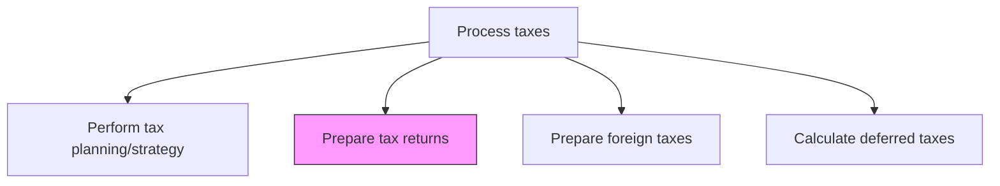
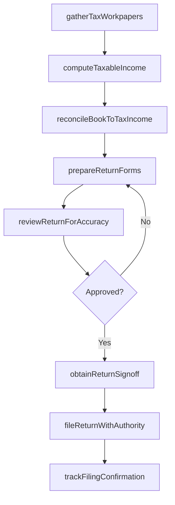

# Prepare tax returns

> Business-as-Code definition for tax return preparation. Models the compilation, review, and filing of corporate income tax returns across all applicable jurisdictions.

## Overview

Preparing and filing corporate income tax returns across all applicable federal, state, and local jurisdictions. This process involves gathering trial balance data and supporting workpapers, computing taxable income through book-to-tax adjustments, and completing the required return forms. Returns undergo multi-level review before obtaining authorized officer sign-off, are filed electronically with the taxing authority, and are tracked through acceptance confirmation.

## Process Hierarchy



## GraphDL

```yaml
prepare:
  object: Tax Returns
  actor: TaxAccountant
  result: TaxReturn
```

## Actions

| Action | Description |
|--------|-------------|
| gatherTaxWorkpapers | Collect trial balance data, schedules, and supporting workpapers for return preparation |
| computeTaxableIncome | Calculate taxable income by applying permanent and temporary adjustments to book income |
| prepareReturnForms | Complete federal, state, and local tax return forms with computed amounts |
| reconcileBookToTaxIncome | Document the reconciliation between book income and taxable income (Schedule M) |
| reviewReturnForAccuracy | Perform multi-level review of return calculations, disclosures, and elections |
| obtainReturnSignoff | Secure authorized officer signature and approval prior to filing |
| fileReturnWithAuthority | Electronically file or mail the completed return to the taxing authority |
| trackFilingConfirmation | Monitor receipt acknowledgments and resolve any rejection notices |

## Events

| Event | Description |
|-------|-------------|
| taxWorkpapersGathered | Trial balance and supporting schedules have been collected |
| taxableIncomeComputed | Taxable income adjustments have been calculated |
| returnFormsPrepared | Tax return forms have been completed with final amounts |
| bookToTaxReconciled | Book-to-tax income reconciliation has been documented |
| returnReviewCompleted | Multi-level review of the return has been finalized |
| returnSignoffObtained | Authorized officer has approved the return for filing |
| returnFiled | The tax return has been submitted to the taxing authority |
| filingConfirmationReceived | Acceptance confirmation from the taxing authority has been received |

## Searches

| Search | Description |
|--------|-------------|
| getReturnStatus | Retrieve the preparation and filing status of a tax return by entity and period |
| getTaxableIncomeReconciliation | Return the book-to-tax income reconciliation for a specific entity and year |
| getFilingCalendar | List upcoming filing deadlines by jurisdiction and entity |
| getReturnWorkpapers | Retrieve supporting workpapers and schedules for a specific return |
| getExtensionStatus | Check the status of filing extensions by entity and jurisdiction |

## Process Flow



## RACI Matrix

| Activity | Responsible | Accountable | Consulted | Informed |
|----------|-------------|-------------|-----------|----------|
| gatherTaxWorkpapers | TaxAccountant | TaxManager | GeneralLedgerAccountant | Controller |
| computeTaxableIncome | TaxAccountant | TaxManager | ExternalTaxAdvisor | TaxDirector |
| reviewReturnForAccuracy | TaxManager | TaxDirector | ExternalTaxAdvisor | CFO |
| obtainReturnSignoff | TaxDirector | CFO | GeneralCounsel | Controller |
| fileReturnWithAuthority | TaxAccountant | TaxManager | TaxDirector | CFO |

## Related Processes

| Process | Relationship |
|---------|-------------|
| 9.9.2.1 Perform tax planning/strategy | Upstream - planning outputs feed return preparation |
| 9.9.2.3 Prepare foreign taxes | Parallel - foreign return data consolidates into domestic filings |
| 9.9.2.4 Calculate deferred taxes | Related - deferred tax schedules are included in return workpapers |
| 9.9.2.5 Account for taxes | Downstream - filed returns trigger tax accounting entries |

## Related Departments

| Department | Role |
|-----------|------|
| Tax | Primary owner of return preparation and filing |
| General Accounting | Provides trial balance and general ledger data |
| Legal | Reviews disclosure positions and uncertain tax positions |
| Treasury | Coordinates tax payment funding upon filing |

## Related Occupations

| Occupation | Involvement |
|-----------|-------------|
| Tax Accountant | Prepares workpapers, computes taxable income, and completes return forms |
| Tax Manager | Reviews returns for accuracy and manages filing calendar |
| External Tax Advisor | Provides specialized guidance on complex return positions |

## KPIs

| KPI | Description | Unit |
|-----|-------------|------|
| On-Time Filing Rate | Percentage of returns filed by statutory or extended deadline | % |
| Return Accuracy Rate | Percentage of returns filed without subsequent amendment | % |
| Book-Tax Reconciliation Variance | Difference between estimated and actual book-to-tax adjustments | Currency |
| Preparation Cycle Time | Average days from period close to return filing | Days |

## Usage

```typescript
import { prepareTaxReturns } from '@headlessly/prepare-tax-returns'

const client = prepareTaxReturns()

// Compute taxable income for a specific entity and year
const taxableIncome = await client.computeTaxableIncome({
  entity: 'US-PARENT',
  fiscalYear: 2025,
  adjustments: ['depreciation', 'stockCompensation', 'mealEntertainment']
})

// Get the filing calendar for upcoming deadlines
const calendar = await client.getFilingCalendar({
  entity: 'US-PARENT',
  jurisdictions: ['federal', 'CA', 'NY'],
  includeExtensions: true
})
```
