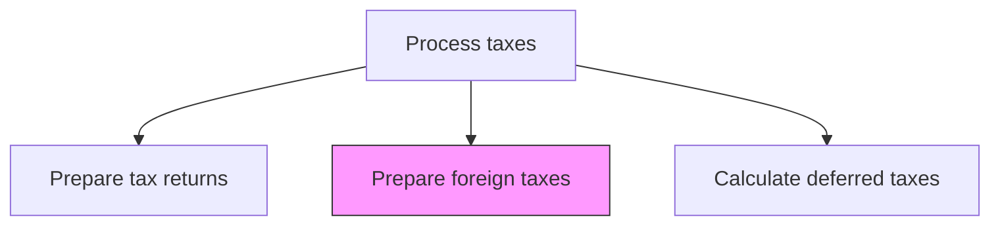
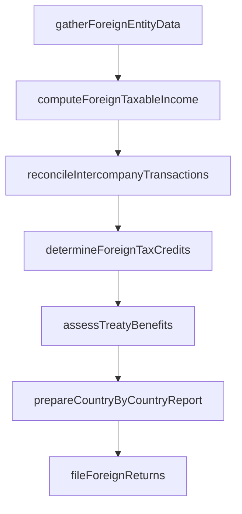

# Prepare foreign taxes

> Business-as-Code definition for foreign tax preparation. Models the calculation and documentation of tax obligations for international jurisdictions including foreign tax credits and treaty benefits.

## Overview

Preparing and filing tax obligations for international jurisdictions where the organization has foreign subsidiaries or taxable presence. This process includes gathering financial data from foreign entities, computing taxable income per local country rules, determining creditable foreign taxes for the domestic return, and evaluating tax treaty provisions. It also covers OECD Country-by-Country reporting for transfer pricing transparency and the reconciliation of intercompany transactions.

## Process Hierarchy



## GraphDL

```yaml
prepare:
  object: Foreign Taxes
  actor: InternationalTaxSpecialist
  result: ForeignTaxFiling
```

## Actions

| Action | Description |
|--------|-------------|
| gatherForeignEntityData | Collect financial statements and trial balances from foreign subsidiaries |
| computeForeignTaxableIncome | Calculate taxable income per local country tax rules for each foreign entity |
| determineForeignTaxCredits | Calculate creditable foreign taxes for the domestic return (Form 1118/FTC) |
| assessTreatyBenefits | Evaluate applicable tax treaty provisions to reduce withholding or double taxation |
| prepareCountryByCountryReport | Compile OECD Country-by-Country reporting for transfer pricing transparency |
| reconcileIntercompanyTransactions | Validate intercompany charges align with transfer pricing documentation |
| fileForeignReturns | Submit tax returns to foreign jurisdictions per local filing requirements |

## Events

| Event | Description |
|-------|-------------|
| foreignEntityDataGathered | Financial data from foreign subsidiaries has been collected |
| foreignTaxableIncomeComputed | Taxable income per local rules has been calculated for each entity |
| foreignTaxCreditsDetermined | Creditable foreign taxes have been computed for domestic return |
| treatyBenefitsAssessed | Applicable tax treaty provisions have been evaluated |
| countryByCountryReportPrepared | OECD CbCR has been compiled and is ready for filing |
| intercompanyTransactionsReconciled | Intercompany charges have been validated against transfer pricing policy |
| foreignReturnsFiled | Tax returns have been submitted to foreign jurisdictions |

## Searches

| Search | Description |
|--------|-------------|
| getForeignFilingCalendar | Retrieve filing deadlines by country and entity |
| getForeignTaxCreditSummary | Return the foreign tax credit pool and limitation calculation |
| getCountryByCountryData | Retrieve CbCR data including revenue, profit, taxes, and employee counts by jurisdiction |
| getTreatyBenefitAnalysis | List applicable treaty rates and benefits by country and income type |
| getWithholdingTaxSummary | Return withholding taxes paid or accrued by country and payment type |

## Process Flow



## RACI Matrix

| Activity | Responsible | Accountable | Consulted | Informed |
|----------|-------------|-------------|-----------|----------|
| computeForeignTaxableIncome | InternationalTaxSpecialist | TaxDirector | LocalTaxAdvisor | Controller |
| determineForeignTaxCredits | InternationalTaxSpecialist | TaxDirector | ExternalTaxAdvisor | CFO |
| assessTreatyBenefits | InternationalTaxSpecialist | TaxDirector | GeneralCounsel | TaxManager |
| prepareCountryByCountryReport | TransferPricingAnalyst | TaxDirector | ExternalTaxAdvisor | CFO |
| fileForeignReturns | InternationalTaxSpecialist | TaxDirector | LocalTaxAdvisor | Controller |

## Related Processes

| Process | Relationship |
|---------|-------------|
| 9.9.1.1 Develop foreign, national, state, and local tax strategy | Upstream - jurisdictional strategy guides foreign tax positions |
| 9.9.2.2 Prepare tax returns | Parallel - foreign tax credits feed into domestic return |
| 9.9.2.4 Calculate deferred taxes | Related - foreign temporary differences feed deferred tax calculations |
| 9.10 Manage international funds/consolidation | Related - international cash flows affect foreign tax obligations |

## Related Departments

| Department | Role |
|-----------|------|
| Tax | Primary owner of foreign tax return preparation and filing |
| International Finance | Provides foreign subsidiary financial data and intercompany balances |
| Treasury | Manages foreign currency remittances and withholding tax payments |
| Legal | Advises on entity structures and treaty eligibility |

## Related Occupations

| Occupation | Involvement |
|-----------|-------------|
| International Tax Specialist | Prepares foreign returns and computes foreign tax credits |
| Transfer Pricing Analyst | Validates intercompany pricing and prepares CbCR |
| Local Tax Advisor | Provides in-country filing guidance and compliance support |

## KPIs

| KPI | Description | Unit |
|-----|-------------|------|
| Foreign Filing Compliance Rate | Percentage of foreign returns filed on time across all jurisdictions | % |
| Foreign Tax Credit Utilization | Percentage of available foreign tax credits utilized in the current year | % |
| Withholding Tax Recovery Rate | Percentage of reclaimable withholding taxes successfully recovered | % |
| Transfer Pricing Adjustment Rate | Frequency of transfer pricing adjustments by tax authorities | Per Year |

## Usage

```typescript
import { prepareForeignTaxes } from '@headlessly/prepare-foreign-taxes'

const client = prepareForeignTaxes()

// Compute foreign taxable income for a subsidiary
const foreignIncome = await client.computeForeignTaxableIncome({
  entity: 'UK-SUB',
  fiscalYear: 2025,
  localCurrency: 'GBP',
  applyTreatyRates: true
})

// Get the foreign tax credit summary for the consolidated group
const ftcSummary = await client.getForeignTaxCreditSummary({
  parentEntity: 'US-PARENT',
  fiscalYear: 2025,
  basketType: 'general'
})
```
