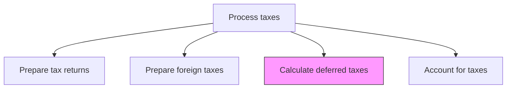
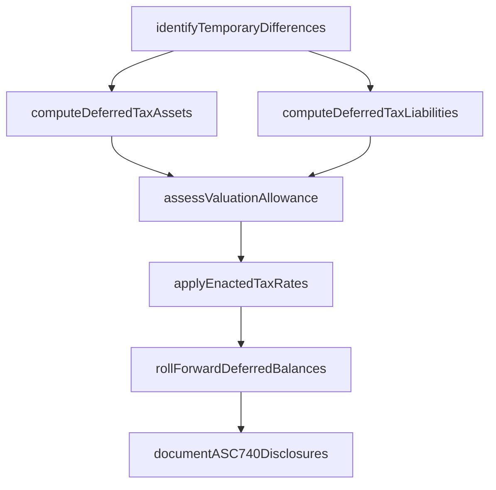

# Calculate deferred taxes

> Business-as-Code definition for deferred tax calculation. Models the computation of deferred tax assets and liabilities arising from temporary differences between book and tax basis of assets and liabilities.

## Overview

Calculating deferred tax assets and liabilities arising from temporary differences between the book and tax basis of assets and liabilities. This process identifies all timing differences such as depreciation, stock compensation, lease obligations, and reserves, then applies current and future enacted tax rates to compute deferred balances. It also includes the assessment of valuation allowances for deferred tax assets, roll-forward reconciliations, and the preparation of ASC 740 footnote disclosures for financial reporting.

## Process Hierarchy



## GraphDL

```yaml
calculate:
  object: Deferred Taxes
  actor: TaxAccountant
  result: DeferredTaxSchedule
```

## Actions

| Action | Description |
|--------|-------------|
| identifyTemporaryDifferences | Catalog all temporary differences between book and tax basis of assets and liabilities |
| computeDeferredTaxAssets | Calculate deferred tax assets from deductible temporary differences and carryforwards |
| computeDeferredTaxLiabilities | Calculate deferred tax liabilities from taxable temporary differences |
| assessValuationAllowance | Evaluate whether a valuation allowance is needed for deferred tax assets based on realizability |
| applyEnactedTaxRates | Apply current and future enacted tax rates to temporary differences by jurisdiction |
| rollForwardDeferredBalances | Reconcile opening to closing deferred tax balances and explain movements |
| documentASC740Disclosures | Prepare rate reconciliation and deferred tax footnote disclosures per ASC 740 |

## Events

| Event | Description |
|-------|-------------|
| temporaryDifferencesIdentified | All book-tax temporary differences have been cataloged |
| deferredTaxAssetsComputed | Deferred tax assets have been calculated |
| deferredTaxLiabilitiesComputed | Deferred tax liabilities have been calculated |
| valuationAllowanceAssessed | Realizability of deferred tax assets has been evaluated |
| enactedRatesApplied | Enacted tax rates have been applied to all temporary differences |
| deferredBalancesRolledForward | Opening-to-closing deferred balance reconciliation is complete |
| asc740DisclosuresPrepared | Tax footnote disclosures have been documented |

## Searches

| Search | Description |
|--------|-------------|
| getDeferredTaxSchedule | Retrieve the deferred tax asset and liability schedule by entity and period |
| getTemporaryDifferenceDetail | Return the breakdown of temporary differences by category |
| getValuationAllowanceAnalysis | Retrieve the valuation allowance assessment and supporting evidence |
| getDeferredTaxRollForward | Return the opening-to-closing deferred tax balance reconciliation |
| getRateReconciliation | Retrieve the effective tax rate reconciliation for ASC 740 disclosure |

## Process Flow



## RACI Matrix

| Activity | Responsible | Accountable | Consulted | Informed |
|----------|-------------|-------------|-----------|----------|
| identifyTemporaryDifferences | TaxAccountant | TaxManager | FixedAssetAccountant | Controller |
| assessValuationAllowance | TaxManager | TaxDirector | ExternalAuditor | CFO |
| applyEnactedTaxRates | TaxAccountant | TaxManager | ExternalTaxAdvisor | TaxDirector |
| documentASC740Disclosures | TaxManager | TaxDirector | ExternalAuditor | AuditCommittee |

## Related Processes

| Process | Relationship |
|---------|-------------|
| 9.9.2.1 Perform tax planning/strategy | Upstream - tax planning identifies expected temporary differences |
| 9.9.2.2 Prepare tax returns | Upstream - return data confirms actual temporary differences |
| 9.9.2.5 Account for taxes | Downstream - deferred tax amounts are recorded in the general ledger |
| 9.3.3.2 Establish tax and book depreciation policies | Related - depreciation policies create timing differences |

## Related Departments

| Department | Role |
|-----------|------|
| Tax | Primary owner of deferred tax calculations |
| General Accounting | Provides book basis data for temporary difference identification |
| Financial Reporting | Incorporates deferred tax disclosures into financial statements |
| External Audit | Reviews deferred tax positions and valuation allowance assessments |

## Related Occupations

| Occupation | Involvement |
|-----------|-------------|
| Tax Accountant | Calculates temporary differences and computes deferred tax balances |
| Tax Manager | Reviews valuation allowance assessments and rate reconciliation |
| External Auditor | Audits deferred tax positions and ASC 740 disclosures |

## KPIs

| KPI | Description | Unit |
|-----|-------------|------|
| Deferred Tax Accuracy | Variance between estimated and final deferred tax balances | % |
| Valuation Allowance Adequacy | Percentage of valuation allowance changes requiring restatement | % |
| Temporary Difference Coverage | Percentage of book-tax differences with documented support | % |
| Disclosure Preparation Cycle Time | Days from period close to completed ASC 740 footnote | Days |

## Usage

```typescript
import { calculateDeferredTaxes } from '@headlessly/calculate-deferred-taxes'

const client = calculateDeferredTaxes()

// Compute the deferred tax schedule for an entity
const schedule = await client.getDeferredTaxSchedule({
  entity: 'US-PARENT',
  period: '2025-12',
  includeValuationAllowance: true
})

// Get the temporary difference breakdown
const tempDiffs = await client.getTemporaryDifferenceDetail({
  entity: 'CONSOLIDATED',
  period: '2025-12',
  categories: ['depreciation', 'stockCompensation', 'leases', 'reserves']
})
```
