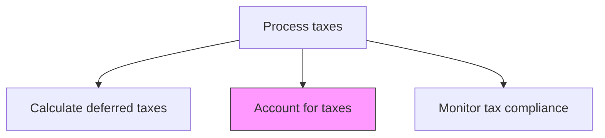
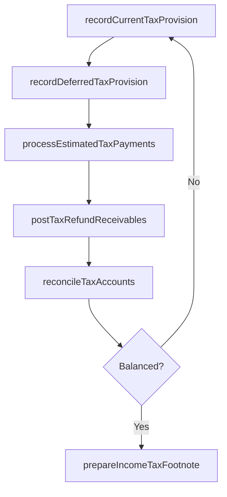

# Account for taxes

> Business-as-Code definition for tax accounting. Models the recording of current and deferred tax provisions, tax payments, and tax-related journal entries in the general ledger.

## Overview

Recording current and deferred tax provisions, estimated payments, refund receivables, and tax-related journal entries in the general ledger. This process ensures that income tax expense is properly recognized in each reporting period using the annual effective rate method for interim periods. It also encompasses the reconciliation of tax-related GL accounts to supporting schedules, and the compilation of income tax footnote data for financial statement disclosure.

## Process Hierarchy



## GraphDL

```yaml
account:
  object: For Taxes
  actor: TaxAccountant
  result: TaxJournalEntry
```

## Actions

| Action | Description |
|--------|-------------|
| recordCurrentTaxProvision | Post the current income tax expense and payable entries to the general ledger |
| recordDeferredTaxProvision | Post deferred tax asset and liability entries based on temporary difference calculations |
| reconcileTaxAccounts | Reconcile tax-related general ledger accounts to supporting schedules and returns |
| processEstimatedTaxPayments | Record estimated tax payments and reconcile against the current provision |
| postTaxRefundReceivables | Record tax refund receivables when overpayments or credit carrybacks are identified |
| prepareIncomeTaxFootnote | Compile the income tax footnote data for financial statement disclosure |
| closeInterimTaxProvision | Calculate and record the interim period tax provision using the annual effective rate method |

## Events

| Event | Description |
|-------|-------------|
| currentProvisionRecorded | Current income tax expense and payable have been posted |
| deferredProvisionRecorded | Deferred tax asset and liability entries have been posted |
| taxAccountsReconciled | Tax GL accounts have been reconciled to supporting schedules |
| estimatedPaymentsProcessed | Estimated tax payments have been recorded and reconciled |
| taxRefundReceivablesPosted | Tax refund receivables have been recorded |
| incomeTaxFootnotePrepared | Income tax footnote disclosures have been compiled |
| interimProvisionClosed | Interim period tax provision has been calculated and recorded |

## Searches

| Search | Description |
|--------|-------------|
| getTaxProvisionSummary | Retrieve the current and deferred tax provision by entity and period |
| getTaxAccountBalances | Return tax-related general ledger account balances and reconciliation status |
| getEstimatedPaymentSchedule | List estimated tax payments made and remaining by entity and jurisdiction |
| getTaxFootnoteData | Retrieve compiled income tax footnote data for financial reporting |
| getTaxProvisionJournalEntries | Return all tax-related journal entries for a specific period |

## Process Flow



## RACI Matrix

| Activity | Responsible | Accountable | Consulted | Informed |
|----------|-------------|-------------|-----------|----------|
| recordCurrentTaxProvision | TaxAccountant | TaxManager | Controller | CFO |
| recordDeferredTaxProvision | TaxAccountant | TaxManager | ExternalAuditor | Controller |
| reconcileTaxAccounts | TaxAccountant | TaxManager | GeneralLedgerAccountant | TaxDirector |
| prepareIncomeTaxFootnote | TaxManager | TaxDirector | ExternalAuditor | AuditCommittee |

## Related Processes

| Process | Relationship |
|---------|-------------|
| 9.9.2.4 Calculate deferred taxes | Upstream - deferred tax calculations feed journal entries |
| 9.9.2.1 Perform tax planning/strategy | Upstream - tax provision estimates originate from planning |
| 9.3.2.2 Process journal entries | Related - tax entries are posted through the journal entry process |
| 9.3.4 Perform financial reporting | Downstream - tax footnote data is included in financial statements |

## Related Departments

| Department | Role |
|-----------|------|
| Tax | Primary owner of tax accounting entries and provision calculations |
| General Accounting | Maintains the general ledger where tax entries are posted |
| Financial Reporting | Incorporates tax footnote disclosures into published financials |
| Treasury | Coordinates cash movements for estimated tax payments |

## Related Occupations

| Occupation | Involvement |
|-----------|-------------|
| Tax Accountant | Prepares and posts tax journal entries and reconciles accounts |
| Tax Manager | Reviews provision calculations and approves footnote disclosures |
| External Auditor | Audits the tax provision and related financial statement disclosures |

## KPIs

| KPI | Description | Unit |
|-----|-------------|------|
| Provision Accuracy | Variance between estimated and actual income tax expense | % |
| Tax Account Reconciliation Rate | Percentage of tax GL accounts fully reconciled by close deadline | % |
| Footnote Preparation Cycle Time | Days from period close to completed income tax footnote | Days |
| Estimated Payment Accuracy | Difference between estimated payments and final tax liability | Currency |

## Usage

```typescript
import { accountForTaxes } from '@headlessly/account-for-taxes'

const client = accountForTaxes()

// Record the current tax provision for the period
const provision = await client.recordCurrentTaxProvision({
  entity: 'US-PARENT',
  period: '2025-12',
  currentExpense: 4500000,
  jurisdiction: 'federal'
})

// Get the tax provision summary for financial reporting
const summary = await client.getTaxProvisionSummary({
  entity: 'CONSOLIDATED',
  period: '2025-12',
  includeDeferred: true,
  includeRateReconciliation: true
})
```
