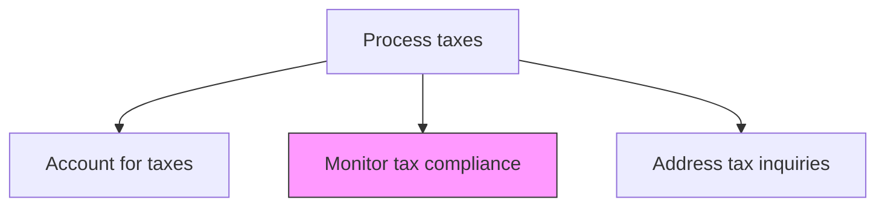
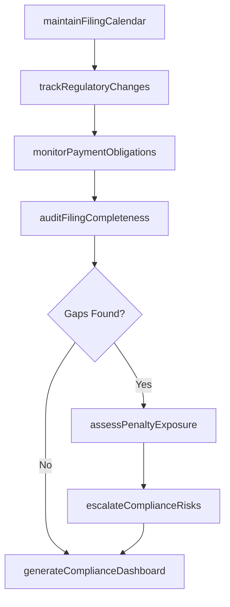

# Monitor tax compliance

> Business-as-Code definition for tax compliance monitoring. Models the tracking of filing deadlines, payment obligations, and regulatory changes to ensure timely and accurate tax compliance across all jurisdictions.

## Overview

Tracking filing deadlines, payment obligations, and regulatory changes across all jurisdictions to ensure the organization remains in full tax compliance. This process maintains a comprehensive filing calendar, monitors legislative updates that may affect obligations, and audits the completeness of all required returns and information reports. When compliance gaps are detected, the team assesses potential penalty exposure and escalates risks to leadership for timely remediation.

## Process Hierarchy



## GraphDL

```yaml
monitor:
  object: Tax Compliance
  actor: TaxComplianceAnalyst
  result: ComplianceStatusReport
```

## Actions

| Action | Description |
|--------|-------------|
| maintainFilingCalendar | Track all tax filing deadlines across jurisdictions and entity types |
| trackRegulatoryChanges | Monitor legislative and regulatory changes that affect filing or payment obligations |
| auditFilingCompleteness | Verify that all required returns and information reports have been filed |
| monitorPaymentObligations | Track estimated and final tax payment due dates and amounts |
| assessPenaltyExposure | Calculate potential penalties and interest for late filings or underpayments |
| generateComplianceDashboard | Produce a consolidated compliance status view across all jurisdictions |
| escalateComplianceRisks | Alert leadership to upcoming deadlines at risk or identified compliance gaps |

## Events

| Event | Description |
|-------|-------------|
| filingCalendarUpdated | Filing deadlines have been refreshed for new periods or jurisdictions |
| regulatoryChangeIdentified | A legislative or regulatory change affecting compliance has been detected |
| filingCompletenessAudited | All required filings have been verified for a given period |
| paymentObligationsTracked | Tax payment due dates and amounts have been reconciled |
| penaltyExposureAssessed | Potential penalty and interest exposure has been calculated |
| complianceDashboardGenerated | Consolidated compliance status report has been produced |
| complianceRiskEscalated | A compliance risk has been communicated to leadership |

## Searches

| Search | Description |
|--------|-------------|
| getComplianceStatus | Retrieve the overall compliance status by entity and jurisdiction |
| getUpcomingDeadlines | List filing and payment deadlines within a specified time horizon |
| getMissedFilings | Return any filings that were not submitted by their deadline |
| getRegulatoryChangeLog | Retrieve recent legislative and regulatory changes by jurisdiction |
| getPenaltyExposureSummary | Return the total penalty and interest exposure across all jurisdictions |

## Process Flow



## RACI Matrix

| Activity | Responsible | Accountable | Consulted | Informed |
|----------|-------------|-------------|-----------|----------|
| maintainFilingCalendar | TaxComplianceAnalyst | TaxManager | ExternalTaxAdvisor | TaxDirector |
| trackRegulatoryChanges | TaxComplianceAnalyst | TaxManager | GeneralCounsel | CFO |
| auditFilingCompleteness | TaxManager | TaxDirector | InternalAudit | Controller |
| escalateComplianceRisks | TaxDirector | CFO | GeneralCounsel | AuditCommittee |

## Related Processes

| Process | Relationship |
|---------|-------------|
| 9.9.2.2 Prepare tax returns | Upstream - filing status feeds compliance tracking |
| 9.9.2.7 Address tax inquiries | Downstream - compliance gaps may trigger authority inquiries |
| 9.9.1.3 Maintain tax master data | Related - master data accuracy supports compliance monitoring |
| 9.8.2.2 Monitor control effectiveness | Related - tax compliance is a component of internal control monitoring |

## Related Departments

| Department | Role |
|-----------|------|
| Tax | Primary owner of compliance monitoring and calendar management |
| Legal | Advises on regulatory changes and penalty exposure |
| Internal Audit | Periodically reviews tax compliance processes |
| Treasury | Ensures tax payment funding is available by due dates |

## Related Occupations

| Occupation | Involvement |
|-----------|-------------|
| Tax Compliance Analyst | Monitors deadlines, tracks filings, and identifies compliance gaps |
| Tax Manager | Reviews compliance status and coordinates remediation |
| Tax Director | Escalates compliance risks to leadership and audit committee |

## KPIs

| KPI | Description | Unit |
|-----|-------------|------|
| Filing Compliance Rate | Percentage of returns filed on or before deadline across all jurisdictions | % |
| Payment Compliance Rate | Percentage of tax payments made on or before due date | % |
| Penalty and Interest Incurred | Total penalties and interest paid due to late filings or underpayments | Currency |
| Regulatory Change Response Time | Average days from regulatory change publication to internal policy update | Days |

## Usage

```typescript
import { monitorTaxCompliance } from '@headlessly/monitor-tax-compliance'

const client = monitorTaxCompliance()

// Get upcoming filing deadlines for the next 90 days
const deadlines = await client.getUpcomingDeadlines({
  entities: ['US-PARENT', 'UK-SUB', 'DE-SUB'],
  daysAhead: 90,
  includeExtensions: true
})

// Check overall compliance status
const status = await client.getComplianceStatus({
  entity: 'CONSOLIDATED',
  fiscalYear: 2025,
  jurisdictionType: 'all'
})
```
