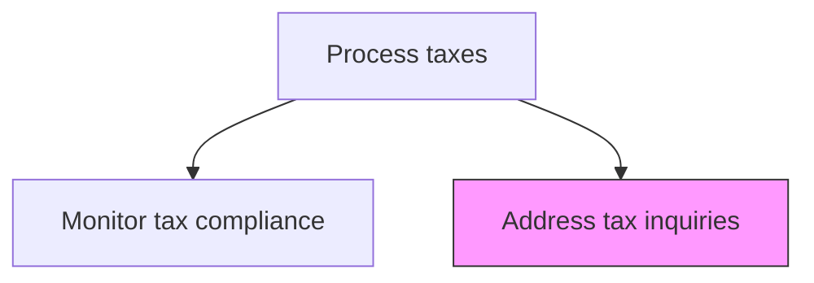
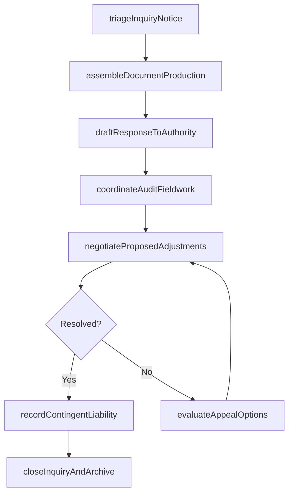

# Address tax inquiries

> Business-as-Code definition for tax inquiry response. Models the management of tax authority audits, information requests, notices, and disputes including document production and negotiation.

## Overview

Addressing tax queries, audits, and notices from regulatory and government authorities by assembling documentation, drafting responses, and negotiating proposed adjustments. This process covers the full lifecycle from initial notice triage through document production, audit fieldwork coordination, and appeal evaluation. It also includes the accrual of contingent liabilities for probable tax assessments under ASC 450/FIN 48 and the archival of all correspondence and workpapers for future reference.

## Process Hierarchy



## GraphDL

```yaml
address:
  object: Tax Inquiries
  actor: TaxContestationManager
  result: InquiryResolution
```

## Actions

| Action | Description |
|--------|-------------|
| triageInquiryNotice | Receive and classify tax authority notices by type, jurisdiction, and urgency |
| assembleDocumentProduction | Gather and organize supporting documents requested by the tax authority |
| draftResponseToAuthority | Prepare a written response addressing the authority's questions or proposed adjustments |
| coordinateAuditFieldwork | Manage on-site or remote audit interactions between the authority and internal teams |
| negotiateProposedAdjustments | Challenge or negotiate proposed tax adjustments with the examining agent |
| evaluateAppealOptions | Assess whether to accept, appeal, or litigate a final determination |
| recordContingentLiability | Accrue reserves for probable tax assessments under ASC 450/FIN 48 |
| closeInquiryAndArchive | Finalize the inquiry resolution and archive all correspondence and workpapers |

## Events

| Event | Description |
|-------|-------------|
| inquiryNoticeTriaged | A tax authority notice has been classified and assigned |
| documentProductionAssembled | Requested supporting documents have been gathered and organized |
| responseToAuthorityDrafted | A written response to the authority has been prepared |
| auditFieldworkCoordinated | Audit interactions with the tax authority have been managed |
| proposedAdjustmentsNegotiated | Proposed tax adjustments have been negotiated with the examining agent |
| appealOptionsEvaluated | Options for appeal or litigation have been assessed |
| contingentLiabilityRecorded | Reserves for probable tax assessments have been accrued |
| inquiryClosed | The inquiry has been resolved and archived |

## Searches

| Search | Description |
|--------|-------------|
| getOpenInquiries | List all open tax authority inquiries by jurisdiction, type, and status |
| getInquiryTimeline | Retrieve the chronological history of correspondence and events for an inquiry |
| getProposedAdjustments | Return proposed adjustments and their financial impact by inquiry |
| getContingentLiabilityReserves | Retrieve accrued reserves for probable tax assessments |
| getInquiryResolutionHistory | Query historical inquiry outcomes and settlement amounts |

## Process Flow



## RACI Matrix

| Activity | Responsible | Accountable | Consulted | Informed |
|----------|-------------|-------------|-----------|----------|
| triageInquiryNotice | TaxContestationManager | TaxDirector | GeneralCounsel | CFO |
| draftResponseToAuthority | TaxContestationManager | TaxDirector | ExternalTaxAdvisor | Controller |
| negotiateProposedAdjustments | TaxDirector | CFO | ExternalTaxCounsel | AuditCommittee |
| evaluateAppealOptions | TaxDirector | CFO | GeneralCounsel | Board |
| recordContingentLiability | TaxManager | Controller | ExternalAuditor | CFO |

## Related Processes

| Process | Relationship |
|---------|-------------|
| 9.9.2.6 Monitor tax compliance | Upstream - compliance gaps may trigger authority inquiries |
| 9.9.2.2 Prepare tax returns | Related - return positions are the subject of inquiries |
| 9.8.4 Report on internal controls | Related - inquiry outcomes may affect SOX disclosures |
| 9.3.4 Perform financial reporting | Downstream - contingent liabilities are disclosed in financial statements |

## Related Departments

| Department | Role |
|-----------|------|
| Tax | Primary owner of inquiry management and response |
| Legal | Provides litigation support and advises on appeal strategy |
| General Accounting | Supplies ledger data and supporting documentation |
| Financial Reporting | Discloses contingent tax liabilities in financial statements |
| Internal Audit | Reviews inquiry response procedures for adequacy |

## Related Occupations

| Occupation | Involvement |
|-----------|-------------|
| Tax Contestation Manager | Manages inquiry responses and coordinates with tax authorities |
| Tax Director | Negotiates adjustments and decides on appeal strategy |
| External Tax Counsel | Provides specialized litigation and appeals representation |

## KPIs

| KPI | Description | Unit |
|-----|-------------|------|
| Inquiry Response Timeliness | Percentage of authority requests answered within the deadline | % |
| Adjustment Success Rate | Percentage of proposed adjustments reduced or eliminated through negotiation | % |
| Average Inquiry Duration | Mean time from notice receipt to inquiry closure | Days |
| Contingent Liability Accuracy | Variance between accrued reserves and final settlement amounts | Currency |

## Usage

```typescript
import { addressTaxInquiries } from '@headlessly/address-tax-inquiries'

const client = addressTaxInquiries()

// List all open tax authority inquiries
const openInquiries = await client.getOpenInquiries({
  jurisdictions: ['IRS', 'HMRC', 'CA-FTB'],
  status: 'active',
  minExposure: 50000
})

// Get the timeline for a specific inquiry
const timeline = await client.getInquiryTimeline({
  inquiryId: 'IRS-2025-AUDIT-001',
  includeCorrespondence: true,
  includeDocumentProduction: true
})
```
