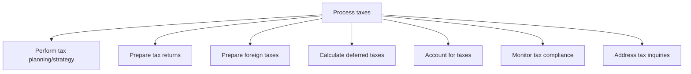
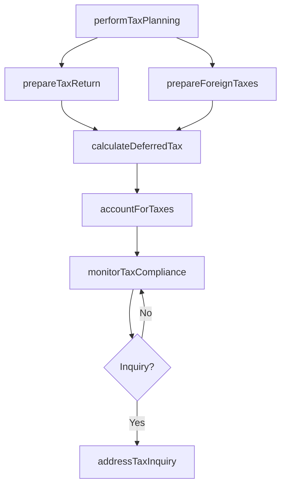

# Process taxes

> Business-as-Code definition for tax processing operations. Models the end-to-end execution of tax return preparation, deferred tax calculations, tax accounting entries, compliance monitoring, and response to tax authority inquiries across all jurisdictions.

## Overview

Processing the taxes of the organization in line with the regional taxation structure, including corporate, property, excise, and service taxes.

## Process Hierarchy



## GraphDL

```yaml
process:
  object: Taxes
  actor: TaxManager
  result: TaxReturn
```

## Actions

| Action | Description |
|--------|-------------|
| performTaxPlanning | Execute periodic tax planning to optimize current period obligations |
| prepareTaxReturn | Compile and draft tax returns for all applicable jurisdictions |
| prepareForeignTaxes | Process tax obligations for international jurisdictions |
| calculateDeferredTax | Compute deferred tax assets and liabilities for financial reporting |
| accountForTaxes | Record tax journal entries in the general ledger |
| monitorTaxCompliance | Track filing deadlines and ensure adherence to tax regulations |
| addressTaxInquiry | Respond to tax authority audits, notices, and information requests |

## Events

| Event | Description |
|-------|-------------|
| taxPlanningPerformed | Periodic tax planning cycle completed |
| taxReturnPrepared | Tax return compiled and ready for filing |
| foreignTaxesPrepared | International tax obligations calculated and documented |
| deferredTaxCalculated | Deferred tax provision computed for the period |
| taxesAccounted | Tax journal entries posted to general ledger |
| taxComplianceMonitored | Filing deadlines and compliance status verified |
| taxInquiryAddressed | Tax authority inquiry responded to or resolved |

## Searches

| Search | Description |
|--------|-------------|
| getTaxReturnStatus | Query preparation and filing status by jurisdiction |
| getDeferredTaxBalance | Retrieve deferred tax asset and liability balances by entity |
| getTaxFilingCalendar | List upcoming filing deadlines with responsible party |
| getTaxInquiries | Retrieve open tax authority inquiries and audit status |

## Process Flow



## RACI Matrix

| Activity | Responsible | Accountable | Consulted | Informed |
|----------|-------------|-------------|-----------|----------|
| prepareTaxReturn | TaxAccountant | TaxManager | ExternalTaxAdvisor | Controller |
| calculateDeferredTax | TaxAccountant | TaxManager | Controller | ExternalAuditor |
| monitorTaxCompliance | TaxAnalyst | TaxManager | LegalCounsel | CFO |
| addressTaxInquiry | TaxManager | TaxDirector | LegalCounsel | CFO |

## Sub-Processes

| ID | Name | Description |
|----|------|-------------|
| 9.9.2.1 | Perform tax planning/strategy | Creating and implementing strategies for taxes to be paid or collected by the business. |
| 9.9.2.2 | Prepare tax returns | Preparing and submitting tax reports for every employee to the tax department in order to show the t |
| 9.9.2.3 | Prepare foreign taxes | Preparing reports about paid or accrued foreign taxes to an overseas country. |
| 9.9.2.4 | Calculate deferred taxes | Calculating the income that has been realized when the tax on that income has not. |
| 9.9.2.5 | Account for taxes | Managing the organization's financial accounts for the purpose of taxation. Prepare and maintain the |
| 9.9.2.6 | Monitor tax compliance | Checking and correcting the tax policies according to the rules and regulations set by the organizat |
| 9.9.2.7 | Address tax inquiries | Addressing any tax queries by any regulatory or government authorities. Review historical records re |

## Related Processes

| Process | Relationship |
|---------|-------------|
| 9.9.1 Develop tax strategy and plan | Upstream - strategy guides tax processing decisions |
| 9.3 Perform general accounting and reporting | Upstream - GL data feeds tax calculations |
| 9.6.1 Process accounts payable AP | Upstream - payables tax data supports return preparation |

## Related Departments

| Department | Role |
|-----------|------|
| Tax | Prepares returns, calculates provisions, and manages compliance |
| Accounting | Provides general ledger data for tax calculations |
| Legal | Supports tax controversy and inquiry responses |
| Finance | Supplies budget data for estimated tax payments |

## Related Occupations

| Occupation | Involvement |
|-----------|-------------|
| Tax Manager | Oversees return preparation and compliance monitoring |
| Tax Accountant | Prepares returns and computes deferred taxes |
| International Tax Specialist | Manages foreign tax obligations and treaties |

## KPIs

| KPI | Description | Unit |
|-----|-------------|------|
| Filing On-Time Rate | Percentage of returns filed by statutory deadline | % |
| Tax Provision Accuracy | Variance between estimated and actual tax liability | % |
| Deferred Tax Reconciliation Time | Days to complete deferred tax reconciliation | Days |
| Inquiry Resolution Time | Average days to resolve tax authority inquiries | Days |

## Usage

```typescript
import { processTaxes } from '@headlessly/process-taxes'

const taxes = processTaxes()

// Prepare federal tax return
const fedReturn = await taxes.prepareTaxReturn({
  jurisdiction: 'US-Federal',
  taxYear: 2024,
  entityId: 'US-HQ',
  returnType: 'Form-1120'
})

// Calculate deferred tax for quarterly reporting
const deferred = await taxes.calculateDeferredTax({
  period: 'Q1-2025',
  entities: ['US-HQ', 'EU-Sub'],
  method: 'balance-sheet'
})
```
