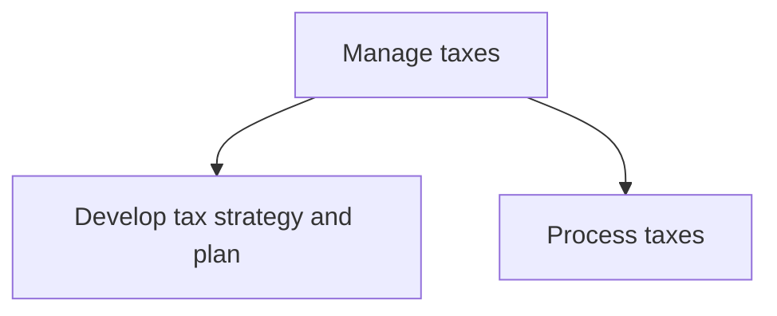
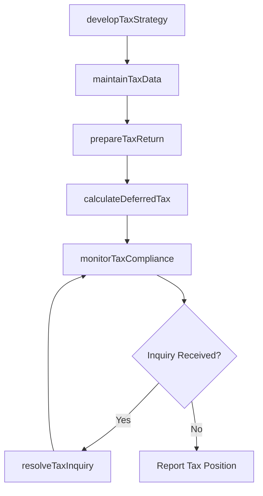

# Manage taxes

> Business-as-Code definition for corporate tax management. Models the complete lifecycle of tax strategy development, return preparation, compliance monitoring, and multi-jurisdictional tax obligation fulfillment.

## Overview

Estimating the organization's periodic tax liabilities. Ensure that appropriate taxing authorities receive tax return filings and payments when due.

## Process Hierarchy



## GraphDL

```yaml
manage:
  object: Taxes
  actor: TaxDirector
  result: TaxComplianceRecord
```

## Actions

| Action | Description |
|--------|-------------|
| developTaxStrategy | Formulate tax planning strategies to optimize the effective tax rate |
| prepareTaxReturn | Compile and file tax returns for all applicable jurisdictions |
| calculateDeferredTax | Compute deferred tax assets and liabilities for financial reporting |
| monitorTaxCompliance | Track filing deadlines, payment obligations, and regulatory changes |
| resolveTaxInquiry | Respond to tax authority audits, notices, and information requests |
| maintainTaxData | Update tax master data including rates, exemptions, and entity structures |

## Events

| Event | Description |
|-------|-------------|
| taxStrategyDeveloped | Annual tax strategy approved and documented |
| taxReturnPrepared | Tax return compiled and ready for filing |
| deferredTaxCalculated | Deferred tax provision computed for the period |
| taxComplianceVerified | Compliance status confirmed across all jurisdictions |
| taxInquiryResolved | Tax authority inquiry or audit closed |
| taxDataUpdated | Tax master data refreshed with current rates and rules |

## Searches

| Search | Description |
|--------|-------------|
| getTaxObligations | Retrieve outstanding tax liabilities by jurisdiction and type |
| getFilingCalendar | List upcoming filing deadlines with status and responsible party |
| getTaxProvision | Query current and deferred tax provision details by entity |
| getAuditHistory | Retrieve tax authority audit and inquiry records |

## Process Flow



## RACI Matrix

| Activity | Responsible | Accountable | Consulted | Informed |
|----------|-------------|-------------|-----------|----------|
| developTaxStrategy | TaxDirector | CFO | ExternalTaxAdvisor | Board |
| prepareTaxReturn | TaxManager | TaxDirector | Controller | ExternalAuditor |
| calculateDeferredTax | TaxAccountant | TaxManager | Controller | CFO |
| monitorTaxCompliance | TaxAnalyst | TaxDirector | LegalCounsel | RiskManager |

## Sub-Processes

| ID | Name | Description |
|----|------|-------------|
| 9.9.1 | Develop tax strategy and plan | Setting targets for periodic tax liabilities. Assess the tax impact of various activities such as th |
| 9.9.2 | Process taxes | Processing the taxes of the organization in line with the regional taxation structure, including cor |

## Related Processes

| Process | Relationship |
|---------|-------------|
| 9.3 Perform general accounting and reporting | Upstream - general ledger data feeds tax calculations |
| 9.6 Process accounts payable and expense reimbursements | Upstream - payables tax data supports return preparation |
| 9.8 Manage internal controls | Parallel - controls framework governs tax processes |
| 9.11 Perform global trade services | Parallel - trade duties and tariffs intersect with tax management |

## Related Departments

| Department | Role |
|-----------|------|
| Tax | Primary owner of strategy, compliance, and filing |
| Finance | Provides financial data for tax calculations |
| Legal | Advises on tax law interpretation and dispute resolution |
| Accounting | Supplies general ledger and sub-ledger data |
| Treasury | Coordinates tax payment funding and timing |

## Related Occupations

| Occupation | Involvement |
|-----------|-------------|
| Tax Director | Strategic tax planning and authority oversight |
| Tax Manager | Return preparation and compliance management |
| Tax Accountant | Deferred tax calculations and journal entries |
| Transfer Pricing Specialist | Intercompany pricing and documentation |

## KPIs

| KPI | Description | Unit |
|-----|-------------|------|
| Effective Tax Rate | Total tax expense as percentage of pre-tax income | % |
| Filing On-Time Rate | Percentage of returns filed by statutory deadline | % |
| Tax Provision Accuracy | Variance between estimated and final tax liability | % |
| Audit Adjustment Rate | Tax adjustments resulting from authority audits | Currency |
| Tax Controversy Resolution Time | Average days to resolve tax authority inquiries | Days |

## Usage

```typescript
import { manageTaxes } from '@headlessly/manage-taxes'

const tax = manageTaxes()

// Develop tax strategy for the fiscal year
const strategy = await tax.developTaxStrategy({
  fiscalYear: 2025,
  jurisdictions: ['US-Federal', 'US-CA', 'UK', 'DE'],
  targetEffectiveRate: 22.5
})

// Monitor compliance across all filing obligations
const compliance = await tax.monitorTaxCompliance({
  quarter: 'Q1-2025',
  includeEstimatedPayments: true
})
```
