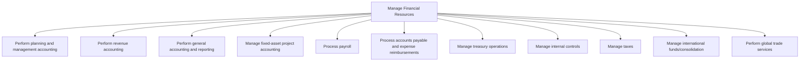
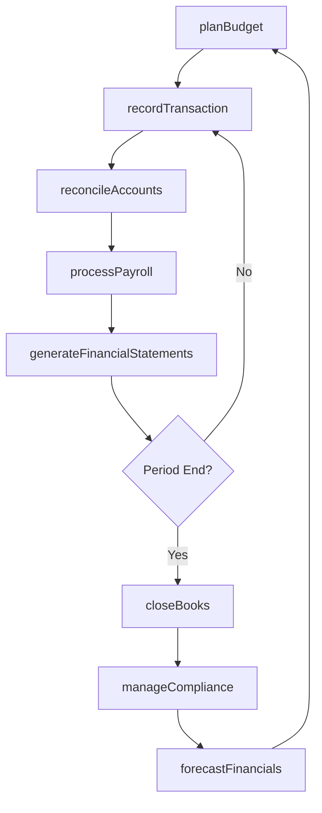

# Manage Financial Resources

> Business-as-Code definition for the end-to-end financial management lifecycle. Models planning, accounting, reporting, payroll, treasury, tax, and compliance operations as programmable APIs.

## Overview

Overseeing key back-office processes for organizations. This category includes process groups related to planning and management accounting, revenue accounting, general accounting and reporting, fixed-asset project accounting, payroll, accounts payable and expense reimbursements, treasury operations, internal controls, tax management, international funds/consolidation, and global trade services.

## Process Hierarchy



## GraphDL

```yaml
manage:
  object: Financial Resources
  actor: ChiefFinancialOfficer
  result: FinancialPerformanceReport
```

## Actions

| Action | Description |
|--------|-------------|
| planBudget | Develop and approve annual operating and capital budgets |
| recordTransaction | Capture and classify financial transactions in the general ledger |
| reconcileAccounts | Match and verify account balances across subledgers and the general ledger |
| processPayroll | Calculate employee compensation, withholdings, and disbursements |
| generateFinancialStatements | Prepare balance sheet, income statement, and cash flow reports |
| manageCompliance | Ensure adherence to accounting standards, tax regulations, and internal controls |
| forecastFinancials | Project future revenue, expenses, and cash positions |
| closeBooks | Execute period-end closing activities and produce finalized financial records |

## Events

| Event | Description |
|-------|-------------|
| budgetPlanned | Annual budget approved and distributed to business units |
| transactionRecorded | Financial transaction captured and posted to the general ledger |
| accountsReconciled | Subledger and general ledger balances verified and matched |
| payrollProcessed | Employee compensation calculated and payments disbursed |
| financialStatementsGenerated | Period-end financial statements prepared and reviewed |
| complianceVerified | Regulatory and internal control requirements confirmed as met |
| financialsForecasted | Forward-looking financial projections completed |
| booksClosed | Period-end closing finalized and records locked |

## Searches

| Search | Description |
|--------|-------------|
| getFinancialSummary | Retrieve consolidated financial performance for a given period |
| findTransactions | Search transactions by account, date range, amount, or entity |
| getAccountBalances | Retrieve current balances for specified general ledger accounts |
| getBudgetVariance | Compare actual spending against budgeted amounts by cost center |
| getPayrollSummary | Retrieve payroll totals by period, department, or employee class |

## Process Flow



## RACI Matrix

| Activity | Responsible | Accountable | Consulted | Informed |
|----------|-------------|-------------|-----------|----------|
| planBudget | FP&A Manager | CFO | Business Unit Heads | Board of Directors |
| recordTransaction | Staff Accountant | Controller | Tax Manager | CFO |
| reconcileAccounts | Senior Accountant | Controller | Internal Audit | CFO |
| processPayroll | Payroll Manager | VP Finance | HR Director | Employees |
| closeBooks | Controller | CFO | External Auditors | Board of Directors |

## Sub-Processes

| ID | Name | Description |
|----|------|-------------|
| 9.1 | Perform planning and management accounting | Determining different stages of the planning process and accounting. Classify, determine, analyze, i |
| 9.2 | Perform revenue accounting | Comparing revenue targets to reality. Review all transactions and entries passed in final accounts i |
| 9.3 | Perform general accounting and reporting | Making statements about business activities and functions. Prepare financial statements (balance she |
| 9.4 | Manage fixed-asset project accounting | Managing accounts for large funds-invested projects. Manage and account for fixed assets projects (c |
| 9.5 | Process payroll | Handling reporting time, managing pay, and processing taxes from salaries. Pay employees. Withhold t |
| 9.6 | Process accounts payable and expense reimbursements | Handling bills and reimbursements to be made. Make payments for goods or services taken or used on b |
| 9.7 | Manage treasury operations | Managing business's investments in trading in bonds, currencies, financial derivatives, etc. Manage  |
| 9.8 | Manage internal controls | Administering internal controls. This process requires the organization to manage entity's board of  |
| 9.9 | Manage taxes | Estimating the organization's periodic tax liabilities. Ensure that appropriate taxing authorities r |
| 9.10 | Manage international funds/consolidation | Managing cash collections and disbursements made by operating units across the enterprise. When appr |
| 9.11 | Perform global trade services | Making and collecting payments for transactions in products/services, and transporting them to inter |

## Related Processes

| Process | Relationship |
|---------|-------------|
| 1.0 Develop Vision and Strategy | Upstream - financial planning supports strategic objectives |
| 7.0 Manage Information Technology | Enabling - IT provides financial systems infrastructure |
| 11.0 Manage Business Risk | Parallel - financial controls mitigate enterprise risk |
| 12.0 Manage External Relationships | Downstream - financial data supports investor and regulatory relations |

## Related Departments

| Department | Role |
|-----------|------|
| Finance | Primary owner of all financial management processes |
| Accounting | Executes transaction recording, reconciliation, and reporting |
| Treasury | Manages cash, investments, and banking relationships |
| Tax | Handles tax compliance, planning, and regulatory filings |
| Internal Audit | Validates controls and process adherence |

## Related Occupations

| Occupation | Involvement |
|-----------|-------------|
| Chief Financial Officer | Executive accountability for all financial operations |
| Controller | Oversight of accounting, reporting, and close processes |
| Financial Analyst | Budget preparation, forecasting, and variance analysis |
| Payroll Specialist | Compensation processing and tax withholding |

## KPIs

| KPI | Description | Unit |
|-----|-------------|------|
| Days to Close | Number of business days to complete monthly financial close | Days |
| Budget Variance | Percentage deviation of actual spend from approved budget | % |
| Accounts Receivable DSO | Average days sales outstanding for receivables collection | Days |
| Payroll Accuracy Rate | Percentage of payroll runs completed without error | % |
| Financial Statement Timeliness | Days from period end to issuance of financial statements | Days |

## Usage

```typescript
import { manageFinancialResources } from '@headlessly/manage-financial-resources'

const finance = manageFinancialResources()

// Retrieve consolidated financial summary for the quarter
const summary = await finance.getFinancialSummary({
  period: 'Q4-2025',
  consolidation: 'entity-wide'
})

// Plan next fiscal year budget
const budget = await finance.planBudget({
  fiscalYear: 2026,
  basedOn: 'rolling-forecast',
  approvalWorkflow: 'standard'
})

// Close the books for the current period
await finance.closeBooks({
  period: '2025-12',
  includeAccruals: true,
  intercompanyEliminations: true
})
```
