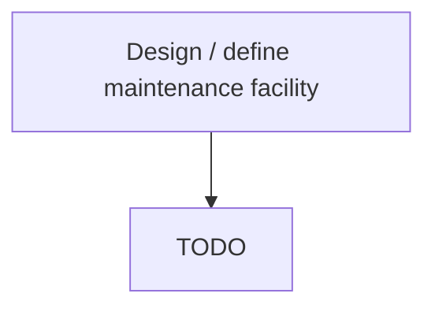

# Design / define maintenance facility

> TODO: Business-as-Code definition for design / define maintenance facility (aerospace-and-defense)

## Overview

Analyzing the need and type of maintenance facility required.  The facility is a locations in which aircraft maintenance work can be carried out. It will be defined according to the maintenance services that will be provided to customers. For example: Line Maintenance, Heavy Maintenance, Aircraft Recovery, Incident repairs, Aircraft Modifications, Passenger to Freighter conversions. All of these capabilities must fully certified by the relevant NAA and Product OEMs. These are defined in Develop products and services, [10003]

## Process Hierarchy



## GraphDL

```yaml
design:
  object: / Define Maintenance Facility
  actor: TODO
  result: TODO
```

## Actions

| Action | Description |
|--------|-------------|
| TODO | TODO |

## Events

| Event | Description |
|-------|-------------|
| TODO | TODO |

## Searches

| Search | Description |
|--------|-------------|
| TODO | TODO |

## Process Flow


## RACI Matrix

| Activity | Responsible | Accountable | Consulted | Informed |
|----------|-------------|-------------|-----------|----------|
| TODO | TODO | TODO | TODO | TODO |

## Related Processes

| Process | Relationship |
|---------|-------------|
| TODO | TODO |

## Related Departments

| Department | Role |
|-----------|------|
| TODO | TODO |

## Related Occupations

| Occupation | Involvement |
|-----------|-------------|
| TODO | TODO |

## KPIs

| KPI | Description | Unit |
|-----|-------------|------|
| TODO | TODO | TODO |

## Usage

```typescript
import { TODO } from '@headlessly/design-/-define-maintenance-facility'

const client = TODO()

// TODO: Example action calls
```
