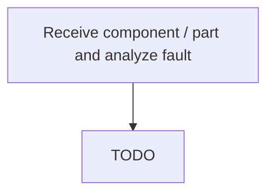

# Receive component / part and analyze fault

> TODO: Business-as-Code definition for receive component / part and analyze fault (aerospace-and-defense)

## Overview

Analyzing components/parts for fault. Analysis will include the following questions: 1. Is the part in receiving as indicated by the shipping notification?  2. Is the part that was sent the same as documented in the system?  I.e., is it the part expected to receive? 3. Is there documentation provided of what is wrong with the part? 4. Can confirmation of what is wrong with the part be made in regard to what is reported as the problem? 5. If confirmation cannot be made, then can a determination me made through testing? 6. Do the tests confirm the mentioned fault? 7. If #6 evaluates to false, the part is a NFF part, etc.

## Process Hierarchy



## GraphDL

```yaml
receive:
  object: Component / Part And Analyze Fault
  actor: TODO
  result: TODO
```

## Actions

| Action | Description |
|--------|-------------|
| TODO | TODO |

## Events

| Event | Description |
|-------|-------------|
| TODO | TODO |

## Searches

| Search | Description |
|--------|-------------|
| TODO | TODO |

## Process Flow


## RACI Matrix

| Activity | Responsible | Accountable | Consulted | Informed |
|----------|-------------|-------------|-----------|----------|
| TODO | TODO | TODO | TODO | TODO |

## Related Processes

| Process | Relationship |
|---------|-------------|
| TODO | TODO |

## Related Departments

| Department | Role |
|-----------|------|
| TODO | TODO |

## Related Occupations

| Occupation | Involvement |
|-----------|-------------|
| TODO | TODO |

## KPIs

| KPI | Description | Unit |
|-----|-------------|------|
| TODO | TODO | TODO |

## Usage

```typescript
import { TODO } from '@headlessly/receive-component-/-part-and-analyze-fault'

const client = TODO()

// TODO: Example action calls
```
