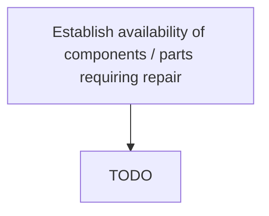

# Establish availability of components / parts requiring repair

> TODO: Business-as-Code definition for establish availability of components / parts requiring repair (aerospace-and-defense)

## Overview

Identify the availability of the parts requiring repair. This requires full visibility across the entire internal and partner networks of all available materials both on hand and on order, and also includes parts themselves within the repair process.  Many OEMs and suppliers have developed the capability to share  available parts inventory across partner networks in real time.  (Determining the availability of inventory starts by looking within a warehouse; at all warehouses in a given location and may expand to country-wide and worldwide checks. It also involves lookup of  consignment inventory, inventory on order with lead time, in repair with estimated availability date, checks for replacement parts and their associated availability, or PMA parts.  Interchangeability is defined in the engineering system but, the key source of information for interchangeability of parts is the Illustrated Parts Catalog.)

## Process Hierarchy



## GraphDL

```yaml
establish:
  object: Availability Of Components / Parts Requiring Repair
  actor: TODO
  result: TODO
```

## Actions

| Action | Description |
|--------|-------------|
| TODO | TODO |

## Events

| Event | Description |
|-------|-------------|
| TODO | TODO |

## Searches

| Search | Description |
|--------|-------------|
| TODO | TODO |

## Process Flow


## RACI Matrix

| Activity | Responsible | Accountable | Consulted | Informed |
|----------|-------------|-------------|-----------|----------|
| TODO | TODO | TODO | TODO | TODO |

## Related Processes

| Process | Relationship |
|---------|-------------|
| TODO | TODO |

## Related Departments

| Department | Role |
|-----------|------|
| TODO | TODO |

## Related Occupations

| Occupation | Involvement |
|-----------|-------------|
| TODO | TODO |

## KPIs

| KPI | Description | Unit |
|-----|-------------|------|
| TODO | TODO | TODO |

## Usage

```typescript
import { TODO } from '@headlessly/establish-availability-of-components-/-parts-requiring-repair'

const client = TODO()

// TODO: Example action calls
```
