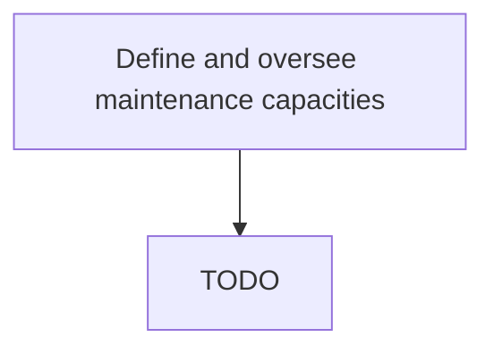

# Define and oversee maintenance capacities

> TODO: Business-as-Code definition for define and oversee maintenance capacities (aerospace-and-defense)

## Overview

Managing the potential facilities capacities that are available for planning maintenance services. An example will include a hanger which can have one bay which can accommodate 1 B747 or B777, or 2 B737s or 2 A320s.

## Process Hierarchy



## GraphDL

```yaml
define:
  object: And Oversee Maintenance Capacities
  actor: TODO
  result: TODO
```

## Actions

| Action | Description |
|--------|-------------|
| TODO | TODO |

## Events

| Event | Description |
|-------|-------------|
| TODO | TODO |

## Searches

| Search | Description |
|--------|-------------|
| TODO | TODO |

## Process Flow


## RACI Matrix

| Activity | Responsible | Accountable | Consulted | Informed |
|----------|-------------|-------------|-----------|----------|
| TODO | TODO | TODO | TODO | TODO |

## Related Processes

| Process | Relationship |
|---------|-------------|
| TODO | TODO |

## Related Departments

| Department | Role |
|-----------|------|
| TODO | TODO |

## Related Occupations

| Occupation | Involvement |
|-----------|-------------|
| TODO | TODO |

## KPIs

| KPI | Description | Unit |
|-----|-------------|------|
| TODO | TODO | TODO |

## Usage

```typescript
import { TODO } from '@headlessly/define-and-oversee-maintenance-capacities'

const client = TODO()

// TODO: Example action calls
```
