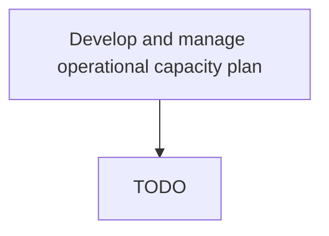

# Develop and manage operational capacity plan

> TODO: Business-as-Code definition for develop and manage operational capacity plan (aerospace-and-defense)

## Overview

Managing operational capacity on a shift-by-shift basis. The number of resources and distribution of resources are aligned with the short-term demand. Output of the operational plan may involve determining overtime and reallocation of capacity to demand in order to optimize operations.  At an operational level, the activity is focused primarily on internal operations.

## Process Hierarchy



## GraphDL

```yaml
develop:
  object: And Manage Operational Capacity Plan
  actor: TODO
  result: TODO
```

## Actions

| Action | Description |
|--------|-------------|
| TODO | TODO |

## Events

| Event | Description |
|-------|-------------|
| TODO | TODO |

## Searches

| Search | Description |
|--------|-------------|
| TODO | TODO |

## Process Flow


## RACI Matrix

| Activity | Responsible | Accountable | Consulted | Informed |
|----------|-------------|-------------|-----------|----------|
| TODO | TODO | TODO | TODO | TODO |

## Related Processes

| Process | Relationship |
|---------|-------------|
| TODO | TODO |

## Related Departments

| Department | Role |
|-----------|------|
| TODO | TODO |

## Related Occupations

| Occupation | Involvement |
|-----------|-------------|
| TODO | TODO |

## KPIs

| KPI | Description | Unit |
|-----|-------------|------|
| TODO | TODO | TODO |

## Usage

```typescript
import { TODO } from '@headlessly/develop-and-manage-operational-capacity-plan'

const client = TODO()

// TODO: Example action calls
```
