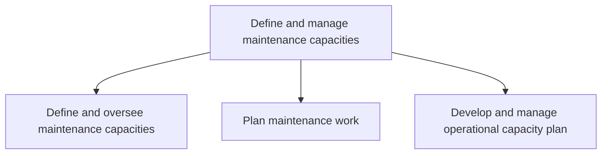

# Define and manage maintenance capacities

> TODO: Business-as-Code definition for define and manage maintenance capacities (aerospace-and-defense)

## Overview

Managing the ability to deliver maintenance services.

## Process Hierarchy



## GraphDL

```yaml
define:
  object: And Manage Maintenance Capacities
  actor: TODO
  result: TODO
```

## Actions

| Action | Description |
|--------|-------------|
| TODO | TODO |

## Events

| Event | Description |
|-------|-------------|
| TODO | TODO |

## Searches

| Search | Description |
|--------|-------------|
| TODO | TODO |

## Process Flow


## RACI Matrix

| Activity | Responsible | Accountable | Consulted | Informed |
|----------|-------------|-------------|-----------|----------|
| TODO | TODO | TODO | TODO | TODO |

## Sub-Processes

| ID | Name | Description |
|----|------|-------------|
| 10.3.5.1 | Define and oversee maintenance capacities | Managing the potential facilities capacities that are available for planning maintenance services. A |
| 10.3.5.2 | Plan maintenance work | TODO |
| 10.3.5.3 | Develop and manage operational capacity plan | Managing operational capacity on a shift-by-shift basis. The number of resources and distribution of |

## Related Processes

| Process | Relationship |
|---------|-------------|
| TODO | TODO |

## Related Departments

| Department | Role |
|-----------|------|
| TODO | TODO |

## Related Occupations

| Occupation | Involvement |
|-----------|-------------|
| TODO | TODO |

## KPIs

| KPI | Description | Unit |
|-----|-------------|------|
| TODO | TODO | TODO |

## Usage

```typescript
import { TODO } from '@headlessly/define-and-manage-maintenance-capacities'

const client = TODO()

// TODO: Example action calls
```
