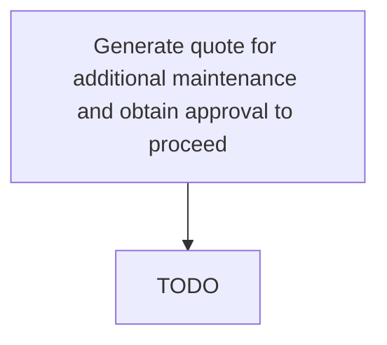

# Generate quote for additional maintenance and obtain approval to proceed

> TODO: Business-as-Code definition for generate quote for additional maintenance and obtain approval to proceed (aerospace-and-defense)

## Overview

Obtaining approval for generated maintenance quotes. This occurs once the aircraft has arrived, and is in the hangar.  This is an estimate generation for any additional work that has been generated between the time the initial work scope was generated and the time that the aircraft entered the hangar (some additional squawks, etc., may be provided by the customer); also includes the subsequent approval of the additional estimate by the customer.  This also occurs on day-by-day, shift-by-shift basis once maintenance work is in progress.  If, during the course of the check event, additional work elements are identified, a quote for the customer needs to be prepared. The consequences of the inclusion of this additional work will be added to the existing contract and presented to the customer for acceptance.

## Process Hierarchy



## GraphDL

```yaml
generate:
  object: Quote For Additional Maintenance And Obtain Approval To Proceed
  actor: TODO
  result: TODO
```

## Actions

| Action | Description |
|--------|-------------|
| TODO | TODO |

## Events

| Event | Description |
|-------|-------------|
| TODO | TODO |

## Searches

| Search | Description |
|--------|-------------|
| TODO | TODO |

## Process Flow


## RACI Matrix

| Activity | Responsible | Accountable | Consulted | Informed |
|----------|-------------|-------------|-----------|----------|
| TODO | TODO | TODO | TODO | TODO |

## Related Processes

| Process | Relationship |
|---------|-------------|
| TODO | TODO |

## Related Departments

| Department | Role |
|-----------|------|
| TODO | TODO |

## Related Occupations

| Occupation | Involvement |
|-----------|-------------|
| TODO | TODO |

## KPIs

| KPI | Description | Unit |
|-----|-------------|------|
| TODO | TODO | TODO |

## Usage

```typescript
import { TODO } from '@headlessly/generate-quote-for-additional-maintenance-and-obtain-approval-to-proceed'

const client = TODO()

// TODO: Example action calls
```
