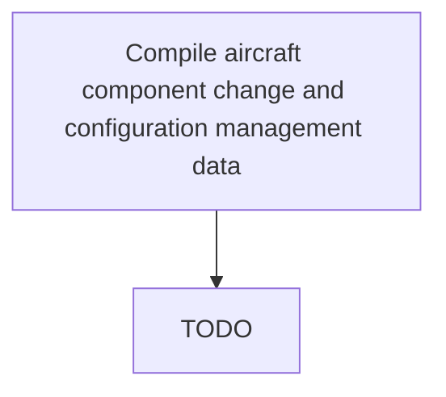

# Compile aircraft component change and configuration management data

> TODO: Business-as-Code definition for compile aircraft component change and configuration management data (aerospace-and-defense)

## Overview

Documenting  components that have been changed.  Record the new serial number, the modification standard of the part being installed, number of cycles remaining on the new part, service bulletins or modifications that need to be made to the component that have not yet been made, and when it is in plan for those changes to be made.

## Process Hierarchy



## GraphDL

```yaml
compile:
  object: Aircraft Component Change And Configuration Management Data
  actor: TODO
  result: TODO
```

## Actions

| Action | Description |
|--------|-------------|
| TODO | TODO |

## Events

| Event | Description |
|-------|-------------|
| TODO | TODO |

## Searches

| Search | Description |
|--------|-------------|
| TODO | TODO |

## Process Flow


## RACI Matrix

| Activity | Responsible | Accountable | Consulted | Informed |
|----------|-------------|-------------|-----------|----------|
| TODO | TODO | TODO | TODO | TODO |

## Related Processes

| Process | Relationship |
|---------|-------------|
| TODO | TODO |

## Related Departments

| Department | Role |
|-----------|------|
| TODO | TODO |

## Related Occupations

| Occupation | Involvement |
|-----------|-------------|
| TODO | TODO |

## KPIs

| KPI | Description | Unit |
|-----|-------------|------|
| TODO | TODO | TODO |

## Usage

```typescript
import { TODO } from '@headlessly/compile-aircraft-component-change-and-configuration-management-data'

const client = TODO()

// TODO: Example action calls
```
