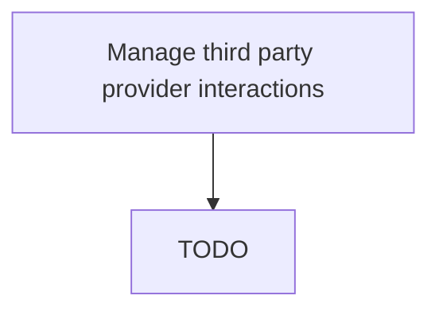

# Manage third party provider interactions

> TODO: Business-as-Code definition for manage third party provider interactions (aerospace-and-defense)

## Overview

Managing all interchanges with 3rd party providers of Service Partners. Ensure that all partners are aware of their commitments and that any modifications required can be quickly and easily completed.

## Process Hierarchy



## GraphDL

```yaml
manage:
  object: Third Party Provider Interactions
  actor: TODO
  result: TODO
```

## Actions

| Action | Description |
|--------|-------------|
| TODO | TODO |

## Events

| Event | Description |
|-------|-------------|
| TODO | TODO |

## Searches

| Search | Description |
|--------|-------------|
| TODO | TODO |

## Process Flow


## RACI Matrix

| Activity | Responsible | Accountable | Consulted | Informed |
|----------|-------------|-------------|-----------|----------|
| TODO | TODO | TODO | TODO | TODO |

## Related Processes

| Process | Relationship |
|---------|-------------|
| TODO | TODO |

## Related Departments

| Department | Role |
|-----------|------|
| TODO | TODO |

## Related Occupations

| Occupation | Involvement |
|-----------|-------------|
| TODO | TODO |

## KPIs

| KPI | Description | Unit |
|-----|-------------|------|
| TODO | TODO | TODO |

## Usage

```typescript
import { TODO } from '@headlessly/manage-third-party-provider-interactions'

const client = TODO()

// TODO: Example action calls
```
