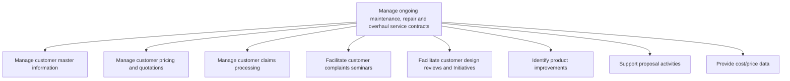

# Manage ongoing maintenance, repair and overhaul service contracts

> TODO: Business-as-Code definition for manage ongoing maintenance, repair and overhaul service contracts (aerospace-and-defense)

## Overview

TODO: Add process overview

## Process Hierarchy



## GraphDL

```yaml
manage:
  object: Ongoing Maintenance, Repair And Overhaul Service Contracts
  actor: TODO
  result: TODO
```

## Actions

| Action | Description |
|--------|-------------|
| TODO | TODO |

## Events

| Event | Description |
|-------|-------------|
| TODO | TODO |

## Searches

| Search | Description |
|--------|-------------|
| TODO | TODO |

## Process Flow


## RACI Matrix

| Activity | Responsible | Accountable | Consulted | Informed |
|----------|-------------|-------------|-----------|----------|
| TODO | TODO | TODO | TODO | TODO |

## Sub-Processes

| ID | Name | Description |
|----|------|-------------|
| 10.3.7.1 | Manage customer master information | TODO |
| 10.3.7.2 | Manage customer pricing and quotations | TODO |
| 10.3.7.3 | Manage customer claims processing | TODO |
| 10.3.7.4 | Facilitate customer complaints seminars | TODO |
| 10.3.7.5 | Facilitate customer design reviews and Initiatives | TODO |
| 10.3.7.6 | Identify product improvements | TODO |
| 10.3.7.7 | Support proposal activities | TODO |
| 10.3.7.8 | Provide cost/price data | TODO |

## Related Processes

| Process | Relationship |
|---------|-------------|
| TODO | TODO |

## Related Departments

| Department | Role |
|-----------|------|
| TODO | TODO |

## Related Occupations

| Occupation | Involvement |
|-----------|-------------|
| TODO | TODO |

## KPIs

| KPI | Description | Unit |
|-----|-------------|------|
| TODO | TODO | TODO |

## Usage

```typescript
import { TODO } from '@headlessly/manage-ongoing-maintenance,-repair-and-overhaul-service-contracts'

const client = TODO()

// TODO: Example action calls
```
