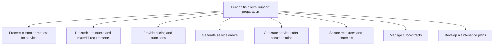

# Provide field-level support preparation

> TODO: Business-as-Code definition for provide field-level support preparation (aerospace-and-defense)

## Overview

TODO: Add process overview

## Process Hierarchy



## GraphDL

```yaml
provide:
  object: Field-level Support Preparation
  actor: TODO
  result: TODO
```

## Actions

| Action | Description |
|--------|-------------|
| TODO | TODO |

## Events

| Event | Description |
|-------|-------------|
| TODO | TODO |

## Searches

| Search | Description |
|--------|-------------|
| TODO | TODO |

## Process Flow


## RACI Matrix

| Activity | Responsible | Accountable | Consulted | Informed |
|----------|-------------|-------------|-----------|----------|
| TODO | TODO | TODO | TODO | TODO |

## Sub-Processes

| ID | Name | Description |
|----|------|-------------|
| 10.3.8.1 | Process customer request for service | TODO |
| 10.3.8.2 | Determine resource and material requirements | TODO |
| 10.3.8.3 | Provide pricing and quotations | TODO |
| 10.3.8.4 | Generate service orders | TODO |
| 10.3.8.5 | Generate service order documentation | TODO |
| 10.3.8.6 | Secure resources and materials | TODO |
| 10.3.8.7 | Manage subcontracts | TODO |
| 10.3.8.8 | Develop maintenance plans | TODO |

## Related Processes

| Process | Relationship |
|---------|-------------|
| TODO | TODO |

## Related Departments

| Department | Role |
|-----------|------|
| TODO | TODO |

## Related Occupations

| Occupation | Involvement |
|-----------|-------------|
| TODO | TODO |

## KPIs

| KPI | Description | Unit |
|-----|-------------|------|
| TODO | TODO | TODO |

## Usage

```typescript
import { TODO } from '@headlessly/provide-field-level-support-preparation'

const client = TODO()

// TODO: Example action calls
```
