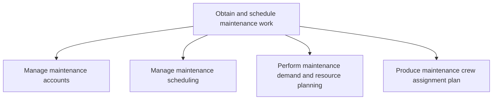

# Obtain and schedule maintenance work

> TODO: Business-as-Code definition for obtain and schedule maintenance work (airline)

## Overview

Handling maintenance accounts.  Manage customer accounts of the maintenance service, which could be other airlines providing maintenance services in another country.  The next activity addresses the management of maintenance scheduling, followed by demand and resource planning and finally the development of a maintenance crew assignment plan.

## Process Hierarchy



## GraphDL

```yaml
obtain:
  object: And Schedule Maintenance Work
  actor: TODO
  result: TODO
```

## Actions

| Action | Description |
|--------|-------------|
| TODO | TODO |

## Events

| Event | Description |
|-------|-------------|
| TODO | TODO |

## Searches

| Search | Description |
|--------|-------------|
| TODO | TODO |

## Process Flow


## RACI Matrix

| Activity | Responsible | Accountable | Consulted | Informed |
|----------|-------------|-------------|-----------|----------|
| TODO | TODO | TODO | TODO | TODO |

## Sub-Processes

| ID | Name | Description |
|----|------|-------------|
| 10.2.1.1 | Manage maintenance accounts | Customer accounts of the maintenance service, could be other airlines providing maintenance services |
| 10.2.1.2 | Manage maintenance scheduling | TODO |
| 10.2.1.3 | Perform maintenance demand and resource planning | TODO |
| 10.2.1.4 | Produce maintenance crew assignment plan | TODO |

## Related Processes

| Process | Relationship |
|---------|-------------|
| TODO | TODO |

## Related Departments

| Department | Role |
|-----------|------|
| TODO | TODO |

## Related Occupations

| Occupation | Involvement |
|-----------|-------------|
| TODO | TODO |

## KPIs

| KPI | Description | Unit |
|-----|-------------|------|
| TODO | TODO | TODO |

## Usage

```typescript
import { TODO } from '@headlessly/obtain-and-schedule-maintenance-work'

const client = TODO()

// TODO: Example action calls
```
