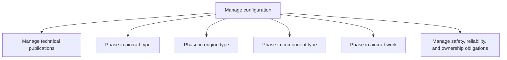

# Manage configuration

> TODO: Business-as-Code definition for manage configuration (airline)

## Overview

Overseeing aircraft technical publications and  work. Manage technical publications including documentation of changes/maintenance provided to an aircraft and that an airline is obliged to publish to the regulator periodically.  There are also activities to phase in / bring into regular service aircraft, engine and component types, as well as aircraft work.  Also included with configuration management is the management of safety, reliability, and ownership obligations.

## Process Hierarchy



## GraphDL

```yaml
manage:
  object: Configuration
  actor: TODO
  result: TODO
```

## Actions

| Action | Description |
|--------|-------------|
| TODO | TODO |

## Events

| Event | Description |
|-------|-------------|
| TODO | TODO |

## Searches

| Search | Description |
|--------|-------------|
| TODO | TODO |

## Process Flow


## RACI Matrix

| Activity | Responsible | Accountable | Consulted | Informed |
|----------|-------------|-------------|-----------|----------|
| TODO | TODO | TODO | TODO | TODO |

## Sub-Processes

| ID | Name | Description |
|----|------|-------------|
| 10.2.2.1 | Manage technical publications | Documentation of changes/maintenance provided is required by law. Airline is obliged to publish thes |
| 10.2.2.2 | Phase in aircraft type | Phasing in: Bringing a new aircraft type into regular service |
| 10.2.2.3 | Phase in engine type | TODO |
| 10.2.2.4 | Phase in component type | TODO |
| 10.2.2.5 | Phase in aircraft work | TODO |
| 10.2.2.6 | Manage safety, reliability, and ownership obligations | TODO |

## Related Processes

| Process | Relationship |
|---------|-------------|
| TODO | TODO |

## Related Departments

| Department | Role |
|-----------|------|
| TODO | TODO |

## Related Occupations

| Occupation | Involvement |
|-----------|-------------|
| TODO | TODO |

## KPIs

| KPI | Description | Unit |
|-----|-------------|------|
| TODO | TODO | TODO |

## Usage

```typescript
import { TODO } from '@headlessly/manage-configuration'

const client = TODO()

// TODO: Example action calls
```
