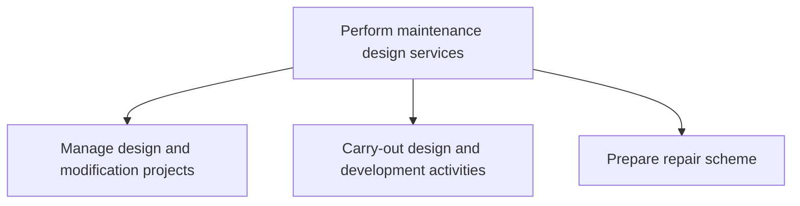

# Perform maintenance design services

> TODO: Business-as-Code definition for perform maintenance design services (airline)

## Overview

Effecting the design, development, and repair of services.

## Process Hierarchy



## GraphDL

```yaml
perform:
  object: Maintenance Design Services
  actor: TODO
  result: TODO
```

## Actions

| Action | Description |
|--------|-------------|
| TODO | TODO |

## Events

| Event | Description |
|-------|-------------|
| TODO | TODO |

## Searches

| Search | Description |
|--------|-------------|
| TODO | TODO |

## Process Flow


## RACI Matrix

| Activity | Responsible | Accountable | Consulted | Informed |
|----------|-------------|-------------|-----------|----------|
| TODO | TODO | TODO | TODO | TODO |

## Sub-Processes

| ID | Name | Description |
|----|------|-------------|
| 10.2.3.1 | Manage design and modification projects | TODO |
| 10.2.3.2 | Carry-out design and development activities | TODO |
| 10.2.3.3 | Prepare repair scheme | TODO |

## Related Processes

| Process | Relationship |
|---------|-------------|
| TODO | TODO |

## Related Departments

| Department | Role |
|-----------|------|
| TODO | TODO |

## Related Occupations

| Occupation | Involvement |
|-----------|-------------|
| TODO | TODO |

## KPIs

| KPI | Description | Unit |
|-----|-------------|------|
| TODO | TODO | TODO |

## Usage

```typescript
import { TODO } from '@headlessly/perform-maintenance-design-services'

const client = TODO()

// TODO: Example action calls
```
