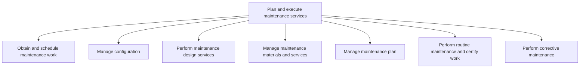

# Plan and execute maintenance services

> TODO: Business-as-Code definition for plan and execute maintenance services (airline)

## Overview

Arranging the time and availability of workers for property maintenance work.

## Process Hierarchy



## GraphDL

```yaml
plan:
  object: And Execute Maintenance Services
  actor: TODO
  result: TODO
```

## Actions

| Action | Description |
|--------|-------------|
| TODO | TODO |

## Events

| Event | Description |
|-------|-------------|
| TODO | TODO |

## Searches

| Search | Description |
|--------|-------------|
| TODO | TODO |

## Process Flow


## RACI Matrix

| Activity | Responsible | Accountable | Consulted | Informed |
|----------|-------------|-------------|-----------|----------|
| TODO | TODO | TODO | TODO | TODO |

## Sub-Processes

| ID | Name | Description |
|----|------|-------------|
| 10.2.1 | Obtain and schedule maintenance work | Handling maintenance accounts.  Manage customer accounts of the maintenance service, which could be  |
| 10.2.2 | Manage configuration | Overseeing aircraft technical publications and  work. Manage technical publications including docume |
| 10.2.3 | Perform maintenance design services | Effecting the design, development, and repair of services. |
| 10.2.4 | Manage maintenance materials and services | Upkeeping parts/equipment used to provide maintenance and providing service strategy. |
| 10.2.5 | Manage maintenance plan | TODO |
| 10.2.6 | Perform routine maintenance and certify work | Arranging workers to perform periodic building maintenance activities. |
| 10.2.7 | Perform corrective maintenance | Arranging workers to perform corrective activities to maintain a property. |

## Related Processes

| Process | Relationship |
|---------|-------------|
| TODO | TODO |

## Related Departments

| Department | Role |
|-----------|------|
| TODO | TODO |

## Related Occupations

| Occupation | Involvement |
|-----------|-------------|
| TODO | TODO |

## KPIs

| KPI | Description | Unit |
|-----|-------------|------|
| TODO | TODO | TODO |

## Usage

```typescript
import { TODO } from '@headlessly/plan-and-execute-maintenance-services'

const client = TODO()

// TODO: Example action calls
```
