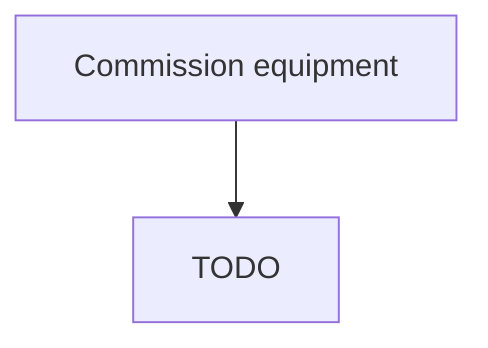

# Commission equipment

> TODO: Business-as-Code definition for commission equipment (airline)

## Overview

Commissioning and inducting any tools, implements, or systems of instruments required for the manufacturing process. Source any engineering solutions that are necessitated for the manufacturing process. Place orders or contract agents for sourcing such equipment. Install and inaugurate the equipment.

## Process Hierarchy



## GraphDL

```yaml
commission:
  object: Equipment
  actor: TODO
  result: TODO
```

## Actions

| Action | Description |
|--------|-------------|
| TODO | TODO |

## Events

| Event | Description |
|-------|-------------|
| TODO | TODO |

## Searches

| Search | Description |
|--------|-------------|
| TODO | TODO |

## Process Flow


## RACI Matrix

| Activity | Responsible | Accountable | Consulted | Informed |
|----------|-------------|-------------|-----------|----------|
| TODO | TODO | TODO | TODO | TODO |

## Related Processes

| Process | Relationship |
|---------|-------------|
| TODO | TODO |

## Related Departments

| Department | Role |
|-----------|------|
| TODO | TODO |

## Related Occupations

| Occupation | Involvement |
|-----------|-------------|
| TODO | TODO |

## KPIs

| KPI | Description | Unit |
|-----|-------------|------|
| TODO | TODO | TODO |

## Usage

```typescript
import { TODO } from '@headlessly/commission-equipment'

const client = TODO()

// TODO: Example action calls
```
