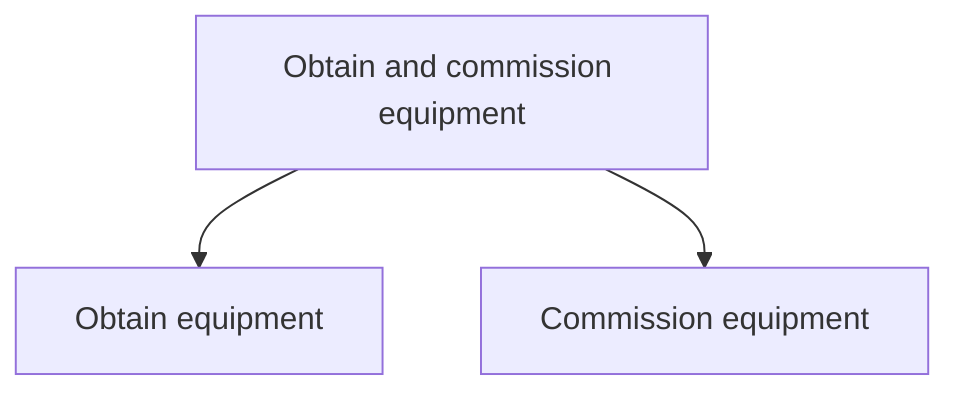

# Obtain and commission equipment

> TODO: Business-as-Code definition for obtain and commission equipment (airline)

## Overview

Acquiring equipment. Install the equipment at a suitable place according to business requirements.

## Process Hierarchy



## GraphDL

```yaml
obtain:
  object: And Commission Equipment
  actor: TODO
  result: TODO
```

## Actions

| Action | Description |
|--------|-------------|
| TODO | TODO |

## Events

| Event | Description |
|-------|-------------|
| TODO | TODO |

## Searches

| Search | Description |
|--------|-------------|
| TODO | TODO |

## Process Flow


## RACI Matrix

| Activity | Responsible | Accountable | Consulted | Informed |
|----------|-------------|-------------|-----------|----------|
| TODO | TODO | TODO | TODO | TODO |

## Sub-Processes

| ID | Name | Description |
|----|------|-------------|
| 10.6.2.1 | Obtain equipment | Creating solutions for simplifying the manufacturing process. Create and adopt new technology in the |
| 10.6.2.2 | Commission equipment | Commissioning and inducting any tools, implements, or systems of instruments required for the manufa |

## Related Processes

| Process | Relationship |
|---------|-------------|
| TODO | TODO |

## Related Departments

| Department | Role |
|-----------|------|
| TODO | TODO |

## Related Occupations

| Occupation | Involvement |
|-----------|-------------|
| TODO | TODO |

## KPIs

| KPI | Description | Unit |
|-----|-------------|------|
| TODO | TODO | TODO |

## Usage

```typescript
import { TODO } from '@headlessly/obtain-and-commission-equipment'

const client = TODO()

// TODO: Example action calls
```
