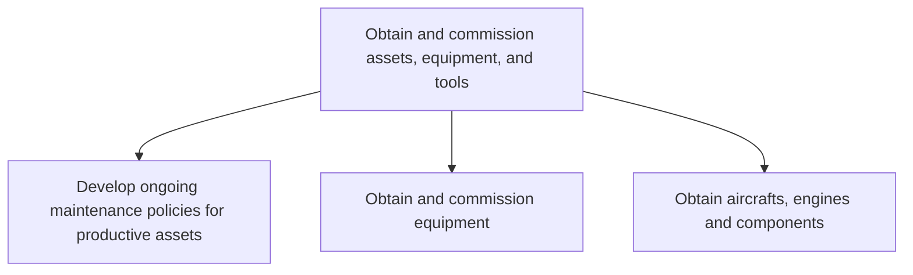

# Obtain and commission assets, equipment, and tools

> TODO: Business-as-Code definition for obtain and commission assets, equipment, and tools (airline)

## Overview

Sourcing new physical assets such as machinery, equipment, production lines, and systems of tools. Integrate new assets into the processing operation.

## Process Hierarchy



## GraphDL

```yaml
obtain:
  object: And Commission Assets, Equipment, And Tools
  actor: TODO
  result: TODO
```

## Actions

| Action | Description |
|--------|-------------|
| TODO | TODO |

## Events

| Event | Description |
|-------|-------------|
| TODO | TODO |

## Searches

| Search | Description |
|--------|-------------|
| TODO | TODO |

## Process Flow


## RACI Matrix

| Activity | Responsible | Accountable | Consulted | Informed |
|----------|-------------|-------------|-----------|----------|
| TODO | TODO | TODO | TODO | TODO |

## Sub-Processes

| ID | Name | Description |
|----|------|-------------|
| 10.6.1 | Develop ongoing maintenance policies for productive assets | Establishing policies for maintaining productive assets. Create rules and regulations for the timely |
| 10.6.2 | Obtain and commission equipment | Acquiring equipment. Install the equipment at a suitable place according to business requirements. |
| 10.6.3 | Obtain aircrafts, engines and components | TODO |

## Related Processes

| Process | Relationship |
|---------|-------------|
| TODO | TODO |

## Related Departments

| Department | Role |
|-----------|------|
| TODO | TODO |

## Related Occupations

| Occupation | Involvement |
|-----------|-------------|
| TODO | TODO |

## KPIs

| KPI | Description | Unit |
|-----|-------------|------|
| TODO | TODO | TODO |

## Usage

```typescript
import { TODO } from '@headlessly/obtain-and-commission-assets,-equipment,-and-tools'

const client = TODO()

// TODO: Example action calls
```
