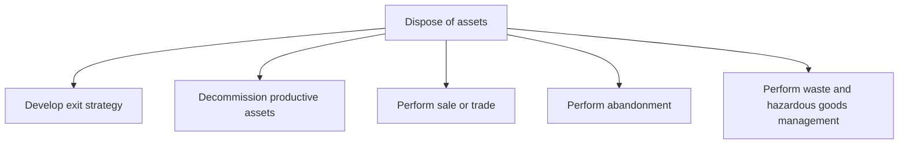

# Dispose of assets

> TODO: Business-as-Code definition for dispose of assets (consumer-products)

## Overview

Retiring productive and non-productive assets.

## Process Hierarchy



## GraphDL

```yaml
dispose:
  object: Of Assets
  actor: TODO
  result: TODO
```

## Actions

| Action | Description |
|--------|-------------|
| TODO | TODO |

## Events

| Event | Description |
|-------|-------------|
| TODO | TODO |

## Searches

| Search | Description |
|--------|-------------|
| TODO | TODO |

## Process Flow


## RACI Matrix

| Activity | Responsible | Accountable | Consulted | Informed |
|----------|-------------|-------------|-----------|----------|
| TODO | TODO | TODO | TODO | TODO |

## Sub-Processes

| ID | Name | Description |
|----|------|-------------|
| 10.4.1 | Develop exit strategy | Creating a strategy for managing asset exits. |
| 10.4.2 | Decommission productive assets | Retiring assets that are no longer viable to the business. Decommission assets that are no longer in |
| 10.4.3 | Perform sale or trade | Performing the sale of assets. Achieve and complete the sale process. Deliver the end product to the |
| 10.4.4 | Perform abandonment | Abandoning assets. Manage the act of deliberately and permanently giving up, granting, leaving, or s |
| 10.4.5 | Perform waste and hazardous goods management | Disposing of waste and hazardous materials as outlined by state, local, and federal regulations. |

## Related Processes

| Process | Relationship |
|---------|-------------|
| TODO | TODO |

## Related Departments

| Department | Role |
|-----------|------|
| TODO | TODO |

## Related Occupations

| Occupation | Involvement |
|-----------|-------------|
| TODO | TODO |

## KPIs

| KPI | Description | Unit |
|-----|-------------|------|
| TODO | TODO | TODO |

## Usage

```typescript
import { TODO } from '@headlessly/dispose-of-assets'

const client = TODO()

// TODO: Example action calls
```
