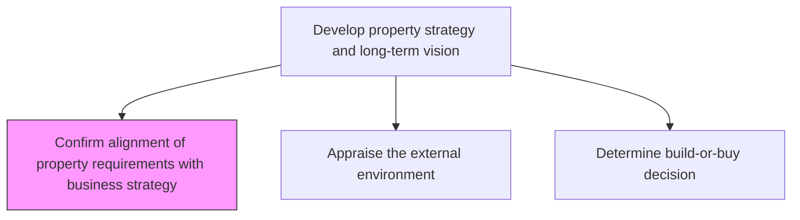
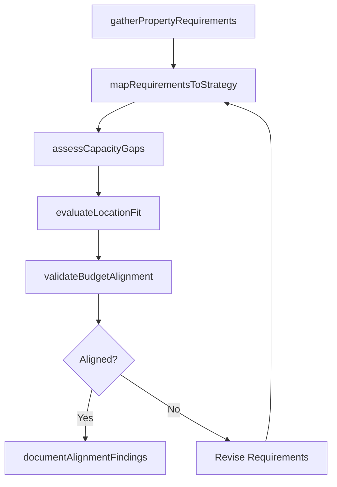

# Confirm alignment of property requirements with business strategy

> Business-as-Code definition for validating that property and real estate requirements are consistent with the organization's strategic plan, growth trajectory, and operational needs.

## Overview

Creating alignment between the requirement of properties and the overall business strategy. This process requires the organization to align the requirement of properties in accordance with its business strategies of the organization.

## Process Hierarchy



## GraphDL

```yaml
confirm:
  object: Alignment Of Property Requirements With Business Strategy
  actor: RealEstateManager
  result: AlignmentAssessment
```

## Actions

| Action | Description |
|--------|-------------|
| gatherPropertyRequirements | Collect property needs from each business unit and function |
| mapRequirementsToStrategy | Cross-reference property needs against strategic growth plans |
| assessCapacityGaps | Identify shortfalls between current property portfolio and future demand |
| evaluateLocationFit | Determine whether property locations support market and talent strategies |
| validateBudgetAlignment | Confirm property investment fits within capital allocation targets |
| documentAlignmentFindings | Produce formal alignment assessment report for leadership review |

## Events

| Event | Description |
|-------|-------------|
| propertyRequirementsGathered | All business unit property needs have been collected |
| requirementsMappedToStrategy | Cross-reference of requirements to strategy completed |
| capacityGapsAssessed | Gap analysis between current portfolio and demand finalized |
| locationFitEvaluated | Location suitability assessment completed |
| budgetAlignmentValidated | Property budget confirmed against capital plan |
| alignmentFindingsDocumented | Formal alignment report produced and distributed |

## Searches

| Search | Description |
|--------|-------------|
| findPropertyRequirements | Retrieve property requirements filtered by business unit or region |
| getAlignmentAssessment | Retrieve the latest alignment assessment for a property initiative |
| getCapacityGaps | List identified capacity gaps by location or function |
| getStrategicPriorities | Retrieve current business strategy priorities for property planning |

## Process Flow



## RACI Matrix

| Activity | Responsible | Accountable | Consulted | Informed |
|----------|-------------|-------------|-----------|----------|
| gatherPropertyRequirements | FacilitiesManager | VP RealEstate | BusinessUnitLeads | CFO |
| mapRequirementsToStrategy | RealEstateAnalyst | VP RealEstate | StrategyTeam | COO |
| assessCapacityGaps | RealEstateAnalyst | VP RealEstate | Operations | Finance |
| validateBudgetAlignment | FinancialAnalyst | CFO | VP RealEstate | Board |

## Related Processes

| Process | Relationship |
|---------|-------------|
| 10.1.1.2 Appraise the external environment | Downstream - feeds market context into alignment |
| 10.1.1.3 Determine build-or-buy decision | Consumer - uses alignment findings to decide approach |
| 10.1.2 Plan facility | Downstream - alignment drives facility planning |

## Related Departments

| Department | Role |
|-----------|------|
| Real Estate | Primary owner of property strategy alignment |
| Strategy | Provides business strategy inputs and priorities |
| Finance | Validates budget and capital allocation fit |
| Operations | Contributes operational space and capacity needs |

## Related Occupations

| Occupation | Involvement |
|-----------|-------------|
| Real Estate Manager | Primary executor of alignment analysis |
| Financial Analyst | Budget and capital validation |
| Strategy Analyst | Strategic priority mapping |

## KPIs

| KPI | Description | Unit |
|-----|-------------|------|
| Alignment Score | Percentage of property requirements aligned with strategic goals | % |
| Capacity Gap Ratio | Proportion of identified gaps to total property needs | % |
| Budget Variance | Deviation between property investment plan and capital allocation | % |
| Cycle Time | Time from requirements gathering to alignment sign-off | Days |

## Usage

```typescript
import { confirmAlignmentOfPropertyRequirementsWithBusinessStrategy } from '@headlessly/confirm-alignment-of-property-requirements-with-business-strategy'

const alignment = confirmAlignmentOfPropertyRequirementsWithBusinessStrategy()

// Gather property requirements from business units
const requirements = await alignment.gatherPropertyRequirements({
  businessUnits: ['Sales', 'Engineering', 'Support'],
  planningHorizon: '5-year'
})

// Map requirements to strategic priorities
const mapping = await alignment.mapRequirementsToStrategy({
  requirementIds: requirements.map(r => r.id),
  strategyVersion: 'FY2026'
})

// Validate budget alignment
const budgetCheck = await alignment.validateBudgetAlignment({
  mappingId: mapping.id,
  capitalBudget: 25000000
})
```
