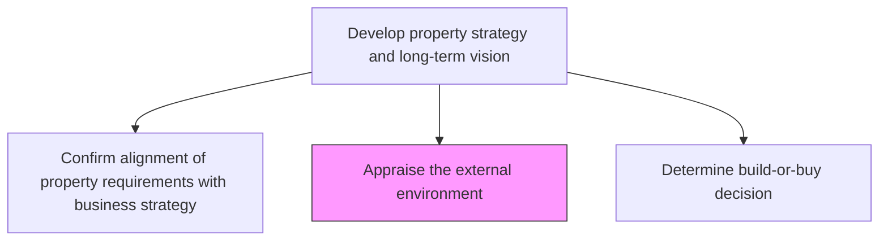
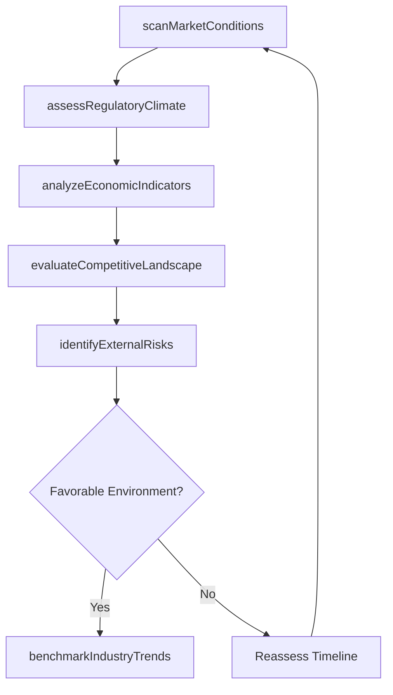

# Appraise the external environment

> Business-as-Code definition for evaluating external market conditions, regulatory landscapes, and economic factors that influence property and asset acquisition decisions.

## Overview

Evaluating the impact of the external environment. Evaluate the circumstances, objects, events, and aspects surrounding an organization that affects its actions and selections and that recognizes its opportunities and risks.

## Process Hierarchy



## GraphDL

```yaml
appraise:
  object: External Environment
  actor: RealEstateAnalyst
  result: EnvironmentalAppraisal
```

## Actions

| Action | Description |
|--------|-------------|
| scanMarketConditions | Survey current real estate market trends, pricing, and availability |
| assessRegulatoryClimate | Evaluate zoning laws, building codes, and regulatory changes |
| analyzeEconomicIndicators | Review interest rates, inflation, and economic forecasts affecting property values |
| evaluateCompetitiveLandscape | Assess competitor property strategies and market positioning |
| identifyExternalRisks | Catalog environmental, political, and market risks to property investments |
| benchmarkIndustryTrends | Compare organizational property approach against industry best practices |

## Events

| Event | Description |
|-------|-------------|
| marketConditionsScanned | Real estate market survey completed and documented |
| regulatoryClimateAssessed | Regulatory environment evaluation finalized |
| economicIndicatorsAnalyzed | Economic forecast review completed |
| competitiveLandscapeEvaluated | Competitor property strategy assessment delivered |
| externalRisksIdentified | External risk catalog produced and rated |
| industryTrendsBenchmarked | Industry benchmarking report finalized |

## Searches

| Search | Description |
|--------|-------------|
| findMarketReports | Retrieve real estate market reports by region and property type |
| getRegulatoryUpdates | List recent regulatory changes affecting property acquisitions |
| getEconomicForecasts | Retrieve economic indicators and interest rate projections |
| getExternalRiskRegister | Query identified external risks by severity and category |

## Process Flow



## RACI Matrix

| Activity | Responsible | Accountable | Consulted | Informed |
|----------|-------------|-------------|-----------|----------|
| scanMarketConditions | RealEstateAnalyst | VP RealEstate | MarketResearch | CFO |
| assessRegulatoryClimate | ComplianceAnalyst | VP RealEstate | Legal | Operations |
| analyzeEconomicIndicators | FinancialAnalyst | CFO | Treasury | Board |
| identifyExternalRisks | RiskAnalyst | VP RealEstate | Insurance | StrategyTeam |

## Related Processes

| Process | Relationship |
|---------|-------------|
| 10.1.1.1 Confirm alignment of property requirements with business strategy | Upstream - alignment drives appraisal scope |
| 10.1.1.3 Determine build-or-buy decision | Downstream - appraisal informs build-or-buy analysis |
| 10.1.2 Plan facility | Consumer - uses environmental appraisal for facility planning |

## Related Departments

| Department | Role |
|-----------|------|
| Real Estate | Primary owner of external environment appraisal |
| Finance | Provides economic analysis and forecasting inputs |
| Legal | Advises on regulatory and compliance landscape |
| Risk Management | Identifies and rates external risk factors |

## Related Occupations

| Occupation | Involvement |
|-----------|-------------|
| Real Estate Analyst | Primary executor of market and environmental analysis |
| Financial Analyst | Economic indicator evaluation |
| Compliance Specialist | Regulatory landscape assessment |

## KPIs

| KPI | Description | Unit |
|-----|-------------|------|
| Market Report Freshness | Average age of external market data used in appraisals | Days |
| Regulatory Change Coverage | Percentage of applicable regulations tracked and reviewed | % |
| Risk Identification Rate | Number of external risks identified per appraisal cycle | Count |
| Appraisal Cycle Time | Time from appraisal initiation to final report delivery | Days |

## Usage

```typescript
import { appraiseExternalEnvironment } from '@headlessly/appraise-external-environment'

const appraisal = appraiseExternalEnvironment()

// Scan current market conditions for a target region
const market = await appraisal.scanMarketConditions({
  region: 'Southeast',
  propertyType: 'industrial',
  timeframe: 'Q1-2026'
})

// Assess regulatory climate
const regulatory = await appraisal.assessRegulatoryClimate({
  jurisdiction: 'state',
  propertyUse: 'manufacturing',
  includeUpcoming: true
})

// Identify external risks
const risks = await appraisal.identifyExternalRisks({
  categories: ['economic', 'environmental', 'political'],
  severityThreshold: 'medium'
})
```
