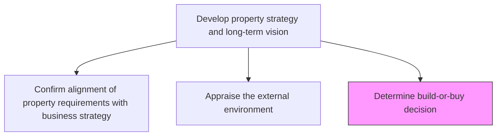
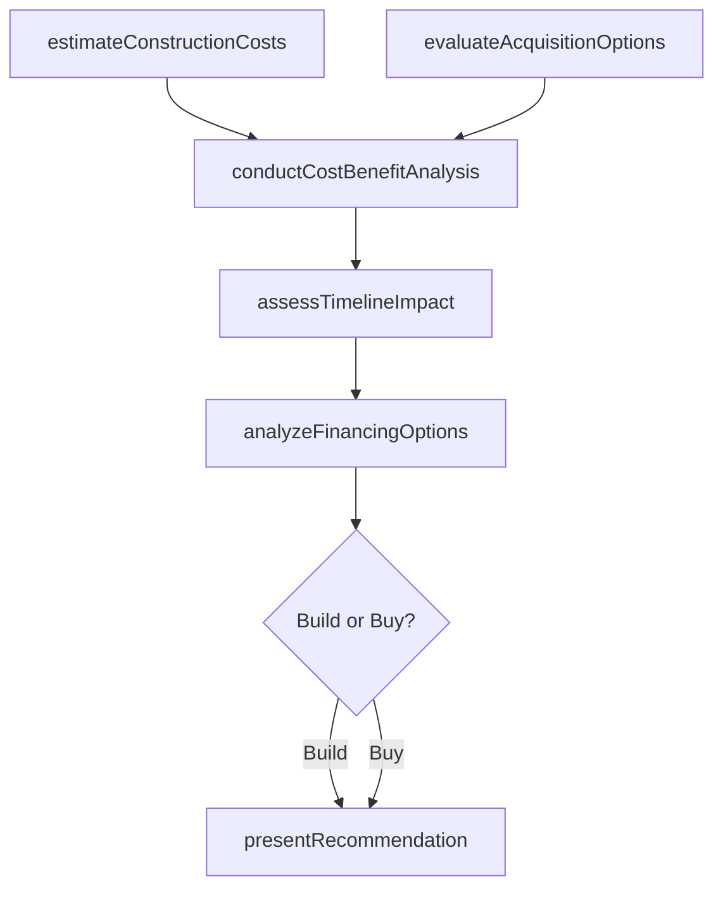

# Determine build or buy decision

> Business-as-Code definition for analyzing whether to construct new facilities or acquire existing properties, based on cost-benefit analysis, market conditions, and strategic requirements.

## Overview

Deciding whether to buy or build properties. Study the market forces about property prices and cost of construction in order to take decisions based on the market research.

## Process Hierarchy



## GraphDL

```yaml
determine:
  object: Build Or Buy Decision
  actor: RealEstateManager
  result: BuildBuyRecommendation
```

## Actions

| Action | Description |
|--------|-------------|
| estimateConstructionCosts | Calculate projected costs for new construction including materials, labor, and permits |
| evaluateAcquisitionOptions | Assess available properties on the market that meet organizational requirements |
| conductCostBenefitAnalysis | Compare total cost of ownership for build versus buy scenarios |
| assessTimelineImpact | Evaluate schedule implications of construction versus immediate acquisition |
| analyzeFinancingOptions | Review capital structure and financing alternatives for each approach |
| presentRecommendation | Deliver build-or-buy recommendation with supporting financial models |

## Events

| Event | Description |
|-------|-------------|
| constructionCostsEstimated | New construction cost projections completed |
| acquisitionOptionsEvaluated | Available property assessment finalized |
| costBenefitAnalysisCompleted | Build versus buy financial comparison delivered |
| timelineImpactAssessed | Schedule analysis for both options documented |
| financingOptionsAnalyzed | Capital and financing review completed |
| recommendationPresented | Final build-or-buy recommendation delivered to decision makers |

## Searches

| Search | Description |
|--------|-------------|
| findAvailableProperties | List properties available for acquisition by location, size, and price |
| getConstructionEstimates | Retrieve construction cost projections by property type and region |
| getCostBenefitModels | Query completed cost-benefit analysis models for review |
| getFinancingScenarios | Retrieve financing options and terms for build and buy scenarios |

## Process Flow



## RACI Matrix

| Activity | Responsible | Accountable | Consulted | Informed |
|----------|-------------|-------------|-----------|----------|
| estimateConstructionCosts | ProjectEstimator | VP RealEstate | Engineering | Finance |
| evaluateAcquisitionOptions | RealEstateManager | VP RealEstate | Legal | Operations |
| conductCostBenefitAnalysis | FinancialAnalyst | CFO | VP RealEstate | Board |
| presentRecommendation | RealEstateManager | CFO | StrategyTeam | ExecutiveCommittee |

## Related Processes

| Process | Relationship |
|---------|-------------|
| 10.1.1.1 Confirm alignment of property requirements with business strategy | Upstream - alignment defines requirements for the decision |
| 10.1.1.2 Appraise the external environment | Upstream - environmental appraisal informs market analysis |
| 10.1.2 Plan facility | Downstream - decision outcome drives facility planning |

## Related Departments

| Department | Role |
|-----------|------|
| Real Estate | Primary owner of build-or-buy analysis |
| Finance | Conducts cost-benefit and financing analysis |
| Engineering | Provides construction feasibility and cost inputs |
| Legal | Reviews acquisition terms and construction contracts |

## Related Occupations

| Occupation | Involvement |
|-----------|-------------|
| Real Estate Manager | Leads the decision analysis process |
| Cost Estimator | Develops construction cost projections |
| Financial Analyst | Builds cost-benefit models and financing scenarios |

## KPIs

| KPI | Description | Unit |
|-----|-------------|------|
| Decision Accuracy | Percentage of build-or-buy decisions where actual costs matched projections | % |
| Analysis Cycle Time | Time from initiation to final recommendation | Days |
| Cost Variance | Deviation between projected and actual total cost of ownership | % |
| Options Evaluated | Number of alternatives analyzed per decision | Count |

## Usage

```typescript
import { determineBuildOrBuyDecision } from '@headlessly/determine-build-or-buy-decision'

const decision = determineBuildOrBuyDecision()

// Estimate construction costs for a new facility
const buildCost = await decision.estimateConstructionCosts({
  facilityType: 'warehouse',
  squareFootage: 50000,
  region: 'Midwest'
})

// Evaluate available acquisition options
const buyOptions = await decision.evaluateAcquisitionOptions({
  propertyType: 'warehouse',
  minSquareFootage: 45000,
  maxPrice: 8000000
})

// Run cost-benefit analysis
const analysis = await decision.conductCostBenefitAnalysis({
  buildEstimate: buildCost.id,
  buyOptions: buyOptions.map(o => o.id),
  horizon: '20-year'
})
```
