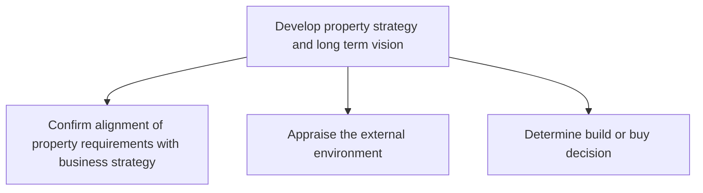
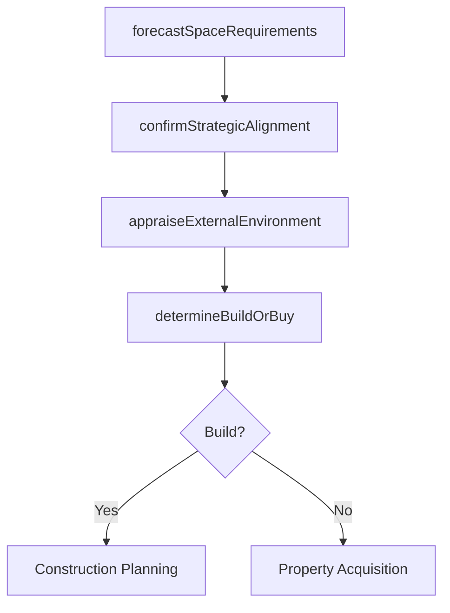

# Develop property strategy and long term vision

> Business-as-Code definition for formulating long-term property management strategies by aligning real estate requirements with business objectives, appraising external market conditions, and determining build-versus-buy decisions.

## Overview

Strategizing a long-term vision for managing properties. Prepare strategies and a long-term vision for managing purchased/retained properties.

## Process Hierarchy



## GraphDL

```yaml
develop:
  object: Property Strategy And Long Term Vision
  actor: RealEstateStrategist
  result: PropertyStrategyPlan
```

## Actions

| Action | Description |
|--------|-------------|
| confirmStrategicAlignment | Validate property requirements against corporate business strategy |
| appraiseExternalEnvironment | Assess market conditions, demographics, and economic trends |
| determineBuildOrBuy | Analyze financial and operational trade-offs between building and purchasing |
| forecastSpaceRequirements | Project future space needs based on growth plans and workforce trends |

## Events

| Event | Description |
|-------|-------------|
| strategicAlignmentConfirmed | Property requirements validated against business strategy |
| externalEnvironmentAppraised | Market and economic assessment completed |
| buildOrBuyDetermined | Build-versus-buy decision finalized with supporting analysis |
| spaceRequirementsForecasted | Future space demand projections completed |

## Searches

| Search | Description |
|--------|-------------|
| getPropertyPortfolio | Retrieve current property holdings with lease and ownership details |
| getMarketConditions | Query real estate market data by geography and property type |
| findStrategicGaps | Identify gaps between current portfolio and projected requirements |

## Process Flow



## RACI Matrix

| Activity | Responsible | Accountable | Consulted | Informed |
|----------|-------------|-------------|-----------|----------|
| confirmStrategicAlignment | RealEstateStrategist | VP Facilities | CFO | BusinessUnitLeads |
| appraiseExternalEnvironment | MarketAnalyst | RealEstateStrategist | Finance | Legal |
| determineBuildOrBuy | RealEstateStrategist | CFO | Engineering | Operations |

## Sub-Processes

| ID | Name | Description |
|----|------|-------------|
| 10.1.1.1 | Confirm alignment of property requirements with business strategy | Creating alignment between the requirement of properties and the overall business strategy. This pro |
| 10.1.1.2 | Appraise the external environment | Evaluating the impact of the external environment. Evaluate the circumstances, objects, events, and  |
| 10.1.1.3 | Determine build or buy decision | Deciding whether to buy or build properties. Study the market forces about property prices and cost  |

## Related Processes

| Process | Relationship |
|---------|-------------|
| 10.1.2 Plan facility | Downstream - strategy decisions feed into facility planning |
| 10.1.3 Provide workspace and facilities | Downstream - strategy drives workspace provisioning |
| 1.0 Develop Vision and Strategy | Upstream - corporate strategy sets property direction |

## Related Departments

| Department | Role |
|-----------|------|
| Real Estate | Leads property strategy development and market analysis |
| Finance | Evaluates capital requirements and financial feasibility |
| Strategy | Provides corporate growth plans and strategic direction |

## Related Occupations

| Occupation | Involvement |
|-----------|-------------|
| Real Estate Strategist | Formulates long-term property vision and acquisition approach |
| Market Research Analyst | Analyzes real estate market conditions and trends |

## KPIs

| KPI | Description | Unit |
|-----|-------------|------|
| Portfolio Alignment Score | Degree of alignment between property portfolio and business strategy | Score (1-10) |
| Build vs Buy Analysis Cycle Time | Time from requirement identification to decision | Days |
| Forecast Accuracy | Variance between projected and actual space requirements | % |

## Usage

```typescript
import { developPropertyStrategyAndLongTermVision } from '@headlessly/develop-property-strategy-and-long-term-vision'

const strategy = developPropertyStrategyAndLongTermVision()

// Confirm alignment with business strategy
const alignment = await strategy.confirmStrategicAlignment({
  businessUnit: 'North-America',
  growthPlan: '15-percent-headcount',
  horizon: '5-year'
})

// Determine build or buy for new requirement
const decision = await strategy.determineBuildOrBuy({
  location: 'Austin-TX',
  requiredSqFt: 50000,
  timeline: '18-months',
  budgetCeiling: 25000000
})
```
