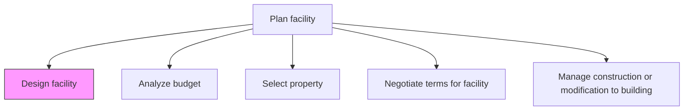
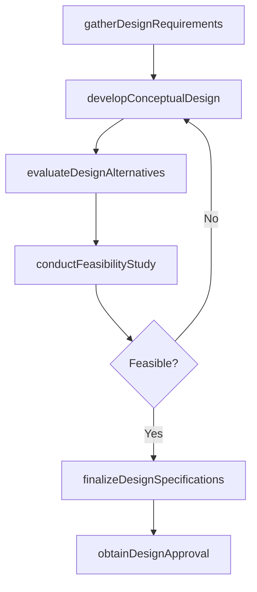

# Design facility

> Business-as-Code definition for developing architectural and engineering designs for new or renovated facilities that meet operational, safety, and regulatory requirements.

## Overview

Preparing and analyzing different designs for a facility in order to finalize which design will be the most suitable option.

## Process Hierarchy



## GraphDL

```yaml
design:
  object: Facility
  actor: FacilityArchitect
  result: FacilityDesign
```

## Actions

| Action | Description |
|--------|-------------|
| gatherDesignRequirements | Collect functional, operational, and regulatory requirements from stakeholders |
| developConceptualDesign | Create preliminary layout and design concepts for evaluation |
| evaluateDesignAlternatives | Compare multiple design options against requirements and constraints |
| conductFeasibilityStudy | Assess technical and financial viability of proposed designs |
| finalizeDesignSpecifications | Lock in detailed architectural and engineering specifications |
| obtainDesignApproval | Present final design for stakeholder and regulatory approval |

## Events

| Event | Description |
|-------|-------------|
| designRequirementsGathered | All stakeholder requirements collected and documented |
| conceptualDesignDeveloped | Preliminary design concepts created and presented |
| designAlternativesEvaluated | Design options scored and ranked |
| feasibilityStudyCompleted | Technical and financial feasibility confirmed |
| designSpecificationsFinalized | Detailed specifications locked and distributed |
| designApprovalObtained | Design formally approved by stakeholders and regulators |

## Searches

| Search | Description |
|--------|-------------|
| findDesignDocuments | Retrieve design documents filtered by facility type or project phase |
| getDesignRequirements | List requirements for a specific facility design project |
| getDesignAlternatives | Query design options with comparison scores |
| getFeasibilityReports | Retrieve feasibility study results by project |

## Process Flow



## RACI Matrix

| Activity | Responsible | Accountable | Consulted | Informed |
|----------|-------------|-------------|-----------|----------|
| gatherDesignRequirements | FacilityArchitect | VP Facilities | Operations | Finance |
| developConceptualDesign | FacilityArchitect | VP Facilities | Engineering | Safety |
| evaluateDesignAlternatives | ProjectManager | VP Facilities | FacilityArchitect | CFO |
| finalizeDesignSpecifications | FacilityArchitect | VP Facilities | Legal | Construction |

## Related Processes

| Process | Relationship |
|---------|-------------|
| 10.1.2.2 Analyze budget | Downstream - design drives budget requirements |
| 10.1.2.3 Select property | Parallel - property constraints influence design |
| 10.1.1 Develop property strategy and long-term vision | Upstream - strategy defines design direction |

## Related Departments

| Department | Role |
|-----------|------|
| Facilities | Primary owner of facility design process |
| Architecture and Engineering | Creates technical designs and specifications |
| Operations | Provides functional requirements and workflow needs |
| Safety and Compliance | Ensures design meets regulatory and safety standards |

## Related Occupations

| Occupation | Involvement |
|-----------|-------------|
| Facility Architect | Primary designer of facility layouts and specifications |
| Structural Engineer | Evaluates structural integrity of proposed designs |
| Project Manager | Coordinates design process across stakeholders |

## KPIs

| KPI | Description | Unit |
|-----|-------------|------|
| Design Cycle Time | Time from requirements gathering to design approval | Days |
| Design Change Frequency | Number of design revisions after initial approval | Count |
| Requirements Coverage | Percentage of stated requirements addressed in final design | % |
| Design Cost Accuracy | Variance between estimated and actual design costs | % |

## Usage

```typescript
import { designFacility } from '@headlessly/design-facility'

const design = designFacility()

// Gather design requirements from stakeholders
const requirements = await design.gatherDesignRequirements({
  facilityType: 'distribution-center',
  stakeholders: ['Operations', 'Safety', 'IT'],
  targetCapacity: 500000
})

// Evaluate design alternatives
const alternatives = await design.evaluateDesignAlternatives({
  requirementSetId: requirements.id,
  maxOptions: 3,
  criteria: ['cost', 'efficiency', 'expandability']
})

// Finalize specifications
const specs = await design.finalizeDesignSpecifications({
  selectedDesignId: alternatives.ranked[0].id,
  detailLevel: 'construction-ready'
})
```
