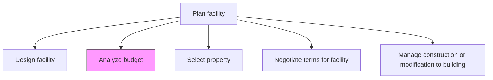
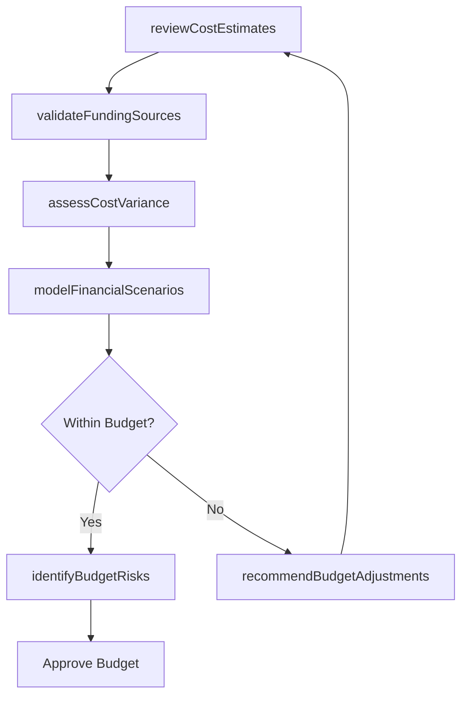

# Analyze budget

> Business-as-Code definition for evaluating the financial feasibility and adequacy of budgets prepared for facility construction, acquisition, or renovation projects.

## Overview

Evaluating the feasibility of budgets prepared for the construction of facilities.

## Process Hierarchy



## GraphDL

```yaml
analyze:
  object: Budget
  actor: FinancialAnalyst
  result: BudgetAnalysis
```

## Actions

| Action | Description |
|--------|-------------|
| reviewCostEstimates | Examine line-item cost projections for materials, labor, and contingencies |
| validateFundingSources | Confirm availability and terms of capital funding for the project |
| assessCostVariance | Compare projected costs against historical benchmarks and market rates |
| modelFinancialScenarios | Run sensitivity analyses on key cost drivers and assumptions |
| identifyBudgetRisks | Catalog financial risks that could cause budget overruns |
| recommendBudgetAdjustments | Propose modifications to align budget with available resources |

## Events

| Event | Description |
|-------|-------------|
| costEstimatesReviewed | Line-item cost review completed and documented |
| fundingSourcesValidated | Capital funding availability confirmed |
| costVarianceAssessed | Benchmark comparison analysis delivered |
| financialScenariosModeled | Sensitivity analyses completed |
| budgetRisksIdentified | Financial risk catalog produced |
| budgetAdjustmentsRecommended | Budget modification recommendations delivered |

## Searches

| Search | Description |
|--------|-------------|
| getBudgetDetails | Retrieve budget breakdown by project, category, or line item |
| findCostBenchmarks | Query historical cost data for similar facility projects |
| getBudgetVarianceReport | Get variance analysis between estimated and actual costs |
| getFundingStatus | Retrieve funding source availability and commitment status |

## Process Flow



## RACI Matrix

| Activity | Responsible | Accountable | Consulted | Informed |
|----------|-------------|-------------|-----------|----------|
| reviewCostEstimates | FinancialAnalyst | CFO | ProjectManager | VP Facilities |
| validateFundingSources | TreasuryManager | CFO | Finance | Board |
| assessCostVariance | CostEngineer | CFO | Procurement | ProjectManager |
| modelFinancialScenarios | FinancialAnalyst | CFO | RiskManagement | VP Facilities |

## Related Processes

| Process | Relationship |
|---------|-------------|
| 10.1.2.1 Design facility | Upstream - design specifications drive cost estimates |
| 10.1.2.4 Negotiate terms for facility | Downstream - budget analysis informs negotiation boundaries |
| 10.1.1 Develop property strategy and long-term vision | Upstream - strategic vision sets budget parameters |

## Related Departments

| Department | Role |
|-----------|------|
| Finance | Primary owner of budget analysis and validation |
| Facilities | Provides cost requirements and specifications |
| Treasury | Manages capital funding sources and availability |
| Procurement | Supplies market rate data for materials and services |

## Related Occupations

| Occupation | Involvement |
|-----------|-------------|
| Financial Analyst | Primary executor of budget analysis and modeling |
| Cost Engineer | Validates cost estimates against benchmarks |
| Treasury Manager | Confirms funding availability and terms |

## KPIs

| KPI | Description | Unit |
|-----|-------------|------|
| Budget Accuracy | Variance between initial budget analysis and final project cost | % |
| Analysis Turnaround Time | Time from budget submission to analysis completion | Days |
| Contingency Adequacy | Ratio of contingency reserves to total project cost | % |
| Funding Coverage | Percentage of project costs with confirmed funding sources | % |

## Usage

```typescript
import { analyzeBudget } from '@headlessly/analyze-budget'

const budget = analyzeBudget()

// Review cost estimates for a facility project
const review = await budget.reviewCostEstimates({
  projectId: 'FAC-2026-001',
  includeContingency: true,
  detailLevel: 'line-item'
})

// Model financial scenarios
const scenarios = await budget.modelFinancialScenarios({
  projectId: 'FAC-2026-001',
  variables: ['materialCosts', 'laborRates', 'interestRates'],
  sensitivity: 'high'
})

// Identify budget risks
const risks = await budget.identifyBudgetRisks({
  projectId: 'FAC-2026-001',
  categories: ['materialInflation', 'laborShortage', 'regulatoryChange']
})
```
