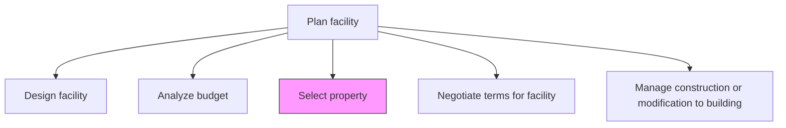
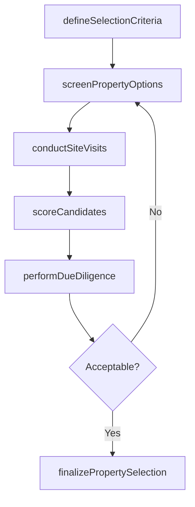

# Select property

> Business-as-Code definition for evaluating and choosing the most suitable property from available options based on location, capacity, cost, and strategic requirements.

## Overview

Assessing and choosing the appropriate property. Analyze the property requirements. Review the available property options. Finalize the most suitable option.

## Process Hierarchy



## GraphDL

```yaml
select:
  object: Property
  actor: RealEstateManager
  result: PropertySelection
```

## Actions

| Action | Description |
|--------|-------------|
| defineSelectionCriteria | Establish weighted evaluation criteria for property selection |
| screenPropertyOptions | Filter candidate properties against minimum requirements |
| conductSiteVisits | Perform on-site evaluations of shortlisted properties |
| scoreCandidates | Rate each property against established selection criteria |
| performDueDiligence | Conduct environmental assessments, title searches, and inspections |
| finalizePropertySelection | Select the recommended property and document the rationale |

## Events

| Event | Description |
|-------|-------------|
| selectionCriteriaDefined | Property evaluation criteria established and weighted |
| propertyOptionsScreened | Initial candidate list filtered to shortlist |
| siteVisitsCompleted | On-site evaluations of shortlisted properties finished |
| candidatesScored | All candidate properties scored and ranked |
| dueDiligencePerformed | Environmental, title, and inspection reviews completed |
| propertySelectionFinalized | Final property selected and recommendation documented |

## Searches

| Search | Description |
|--------|-------------|
| findCandidateProperties | List properties matching selection criteria by location, size, and price |
| getPropertyScorecard | Retrieve scoring results for evaluated candidate properties |
| getDueDiligenceReport | Get due diligence findings for a specific property |
| getSelectionCriteria | Retrieve current weighted evaluation criteria |

## Process Flow



## RACI Matrix

| Activity | Responsible | Accountable | Consulted | Informed |
|----------|-------------|-------------|-----------|----------|
| defineSelectionCriteria | RealEstateManager | VP Facilities | Operations | CFO |
| screenPropertyOptions | RealEstateAnalyst | RealEstateManager | Legal | Finance |
| conductSiteVisits | RealEstateManager | VP Facilities | Engineering | Safety |
| performDueDiligence | Legal | VP Facilities | Environmental | RealEstateManager |

## Related Processes

| Process | Relationship |
|---------|-------------|
| 10.1.2.1 Design facility | Upstream - design requirements constrain property selection |
| 10.1.2.2 Analyze budget | Upstream - budget limits define price range |
| 10.1.2.4 Negotiate terms for facility | Downstream - selected property enters negotiation |

## Related Departments

| Department | Role |
|-----------|------|
| Real Estate | Primary owner of property evaluation and selection |
| Legal | Conducts title searches and due diligence reviews |
| Operations | Validates operational suitability of candidate properties |
| Environmental Health and Safety | Assesses environmental risks and compliance |

## Related Occupations

| Occupation | Involvement |
|-----------|-------------|
| Real Estate Manager | Leads the property selection process |
| Environmental Assessor | Conducts environmental due diligence |
| Property Appraiser | Provides independent property valuations |

## KPIs

| KPI | Description | Unit |
|-----|-------------|------|
| Selection Cycle Time | Time from criteria definition to final property selection | Days |
| Candidate Shortlist Ratio | Percentage of screened properties advancing to site visits | % |
| Due Diligence Pass Rate | Percentage of properties passing due diligence without issues | % |
| Selection Satisfaction Score | Stakeholder satisfaction with selected property | Score (1-10) |

## Usage

```typescript
import { selectProperty } from '@headlessly/select-property'

const selection = selectProperty()

// Define selection criteria
const criteria = await selection.defineSelectionCriteria({
  weights: { location: 0.3, cost: 0.25, size: 0.2, condition: 0.15, zoning: 0.1 },
  minimums: { squareFootage: 40000, ceilingHeight: 24 }
})

// Screen and score candidates
const candidates = await selection.screenPropertyOptions({
  criteriaId: criteria.id,
  region: 'Pacific Northwest',
  maxResults: 10
})

// Perform due diligence on top candidate
const diligence = await selection.performDueDiligence({
  propertyId: candidates.ranked[0].id,
  scope: ['environmental', 'title', 'structural']
})
```
