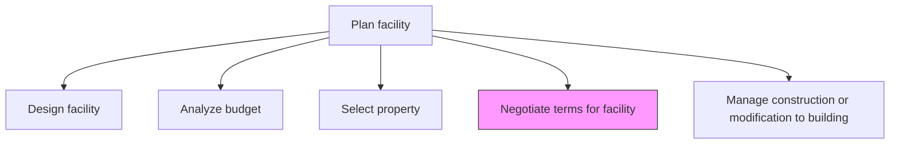
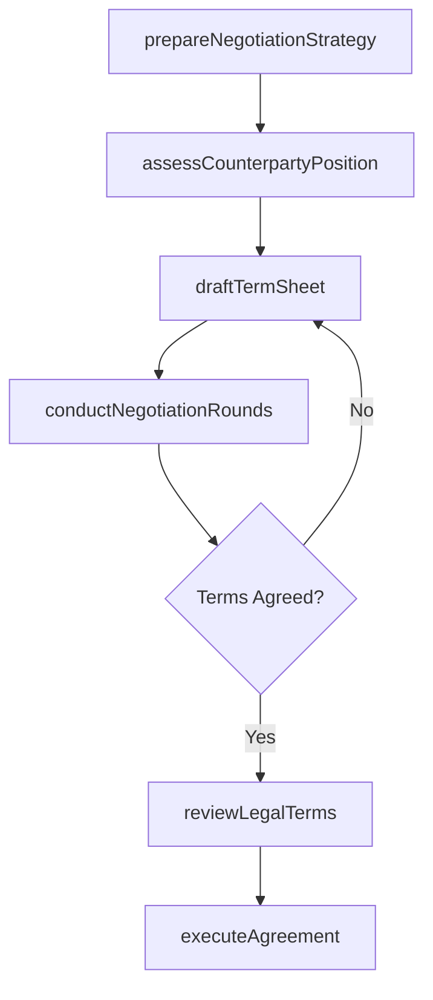

# Negotiate terms for facility

> Business-as-Code definition for negotiating lease terms, purchase agreements, and contractual conditions for facility acquisition aligned with budget constraints and business needs.

## Overview

Discussing the terms and conditions of facilities to be occupied according to the business requirements and availability of budgets.

## Process Hierarchy



## GraphDL

```yaml
negotiate:
  object: Terms For Facility
  actor: RealEstateManager
  result: NegotiatedAgreement
```

## Actions

| Action | Description |
|--------|-------------|
| prepareNegotiationStrategy | Define target terms, walk-away points, and negotiation tactics |
| assessCounterpartyPosition | Evaluate the seller or landlord's motivations and constraints |
| draftTermSheet | Prepare initial term sheet with proposed pricing and conditions |
| conductNegotiationRounds | Execute structured negotiation sessions with counterparty |
| reviewLegalTerms | Analyze contract language for risk, liability, and compliance |
| executeAgreement | Finalize and sign the facility lease or purchase agreement |

## Events

| Event | Description |
|-------|-------------|
| negotiationStrategyPrepared | Target terms and negotiation approach documented |
| counterpartyPositionAssessed | Seller or landlord position analysis completed |
| termSheetDrafted | Initial term sheet prepared and circulated |
| negotiationRoundsCompleted | All negotiation sessions concluded |
| legalTermsReviewed | Contract language reviewed and approved by legal |
| agreementExecuted | Facility agreement signed by all parties |

## Searches

| Search | Description |
|--------|-------------|
| findActiveNegotiations | List ongoing facility negotiations by status and property |
| getTermSheetHistory | Retrieve term sheet versions and revision history |
| getMarketComparables | Query comparable lease or sale terms in the local market |
| getAgreementDetails | Retrieve executed agreement terms and conditions |

## Process Flow



## RACI Matrix

| Activity | Responsible | Accountable | Consulted | Informed |
|----------|-------------|-------------|-----------|----------|
| prepareNegotiationStrategy | RealEstateManager | VP Facilities | CFO | Legal |
| draftTermSheet | RealEstateManager | VP Facilities | FinancialAnalyst | Operations |
| reviewLegalTerms | CorporateCounsel | GeneralCounsel | RealEstateManager | CFO |
| executeAgreement | VP Facilities | CFO | Legal | Board |

## Related Processes

| Process | Relationship |
|---------|-------------|
| 10.1.2.3 Select property | Upstream - selected property enters negotiation |
| 10.1.2.2 Analyze budget | Upstream - budget analysis sets negotiation boundaries |
| 10.1.2.5 Manage construction or modification to building | Downstream - agreed terms enable construction |

## Related Departments

| Department | Role |
|-----------|------|
| Real Estate | Primary owner of facility negotiations |
| Legal | Reviews and approves contract terms and conditions |
| Finance | Validates financial terms against budget constraints |
| Procurement | Provides market intelligence on comparable deals |

## Related Occupations

| Occupation | Involvement |
|-----------|-------------|
| Real Estate Manager | Leads negotiation sessions and strategy |
| Corporate Counsel | Reviews legal terms and protects organizational interests |
| Financial Analyst | Models financial impact of proposed terms |

## KPIs

| KPI | Description | Unit |
|-----|-------------|------|
| Negotiation Savings | Reduction from initial asking price to final agreed price | % |
| Negotiation Duration | Time from first offer to executed agreement | Days |
| Term Sheet Revisions | Number of term sheet iterations before agreement | Count |
| Favorable Terms Rate | Percentage of target terms achieved in final agreement | % |

## Usage

```typescript
import { negotiateTermsForFacility } from '@headlessly/negotiate-terms-for-facility'

const negotiation = negotiateTermsForFacility()

// Prepare negotiation strategy
const strategy = await negotiation.prepareNegotiationStrategy({
  propertyId: 'PROP-2026-042',
  targetPrice: 5500000,
  walkAwayPrice: 6200000,
  keyTerms: ['tenantImprovements', 'escalationCap', 'termLength']
})

// Draft initial term sheet
const termSheet = await negotiation.draftTermSheet({
  strategyId: strategy.id,
  leaseTerm: '10-year',
  annualRent: 280000
})

// Execute final agreement
const agreement = await negotiation.executeAgreement({
  negotiationId: strategy.id,
  finalTerms: termSheet.agreedVersion,
  signatories: ['CFO', 'Landlord']
})
```
