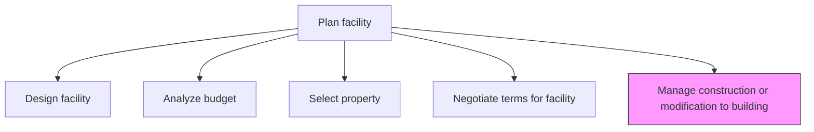
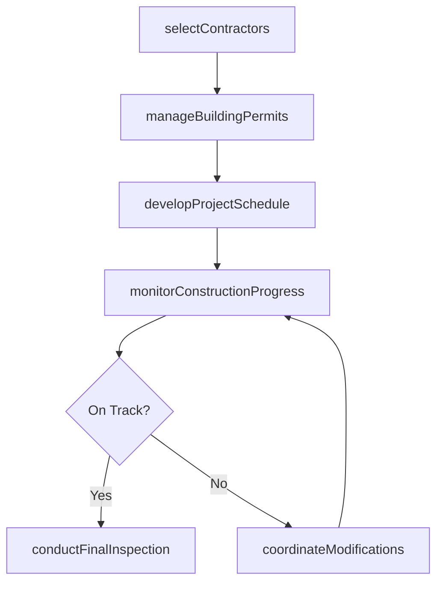

# Manage construction or modification to building

> Business-as-Code definition for overseeing construction projects and building modifications from contractor selection through completion, ensuring adherence to schedule, budget, and quality standards.

## Overview

Constructing the buildings. Manage renovations according to requirements and demands.

## Process Hierarchy



## GraphDL

```yaml
manage:
  object: Construction Or Modification To Building
  actor: ConstructionProjectManager
  result: CompletedBuildingProject
```

## Actions

| Action | Description |
|--------|-------------|
| selectContractors | Evaluate and award contracts to qualified construction firms |
| developProjectSchedule | Create detailed construction timeline with milestones and dependencies |
| monitorConstructionProgress | Track work completion against schedule and quality standards |
| manageBuildingPermits | Obtain and maintain required construction permits and inspections |
| coordinateModifications | Oversee change orders and building modifications during construction |
| conductFinalInspection | Perform punch-list review and certificate of occupancy process |

## Events

| Event | Description |
|-------|-------------|
| contractorsSelected | Construction contractors evaluated and contracts awarded |
| projectScheduleDeveloped | Detailed construction schedule created and approved |
| constructionProgressReported | Periodic construction status report delivered |
| buildingPermitsManaged | Required permits obtained and inspections passed |
| modificationsCoordinated | Change orders processed and modifications incorporated |
| finalInspectionCompleted | Punch-list resolved and occupancy certificate obtained |

## Searches

| Search | Description |
|--------|-------------|
| findActiveProjects | List active construction projects by status, location, or contractor |
| getProjectSchedule | Retrieve construction schedule with milestone status |
| getPermitStatus | Query building permit application and inspection status |
| getChangeOrders | List change orders by project, status, or cost impact |

## Process Flow



## RACI Matrix

| Activity | Responsible | Accountable | Consulted | Informed |
|----------|-------------|-------------|-----------|----------|
| selectContractors | ConstructionProjectManager | VP Facilities | Procurement | Legal |
| developProjectSchedule | ConstructionProjectManager | VP Facilities | Contractors | Operations |
| monitorConstructionProgress | SiteManager | ConstructionProjectManager | Engineering | Finance |
| conductFinalInspection | QualityInspector | VP Facilities | Safety | Operations |

## Related Processes

| Process | Relationship |
|---------|-------------|
| 10.1.2.1 Design facility | Upstream - design specifications drive construction scope |
| 10.1.2.4 Negotiate terms for facility | Upstream - agreed terms enable construction start |
| 10.1.3 Provide workspace and facilities | Downstream - completed building enters workspace management |

## Related Departments

| Department | Role |
|-----------|------|
| Facilities | Primary owner of construction project management |
| Procurement | Manages contractor selection and procurement |
| Legal | Reviews construction contracts and manages claims |
| Safety and Compliance | Ensures construction meets safety and regulatory standards |
| Finance | Tracks construction spend and budget adherence |

## Related Occupations

| Occupation | Involvement |
|-----------|-------------|
| Construction Project Manager | Leads day-to-day construction oversight |
| Site Superintendent | Manages on-site construction activities |
| Building Inspector | Conducts regulatory inspections and sign-offs |

## KPIs

| KPI | Description | Unit |
|-----|-------------|------|
| Schedule Adherence | Percentage of milestones completed on or before target date | % |
| Budget Variance | Deviation between approved construction budget and actual spend | % |
| Change Order Volume | Number of change orders per project | Count |
| Safety Incident Rate | Recordable incidents per 200,000 labor hours on construction sites | Rate |

## Usage

```typescript
import { manageConstructionOrModificationToBuilding } from '@headlessly/manage-construction-or-modification-to-building'

const construction = manageConstructionOrModificationToBuilding()

// Select contractors for a renovation project
const contractors = await construction.selectContractors({
  projectId: 'BLDG-2026-015',
  scope: 'interior-renovation',
  bidDeadline: '2026-03-15'
})

// Monitor construction progress
const progress = await construction.monitorConstructionProgress({
  projectId: 'BLDG-2026-015',
  reportingPeriod: 'weekly',
  includePhotos: true
})

// Conduct final inspection
const inspection = await construction.conductFinalInspection({
  projectId: 'BLDG-2026-015',
  inspectionType: 'certificate-of-occupancy',
  punchListItems: progress.openItems
})
```
