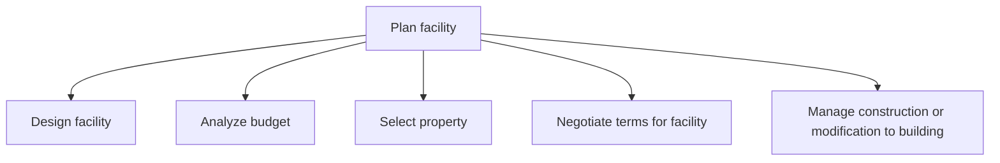
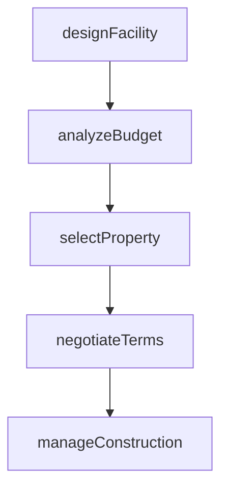

# Plan facility

> Business-as-Code definition for translating facility user needs into actionable project proposals encompassing design, budgeting, property selection, terms negotiation, and construction management.

## Overview

Recognizing the needs of facility users in order to construct a project proposal that meets those needs.

## Process Hierarchy



## GraphDL

```yaml
plan:
  object: Facility
  actor: FacilityPlanner
  result: FacilityPlan
```

## Actions

| Action | Description |
|--------|-------------|
| designFacility | Create floor plans, space allocations, and infrastructure specifications |
| analyzeBudget | Evaluate capital and operating cost projections for the facility |
| selectProperty | Assess candidate properties against design, location, and cost criteria |
| negotiateTerms | Negotiate lease or purchase terms with property owners |
| manageConstruction | Oversee construction or modification work to meet facility design |

## Events

| Event | Description |
|-------|-------------|
| facilityDesigned | Facility design and layout specifications finalized |
| budgetAnalyzed | Budget feasibility assessment completed |
| propertySelected | Candidate property selected from evaluated options |
| termsNegotiated | Lease or purchase agreement terms finalized |
| constructionManaged | Construction or modification project completed |

## Searches

| Search | Description |
|--------|-------------|
| findAvailableProperties | List candidate properties by location, size, and price |
| getFacilityDesign | Retrieve design specifications for a planned facility |
| getProjectBudget | Query budget breakdown for a facility project |

## Process Flow



## RACI Matrix

| Activity | Responsible | Accountable | Consulted | Informed |
|----------|-------------|-------------|-----------|----------|
| designFacility | FacilityArchitect | VP Facilities | Engineering | Operations |
| analyzeBudget | FinancialAnalyst | CFO | RealEstate | Procurement |
| selectProperty | RealEstateManager | VP Facilities | Legal | Finance |
| negotiateTerms | RealEstateManager | GeneralCounsel | Finance | Operations |

## Sub-Processes

| ID | Name | Description |
|----|------|-------------|
| 10.1.2.1 | Design facility | Preparing and analyzing different designs for a facility in order to finalize which design will be t |
| 10.1.2.2 | Analyze budget | Evaluating the feasibility of budgets prepared for the construction of facilities. |
| 10.1.2.3 | Select property | Assessing and choosing the appropriate property. Analyze the property requirements. Review the avail |
| 10.1.2.4 | Negotiate terms for facility | Discussing the terms and conditions of facilities to be occupied according to the business requireme |
| 10.1.2.5 | Manage construction or modification to building | Constructing the buildings. Manage renovations according to requirements and demands. |

## Related Processes

| Process | Relationship |
|---------|-------------|
| 10.1.1 Develop property strategy and long term vision | Upstream - strategy guides facility planning decisions |
| 10.1.3 Provide workspace and facilities | Downstream - planned facilities are provisioned for use |
| 10.2 Design and construct productive assets | Parallel - facility construction may involve productive assets |

## Related Departments

| Department | Role |
|-----------|------|
| Facilities Management | Leads facility planning and design |
| Finance | Evaluates budgets and financial feasibility |
| Real Estate | Sources and negotiates property acquisitions |
| Engineering | Provides technical input on building specifications |

## Related Occupations

| Occupation | Involvement |
|-----------|-------------|
| Facility Planner | Leads facility design and space allocation |
| Real Estate Agent | Identifies and evaluates candidate properties |
| Construction Manager | Oversees building construction or modification |

## KPIs

| KPI | Description | Unit |
|-----|-------------|------|
| Budget Variance | Deviation between planned and actual facility costs | % |
| Design-to-Occupancy Time | Elapsed time from design approval to facility ready for use | Months |
| Property Selection Cycle Time | Time from requirement to property selection decision | Days |

## Usage

```typescript
import { planFacility } from '@headlessly/plan-facility'

const facility = planFacility()

// Design a new facility layout
const design = await facility.designFacility({
  type: 'office',
  targetCapacity: 200,
  floors: 3,
  amenities: ['cafeteria', 'conference-rooms', 'parking']
})

// Analyze budget for the project
const budget = await facility.analyzeBudget({
  projectId: design.projectId,
  includeContingency: true,
  contingencyPercent: 10
})

// Select property from candidates
const property = await facility.selectProperty({
  city: 'Denver',
  minSqFt: 30000,
  maxLeasePerSqFt: 35,
  proximityToTransit: true
})
```
