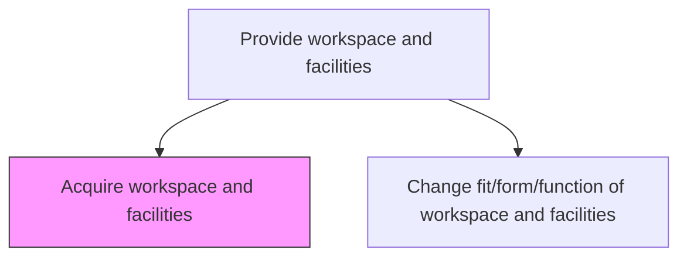
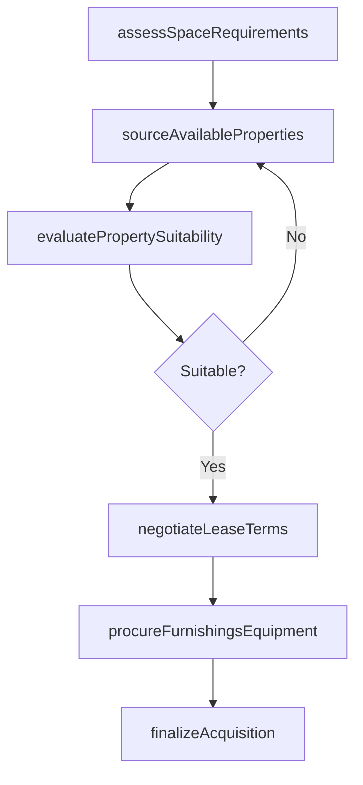

# Acquire workspace and facilities

> Business-as-Code definition for workspace and facilities acquisition. Models the end-to-end process of sourcing, evaluating, negotiating, and securing office space and supporting assets.

## Overview

Attaining the office space with all assets (tables, chairs, computers, admin staff, etc.) according to requirements.

## Process Hierarchy



## GraphDL

```yaml
acquire:
  object: Workspace And Facilities
  actor: FacilitiesManager
  result: WorkspaceAcquisitionRecord
```

## Actions

| Action | Description |
|--------|-------------|
| assessSpaceRequirements | Evaluate current and projected space needs based on headcount and operations |
| sourceAvailableProperties | Identify candidate properties or leases matching organizational criteria |
| evaluatePropertySuitability | Score candidate locations against accessibility, cost, and infrastructure factors |
| negotiateLeaseTerms | Negotiate rental rates, lease duration, tenant improvement allowances, and exit clauses |
| procureFurnishingsEquipment | Acquire desks, chairs, IT infrastructure, and other workspace assets |
| finalizeAcquisition | Execute lease agreements or purchase contracts and complete move-in handover |

## Events

| Event | Description |
|-------|-------------|
| spaceRequirementsAssessed | Workspace demand analysis completed and documented |
| propertiesSourced | Candidate property shortlist compiled |
| propertySuitabilityEvaluated | Location scoring and comparison completed |
| leaseTermsNegotiated | Lease or purchase terms agreed upon |
| furnishingsProcured | Furniture and equipment orders placed and confirmed |
| acquisitionFinalized | Workspace acquisition contract executed and space handed over |

## Searches

| Search | Description |
|--------|-------------|
| findAvailableProperties | List properties filtered by location, size, and budget |
| getLeaseAgreements | Retrieve active and pending lease agreements |
| getSpaceUtilization | Query current workspace utilization metrics by building or floor |
| getFurnishingOrders | Track procurement status for workspace furnishings and equipment |

## Process Flow



## RACI Matrix

| Activity | Responsible | Accountable | Consulted | Informed |
|----------|-------------|-------------|-----------|----------|
| assessSpaceRequirements | FacilitiesManager | VP Operations | DepartmentHeads | Finance |
| sourceAvailableProperties | RealEstateAnalyst | FacilitiesManager | Procurement | Legal |
| negotiateLeaseTerms | RealEstateAnalyst | CFO | Legal | FacilitiesManager |
| procureFurnishingsEquipment | ProcurementSpecialist | FacilitiesManager | IT | Finance |
| finalizeAcquisition | FacilitiesManager | VP Operations | Legal | HR |

## Related Processes

| Process | Relationship |
|---------|-------------|
| 10.1.3.2 Change fit/form/function of workspace and facilities | Downstream - adapts acquired spaces to operational needs |
| 10.1.4.1 Relocate people | Downstream - moves staff into newly acquired workspace |
| 9.2.1 Plan and manage procurement strategy | Upstream - procurement policies govern acquisition approach |

## Related Departments

| Department | Role |
|-----------|------|
| Facilities Management | Primary owner of workspace acquisition and fit-out |
| Real Estate | Sources properties and negotiates lease or purchase terms |
| Finance | Approves capital expenditure and lease budgets |
| Procurement | Manages vendor selection for furnishings and equipment |

## Related Occupations

| Occupation | Involvement |
|-----------|-------------|
| Facilities Manager | Leads workspace planning and acquisition execution |
| Real Estate Analyst | Evaluates property options and market conditions |
| Procurement Specialist | Sources and contracts for workspace assets |

## KPIs

| KPI | Description | Unit |
|-----|-------------|------|
| Acquisition Cycle Time | Average time from requirements to occupancy | Days |
| Cost Per Square Foot | Total lease or purchase cost normalized by area | Currency/sqft |
| Space Utilization Rate | Percentage of acquired workspace actively occupied | % |
| Lease Negotiation Savings | Discount achieved versus initial asking price | % |

## Usage

```typescript
import { acquireWorkspaceAndFacilities } from '@headlessly/acquire-workspace-and-facilities'

const workspace = acquireWorkspaceAndFacilities()

// Assess current space requirements
const requirements = await workspace.assessSpaceRequirements({
  headcount: 250,
  growthProjection: '18-months',
  specialRequirements: ['server-room', 'call-center']
})

// Source and evaluate candidate properties
const properties = await workspace.sourceAvailableProperties({
  region: 'downtown',
  minSqft: 15000,
  maxBudget: 500000
})

// Negotiate lease terms for selected property
const lease = await workspace.negotiateLeaseTerms({
  propertyId: properties[0].id,
  desiredTerm: '5-years',
  tenantImprovementAllowance: 75000
})
```
